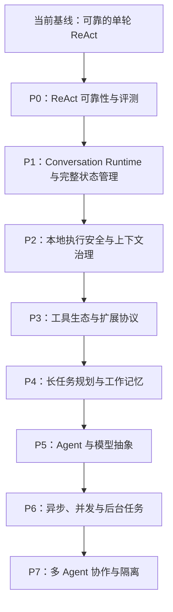

# zzm-agent 升级改进路线图

> **执行说明：进入本文档后，先查看下方“执行进度总览”，根据勾选状态确认当前进度；每次只执行一个最小任务点。任务通过验收后，必须先补齐对应功能说明文档，再将对应的 `- [ ]` 更新为 `- [x]`，不得提前勾选或一次笼统勾选多个任务。**

标记说明：

- [x] 已完成：实现、测试、文档和对应验收均已完成；
- [ ] 未完成：尚未开始、正在进行或尚未通过完整验收；
- 任务开始后仍保持 `- [ ]`，只有满足完成定义后才改为 `- [x]`；
- 每个任务点完成后必须新增或更新对应功能说明文档，文档开头必须先用通俗语言整体说明“这项工作是用来干什么的、为什么要做、解决什么真实问题、用户或运行时什么时候会用到它”，再展开技术细节；
- 功能说明文档必须用中文写清楚：功能作用、至少 1 个具体使用场景或例子、对应代码文件、关键类/函数、执行链路、测试位置和验证结果；
- 功能说明不能只写概念描述，也不能一上来就堆类名和函数名，必须先让后续执行者理解整体背景、典型场景和行为结果，再能直接定位到代码实现位置；
- 本清单是路线图进度的唯一状态来源，后文章节用于说明设计与验收要求；
- 默认从上到下执行；如果因依赖关系调整顺序，应在任务旁补充简短说明。

## 执行进度总览

> **当前下一任务：6.10 Hook 系统、Stop Hook 与阻塞重试保护。**

### 当前能力基线

- [x] Native Tool Calling 驱动的 ReAct 循环
- [x] 流式与非流式模型输出
- [x] 多轮工具调用及 Observation 回填
- [x] 最大工具迭代次数限制和连续重复调用熔断
- [x] 工具风险分级、执行确认和 `auto_approve`
- [x] 结构化工具错误及有限自动重试
- [x] 工具事件、耗时、Diff、Token 和费用可观测性
- [x] 多会话、Semantic / Episodic Memory
- [x] 记忆检索、上下文压缩和 Pinned Context
- [x] PromptManager、回放测试和固定基准任务
- [x] Prompt 评估、候选生成、Diff、应用和回滚

### P0：ReAct 可靠性与评测

- [x] 5.1 ProgressMonitor 无进展检测：识别工具循环、重复结果、连续失败和多轮无新信息等停滞信号
- [x] 5.2 一次性 Reflection 纠偏：首次停滞时插入结构化反思提示，要求模型换策略而不是盲目重试
- [x] 5.3 工具错误恢复增强：细分错误类型、重试策略、退避规则和恢复建议，提升模型从失败中恢复的能力
- [x] 5.4 回放基准扩充（在 5.2、5.3 后执行）：补充权限错误、空结果循环、参数修正、反思换路和安全停止等固定评测场景
- [x] P0 阶段验收：验证 ReAct 可靠性增强不破坏权限、安全熔断、短任务性能和现有回放基线

### P1：Conversation Runtime 与完整状态管理

- [x] 6.1 状态生命周期与所有权模型：定义 Application、Conversation、Turn、Loop、Task 和 WorkingMemory 的创建、修改、持久化和销毁边界
- [x] 6.2 ApplicationState / ConversationState / TurnState / LoopState：把当前散落在 AgentLoop 中的计数器、消息、权限、用量和运行状态收敛到明确状态对象
- [x] 6.3 LoopPhase / LoopTransition 正式状态机：用显式阶段和转换原因描述 ReAct 循环，支持 follow-up、reflection、stop hook、取消和失败
- [x] 6.4 运行时消息、待提交消息与持久化消息分层：区分当前执行视图、未提交消息、已提交历史和模型上下文视图
- [x] 6.5 完整 UsageState 及多作用域累计：按模型、Turn、Conversation、Task 和应用层累计 Token、调用次数和费用
- [x] 6.5.1 Prompt 输出约束与结构化回复协议：统一 system prompt 中的工具调用边界、最终回复版式和不同任务类型的回答协议
- [x] 6.6 完整 PermissionState 及权限生命周期：记录权限请求、授权、拒绝、过期、孤立请求和不同作用域的权限决定
- [x] 6.7-6.8 文件状态缓存与 Memory 加载去重：合并开发 FileStateCache 和 MemoryLoadState，统一处理路径规范化、版本、重复注入、失效和上下文来源追踪
- [x] 6.9 CancellationController 基础层级模型：为会话、Turn、模型请求和工具调用建立可传播的取消控制基础
- [ ] 6.10 Hook 系统、Stop Hook 与阻塞重试保护：支持执行前后扩展点，并防止 Stop Hook 无限阻塞最终回复
- [ ] 6.11 EventBus、ArtifactStore 与 CheckpointStore：统一记录事件、保存大结果/产物，并为恢复与回放提供检查点
- [ ] 6.12-6.15 工具结果、进度事件与展示协议：合并开发 ToolResult、ToolProgressEvent、ToolRenderer / RendererRegistry 和 DisplayMode，统一打通模型内容、展示内容、Artifact、进度和折叠策略
- [ ] 6.16 状态序列化、版本迁移与恢复协议：让 Conversation、Turn、Task 等状态可持久化、可升级并能在重启后安全恢复
- [ ] 6.17-6.18 QueryEngine 与 CLI 迁移：合并开发跨 Turn 会话编排器和 CLI 接入，让 REPL 通过 QueryEngine 统一调度消息、状态、工具、权限、记忆和 AgentLoop
- [ ] P1 阶段验收：确认完整状态体系可观察、可恢复，并保持现有同步 ReAct 调用兼容

### P2：本地执行安全与上下文治理

- [ ] 7.1 工具生命周期与权限网关：统一工具注册、调用前校验、风险分级、权限确认、执行和结果记录流程
- [ ] 7.2 工具参数运行时校验：在执行前验证参数类型、路径边界、必填项和危险参数，减少无效或越权调用
- [ ] 7.3 工具超时与取消：为长时间工具调用提供超时限制、用户取消和清理回调
- [ ] 7.4 ChangeSet 与 `/undo`：记录受管文件变更并支持按变更集安全撤销
- [ ] 7.5 Token Budget 2.0：按系统提示、记忆、历史、工具 Schema、工具结果和输出预留空间进行上下文预算分配
- [ ] 7.6 超长工具结果治理：将大结果转为 Artifact，只向模型注入摘要、关键片段和可追踪引用
- [ ] 7.7 FileReadRenderer：展示文件路径、读取行号范围、内容预览、截断状态和完整 Artifact 引用
- [ ] 7.8 FileEditRenderer：展示语法高亮 Diff、增删行统计、目标文件和变更冲突
- [ ] 7.9 SearchRenderer：按文件分组并高亮匹配内容、行号、结果数量和折叠摘要
- [ ] 7.10 ShellRenderer：展示命令、实时 stdout/stderr、退出码、执行时间和后台任务状态
- [ ] 7.11 动态活动描述：根据工具参数显示 Reading、Searching、Running 等具体 Spinner 文案
- [ ] 7.12 纯文本降级渲染：Rich 或专属 Renderer 不可用时仍输出完整、可读的状态和结果
- [ ] P2 阶段验收：确认本地工具执行更安全、可取消、可撤销，且长结果不会撑爆模型上下文

### P3：工具生态与扩展协议

- [ ] 8.1 MCP Client：接入 MCP Server，完成连接、能力发现、工具注册、错误隔离和统一权限治理
- [ ] 8.2 Skills 模块化外化：把专门任务知识、指令、示例、资源和允许工具沉淀为可安装、可启用的 Skill
- [ ] 8.3 SkillDiscoveryState 完整生命周期：记录可用、发现、激活、固定、拒绝和已加载资源等 Skill 状态
- [ ] 8.4 Skills 自适应检索与自动激活：根据任务意图自动选择相关 Skill，并控制激活数量和 Token 预算
- [ ] 8.5 工具 Schema 按需装载：根据任务、Skill 和阶段只暴露必要工具，减少 Schema Token 浪费
- [ ] 8.6 MCPToolRenderer：展示 MCP Server、远程工具名、连接状态、调用进度和远程错误
- [ ] 8.7 SkillRenderer：展示 Skill 的发现原因、激活状态、资源加载和执行进度
- [ ] P3 阶段验收：确认 MCP 和 Skills 可安全扩展工具生态，并且工具装载更按需、更可解释

### P4：长任务规划与工作记忆

- [ ] 9.1 TaskState：为长任务保存目标、步骤、状态、发现、产物、阻塞原因和更新时间
- [ ] 9.2 WorkingMemory：保存任务内临时事实、计划、子步骤结果和当前阻塞，避免把完整工具历史塞进上下文
- [ ] 9.3 外层 Planner：在 AgentLoop 外部拆解目标、调度子任务、接收结果并维护全局计划
- [ ] 9.4 动态 Reflection 与重规划：在步骤失败、发现新信息或计划失效时反思并调整后续步骤
- [ ] 9.5 用户干预与任务恢复：支持用户确认、修改、跳过、重试、暂停和从检查点恢复任务
- [ ] 9.6 PlannerRenderer：展示任务目标、步骤列表、当前步骤、阻塞原因和计划变更
- [ ] 9.7 TaskProgressRenderer：展示步骤完成比例、Artifacts、Usage 和暂停/恢复状态
- [ ] P4 阶段验收：确认复杂任务能被拆解、执行、更新、恢复，并且简单任务不会被强制 Planner 化

### P5：Agent 与模型抽象

- [ ] 10.1 BaseLLM / ModelAdapter：统一不同模型 Provider 的生成、流式事件、Tool Call、Usage 和错误表示
- [ ] 10.2 多 Provider 支持：支持 OpenAI-compatible、Anthropic、DeepSeek 等 Provider 的配置、凭据和能力声明
- [ ] 10.3 多 Provider 自动路由：根据任务类型、模型能力、成本和上下文长度选择合适模型并记录路由原因
- [ ] 10.4 BaseAgent 统一继承体系：提炼 ChatAgent、ReActAgent、PlannerAgent、SubAgent 等共享生命周期和能力接口
- [ ] P5 阶段验收：确认模型协议与 AgentLoop 解耦，多 Provider 和多个真实 Agent 能通过统一接口运行

### P6：异步、并发与后台任务

- [ ] 11.1 渐进式只读工具并发：优先并发低风险、只读、无依赖工具，验证调度和结果回填策略
- [ ] 11.2 Async Agent Loop：提供异步运行入口，同时保留同步 run 兼容现有调用方式
- [ ] 11.3 层级 CancellationController 与取消传播：将取消信号从会话传递到模型请求、工具、后台进程和子任务
- [ ] 11.4 Concurrent Tool Executor：按依赖、风险和副作用分组调度多个 tool call，并保持模型协议要求的结果顺序
- [ ] 11.5 后台任务管理：支持启动、查询、停止后台进程，并记录日志、状态和清理策略
- [ ] 11.6 孤立权限请求处理与恢复：识别已失去原始 Tool Call 上下文的权限请求并进行一次性安全补偿
- [ ] 11.7 完整 Circuit Breaker：为持续失败的 Provider、MCP Server、网络工具和后台服务建立熔断与半开恢复机制
- [ ] 11.8 ConcurrentToolsRenderer：同时展示多个工具的独立状态、完成顺序、失败和取消
- [ ] 11.9 BackgroundProcessRenderer：展示进程 ID、运行时长、实时日志、退出码和停止状态
- [ ] P6 阶段验收：确认只读并发、异步取消、后台任务和熔断机制安全可观测，且写操作不会错误并发

### P7：多 Agent 协作与隔离

- [ ] 12.1 Sub-Agent / TaskTool：允许主 Agent 委派边界清晰的子任务，并接收结构化结果和证据
- [ ] 12.2 Git Worktree 隔离：让写操作子 Agent 在独立工作树中修改和测试，避免污染用户当前工作区
- [ ] 12.3 Swarm / Multi-Agent 编排：支持多个专门 Agent 按依赖图并行或串行协作完成复杂目标
- [ ] 12.4 子 Agent 状态、取消和 Usage 汇总：独立追踪子 Agent 的状态、成本、取消和结果，并汇总到父任务
- [ ] 12.5 资源与失败治理：限制 Agent 数量、层级、Token、时间、Worktree 和后台进程等资源
- [ ] 12.6 SubAgentRenderer：展示子 Agent 的任务、阶段、当前动作、Token、耗时和最终摘要
- [ ] 12.7 SwarmRenderer：展示 Agent 拓扑、任务分配、依赖关系、冲突和整体收敛状态
- [ ] P7 阶段验收：确认子 Agent 和 Swarm 可控、可取消、可核验，并不会污染主工作区或无限扩张资源

### P8：桌面客户端与可视化操作层

- [ ] 13.1 Desktop Client 边界定义：明确桌面客户端只作为 QueryEngine 的前端入口，不重新实现 AgentLoop、工具执行、权限、取消和记忆逻辑
- [ ] 13.2 Client API / 本地桥接层：为桌面端提供提交消息、取消 Turn/Task、权限确认、会话切换、后台任务查询和 Artifact 打开的稳定接口
- [ ] 13.3 会话与任务主界面：展示会话列表、当前 Turn、运行状态、Token/Usage、Artifacts 和可恢复任务
- [ ] 13.4 取消按钮与任务控制：把桌面端取消按钮接入 `CancellationController` / QueryEngine，支持取消当前 Turn、长任务、后台进程和子 Agent
- [ ] 13.5 权限确认界面：展示工具名、风险等级、参数摘要、作用域选择和拒绝原因，并复用 `PermissionState`
- [ ] 13.6 工具与进度可视化：消费 EventBus、ToolProgressEvent 和 Renderer 输出，展示文件读取、编辑 Diff、搜索、Shell、后台任务和多 Agent 状态
- [ ] 13.7 Artifact / Diff / 日志查看器：打开完整工具结果、生成文件、测试日志、Patch 和回放记录，避免把长内容塞进对话流
- [ ] 13.8 桌面端验收：确认核心能力仍由 QueryEngine 驱动，CLI 与桌面端行为一致，取消、权限、恢复和后台任务在 UI 中可观察、可操作、可回归测试

---

## 1. 路线图目标

zzm-agent 已经具备较完整的 ReAct 核心循环、工具执行安全底座、分层记忆、上下文压缩、Prompt 管理、可观测性和回放评估能力。

后续升级的目标不是机械复制其他 Agent 框架，而是在保持核心简单、可测试和可控的前提下，逐步提高：

- 现有 ReAct 的任务成功率和错误恢复能力；
- 本地文件与命令执行的安全性和可撤销性；
- 模型、上下文、工具和外部协议的扩展能力；
- 长任务的规划、状态保持、暂停和恢复能力；
- 异步执行、并发工具和后台任务的运行效率；
- 多 Agent 协作和隔离执行能力。

Datawhale Hello-Agents、Claude Code 等项目作为设计参考，但不作为逐项复刻清单。每项升级都应对应明确的用户痛点，并通过单元测试、回放基准或可量化指标证明收益。

---

## 2. 当前能力基线

### 2.1 已完成

以下内容是“执行进度总览”中已完成基线的详细说明，不在此处重复维护勾选状态：

- Native Tool Calling 驱动的 ReAct 循环；
- 流式与非流式模型输出；
- 多轮工具调用及 Observation 回填；
- 最大工具迭代次数限制和连续重复调用熔断；
- Low / Medium / High 工具风险分级及执行确认；
- 结构化工具错误及有限自动重试；
- 工具事件、耗时、Diff、Token 和费用可观测性；
- 多会话、Semantic / Episodic Memory；
- 记忆检索、上下文压缩和 Pinned Context；
- PromptManager、回放测试和固定基准任务；
- Prompt 评估、候选生成、Diff、应用和回滚。

### 2.2 当前主要缺口

- 对“没有取得进展”的工具循环只能熔断，不能主动纠偏；
- 工具运行时校验、权限策略、超时和取消机制仍可加强；
- 文件变更缺少任务级统一记录和一键撤销；
- 模型调用仍直接依赖 OpenAI-compatible 客户端接口；
- 工具输出和各类上下文尚未形成完整的分区预算；
- 尚未接入 MCP，也没有独立的 Skills 装载机制；
- 缺少统一 QueryEngine、跨 Turn ConversationState 和正式 Loop 状态机；
- 缺少完整 PermissionState、FileStateCache、Hook、EventBus 和 Checkpoint；
- 缺少 TaskState、WorkingMemory 和外层 Planner；
- Agent Loop 仍为同步执行，多个 tool call 顺序运行；
- 缺少后台任务、子 Agent、Worktree 隔离和 Swarm 编排。

---

## 3. 路线图原则

1. **真实痛点优先**：先解决已经出现的失败模式，再扩大能力边界。
2. **确定性机制优先**：权限、校验、超时和熔断不能只依赖模型自觉。
3. **保持 AgentLoop 聚焦**：AgentLoop 负责单次用户轮次内的 ReAct；Planner 在外层编排。
4. **短任务保持轻量**：普通问答和简单工具调用不承担 Planner、Reflection 等额外模型开销。
5. **抽象由实现推动**：BaseAgent 等统一抽象保留在正式计划中，但应基于多个真实 Agent 实现提炼。
6. **写操作默认串行**：文件写入、Shell 和存在副作用的工具不得盲目并发。
7. **状态可观察、可恢复**：长任务必须能展示进度、报告阻塞并支持恢复。
8. **兼容现有入口**：异步改造、多 Provider 和 Planner 不应破坏现有同步调用方式。
9. **每阶段可独立验收**：实现、测试、文档和回放指标同时满足后才算完成。
10. **所有规划能力正式保留**：后置阶段代表实施顺序，不代表可选、搁置或取消。

---

## 4. 整体演进路线



### 4.1 实际执行顺序

阶段编号表示能力分类，实际执行按依赖关系推进：

```text
5.1 ProgressMonitor（已完成）
→ 5.2 Reflection
→ 5.3 错误恢复
→ 5.4 回放基准
→ P0 阶段验收
→ P1 Conversation Runtime 与完整状态管理
→ P2 本地执行安全与上下文治理
→ P3 工具生态与扩展协议
→ P4 长任务规划与工作记忆
→ P5 Agent 与模型抽象
→ P6 异步、并发与后台任务
→ P7 多 Agent 协作与隔离
```

P0 先完成现有 ReAct 的可靠性闭环；进入 P1 后，再把 Reflection 次数、转换原因和运行状态迁移到正式 TurnState / LoopState，并接入 Hook、EventBus 和 QueryEngine。

### 4.2 完整概念的引入时间

| 完整概念 | 首次引入 | 后续扩展 |
|---|---|---|
| Application / Conversation / Turn / Loop State | P1 | P4 Task、P7 Child Agent |
| Loop 状态机、`needs_follow_up` | P1 | P4 Planner、P6 Async |
| Hook、Stop Hook、`stop_hook_active` | P1 | P4 Task Hook、P7 Agent Hook |
| Runtime / Pending / Persisted Messages | P1 | P4 WorkingMemory、P7 Agent 消息 |
| UsageState | P1 | P4 Task Usage、P5 Model Cost、P7 子 Agent 汇总 |
| PermissionState | P1 | P2 权限策略、P6 孤立请求、P7 Agent 边界 |
| FileStateCache | P1 | P2 ChangeSet、P7 Worktree |
| MemoryLoadState | P1 | P3 Skill References、P4 WorkingMemory |
| CancellationController | P1 同步基础 | P6 异步传播、P7 子 Agent 树 |
| EventBus / Artifact / Checkpoint | P1 | 后续全部阶段复用 |
| ToolResult 展示分层 / ToolProgressEvent | P1 | P2 本地工具、P3 MCP/Skill、P4 Planner、P6/P7 并发与 Agent |
| ToolRenderer / RendererRegistry / DisplayMode | P1 | 各阶段注册对应的专属 Renderer |
| QueryEngine | P1 | P4 Task、P6 后台任务、P7 Multi-Agent |
| SkillDiscoveryState | P3 | P4 Task Skill、P7 Agent Skill |
| TaskState / WorkingMemory | P4 | P7 分布式子任务 |
| BaseAgent / BaseLLM | P5 | P7 多 Agent 类型 |
| Orphaned Permission Recovery | P6 | P7 子 Agent 恢复 |

---

## 5. P0：ReAct 可靠性与评测

### 5.1 ProgressMonitor 无进展检测

在现有重复工具调用检测之上，识别：

- 连续多次不可重试错误；
- 相同工具、参数和 Observation 重复；
- 参数变化但 Observation 基本不变；
- 多个工具之间形成固定循环；
- 连续多轮没有产生新事实、文件变化或有效结果。

ProgressMonitor 只负责判断执行是否停滞，不替代最大迭代上限。

完成情况：

- [x] 新增独立 `ProgressMonitor` 和结构化 `ProgressSignal`；
- [x] 检测变化参数连续得到相同 Observation；
- [x] 检测连续不可重试失败；
- [x] 检测固定工具轮次循环；
- [x] 新结果会重置连续重复结果计数；
- [x] AgentLoop 在检测到停滞后安全持久化结果并停止；
- [x] 保留现有最大迭代和相同调用熔断机制；
- [x] 单元测试、AgentLoop 集成测试和全量回归通过。

### 5.2 一次性 Reflection 纠偏

当执行没有进展时，在熔断前插入一次结构化纠偏提示，要求模型总结已尝试方法、判断失败原因，并更换工具、参数或执行路线。

约束：

- 每个用户轮次最多触发一次；
- 不重置 `max_tool_iterations`；
- 再次无进展时立即熔断；
- 正常成功任务不增加额外模型调用；
- 不要求模型输出或持久化完整隐藏思维链。

完成情况：

- [x] ProgressMonitor 首次检测停滞时注入结构化 `REFLECTION_REQUIRED` System 消息；
- [x] 相同工具盲目重复达到限制时也先获得一次 Reflection 机会；
- [x] Reflection 提示包含停滞原因、轮次数、换路要求和阻塞报告要求；
- [x] 每个用户 Turn 最多触发一次 Reflection；
- [x] Reflection 不重置 `max_tool_iterations`；
- [x] Reflection 后再次停滞会明确标记 `after reflection` 并安全停止；
- [x] Reflection 提示只存在于当前运行上下文，不写入持久会话历史；
- [x] 正常成功任务不产生额外 Reflection 调用；
- [x] 单元测试、AgentLoop 集成测试、Replay 测试和全量回归通过。

### 5.3 工具错误恢复增强

- 区分参数、权限、超时、环境、外部服务和业务错误；
- 根据错误类型决定是否允许重试；
- 支持 Retry-After 和指数退避；
- 对确定性失败禁止盲目重试；
- 将错误摘要、尝试次数和恢复建议统一反馈给模型。

完成情况：

- [x] `ToolError` 增加 `category`、`deterministic`、`attempts` 和 `retry_after_seconds` 字段，同时保留旧 JSON 字段兼容；
- [x] 将参数错误、权限错误、超时、环境错误、外部服务错误和业务错误映射为明确分类；
- [x] 对确定性参数错误、缺失工具、权限拒绝和文件缺失等失败禁止自动重试；
- [x] 对超时和外部服务错误允许有界自动重试；
- [x] 支持异常对象上的 `retry_after_seconds` / `retry_after` 以及响应头 `Retry-After`；
- [x] 自动重试优先遵守 Retry-After，否则使用指数退避；
- [x] 最终错误结果会反馈尝试次数、错误分类、是否确定性、是否可重试和恢复建议；
- [x] 新增无磁盘依赖的错误恢复目标测试，覆盖确定性参数错误、指数退避和 Retry-After。

### 5.4 回放基准扩充

增加权限错误、相同空结果、双工具循环、参数修正恢复、主动报告阻塞、Reflection 换路和安全停止等固定场景。

完成情况：

- [x] Replay Runner 增加扩展断言，支持检查模型调用次数、Reflection 次数、ProgressSignal 原因、工具调用序列、运行时 Prompt、Retry-After 等待和工具结果 JSON；
- [x] Replay Runner 支持从 YAML 声明工具异常，覆盖真实 `tool_error_from_exception()` 错误分类路径；
- [x] Replay Runner 使用内存 Store 运行 deterministic replay，避免磁盘临时目录影响 AgentLoop 行为验证；
- [x] 新增 `07_reflection_repeated_observation.yaml`，覆盖重复 Observation 触发 Reflection；
- [x] 新增 `08_error_category_recovery.yaml`，覆盖 FileNotFoundError 分类和换工具恢复；
- [x] 新增 `09_retry_after_external_service.yaml`，覆盖外部服务 Retry-After 和重试耗尽结构化错误；
- [x] 新增 `tests/test_eval_runner.py`，验证新增 benchmark 能通过，且 runner 能发现错误期望；
- [x] 新增 `docs/5.4-replay-benchmarks.md`，说明功能作用、代码位置、执行链路、测试位置和验证结果。

### 验收标准

- 相同失败调用不会持续到最大迭代次数；
- Reflection 不绕过权限确认和硬性熔断；
- 正常短任务的调用次数和延迟无明显退化；
- 新增行为均具备确定性回放测试。

完成情况：

- [x] 目标测试通过：`tests/test_progress_monitor.py`、`tests/test_tool_error_recovery.py`、`tests/test_eval_runner.py` 共 12 个测试通过；
- [x] Replay suite 通过：9 个 replay benchmark 全部通过，成功率 100%；
- [x] 验收期间修复 replay eval 对真实临时 workspace 的依赖，replay 模式改为无磁盘写入；
- [x] 新增 `docs/p0-acceptance.md`，记录验收项、对应代码、测试结果、已知限制和进入 P1 的迁移点。

---

## 6. P1：Conversation Runtime 与完整状态管理

本阶段建立类似 QueryEngine 的正式会话运行时。它不是临时包装层，而是跨用户 Turn 状态的最终所有者。后续权限、Skills、Planner、异步和多 Agent 都在这一状态体系上扩展。

### 6.1 状态生命周期与所有权模型

正式定义五层状态及生命周期：

```text
ApplicationState
└── ConversationState
    ├── TurnState
    │   └── LoopState
    └── TaskState
        └── WorkingMemory
```

- `ApplicationState`：进程级，保存配置、模型、工具、Skills、MCP 连接和活动会话；
- `ConversationState`：会话级，跨多个用户 Turn 累积；
- `TurnState`：单次用户输入级，从提交消息到最终完成；
- `LoopState`：单个 Turn 内部的 ReAct 状态；
- `TaskState`：长任务级，跨多个 Turn 和子步骤存在；
- `WorkingMemory`：Task 内的结构化临时记忆。

每种状态必须明确：创建者、唯一所有者、允许修改者、持久化边界、恢复策略和销毁时机。

完成情况：

- [x] 新增 `zzm_agent/core/state_lifecycle.py`，定义状态范围、生命周期、持久化边界、恢复策略和状态生命周期规则；
- [x] 定义 `Application / Conversation / Turn / Loop / Task / WorkingMemory` 的父子关系、所有者、允许修改者、创建者、销毁时机和用途；
- [x] 提供 `get_state_policy()`、`state_lineage()`、`state_children()` 和 `validate_state_lifecycle_policies()` 查询与校验函数；
- [x] 新增 `tests/test_state_lifecycle.py`，固定状态层级、所有权、持久化边界和恢复策略；
- [x] 新增 `docs/6.1-state-lifecycle-ownership.md`，说明整体背景、代码位置、执行链路、测试位置和后续 6.2 边界。

### 6.2 ApplicationState / ConversationState / TurnState / LoopState

正式状态至少包含：

```text
ApplicationState
├── configuration
├── model_registry
├── tool_registry
├── skill_registry
├── mcp_connections
└── active_session_id

ConversationState
├── session_id
├── messages
├── usage
├── permissions
├── file_reads
├── skills
├── memories
├── cancellation
├── active_turn
└── active_task

TurnState
├── turn_id
├── user_input
├── status
├── usage
├── discovered_skills
├── loaded_memory_paths
├── permission_requests
├── permission_denials
├── artifacts
├── loop
├── final_response
└── error

LoopState
├── phase
├── transition
├── model_iterations
├── tool_iterations
├── reflection_count
├── current_tool_calls
├── observations
├── progress_signal
├── needs_follow_up
├── stop_hook_active
└── stop_hook_attempts
```

当前 `AgentLoop` 中的局部计数器和 `last_*` 字段逐步迁移到这些有明确作用域的状态对象。

完成情况：

- [x] 新增 `zzm_agent/core/runtime_state.py`，实现 `ApplicationState`、`ConversationState`、`TurnState`、`LoopState` 四层运行时状态对象；
- [x] 新增 `TurnStatus` 和 6.2 过渡版 `LoopPhase`，先承载状态字段和基础阶段记录，正式状态机留到 6.3 完成；
- [x] 每个运行时状态对象都提供 `policy()`，与 6.1 的 `StateScope` / `StatePolicy` 生命周期规则对齐；
- [x] `ConversationState` 支持创建、完成、失败和防重入 Turn，避免同一会话中同时存在多个活动 Turn；
- [x] `TurnState` 记录用户输入、状态、用量、Skills、Memory 路径、权限请求/拒绝、Artifacts、最终回复和错误；
- [x] `LoopState` 记录模型调用次数、工具轮次、当前工具调用、Observation、无进展信号、Reflection 次数、follow-up 标记和 Stop Hook 标记；
- [x] `AgentLoop.run()` 开始创建并更新 `last_turn_state` / `last_loop_state`，让单轮 ReAct 执行过程能被结构化观察；
- [x] 新增 `tests/test_runtime_state.py`，覆盖状态对象字段、生命周期、防重入、Loop 观测记录，以及 `AgentLoop` 的基础集成；
- [x] 新增 `docs/6.2-runtime-state-objects.md`，用中文说明整体作用、代码位置、关键类、执行链路、测试位置和验证结果。

### 6.3 LoopPhase / LoopTransition 正式状态机

正式引入状态枚举：

```text
LoopPhase:
IDLE → PREPARING → CALLING_MODEL → STREAMING_RESPONSE
→ VALIDATING_TOOL_CALLS → AWAITING_PERMISSION
→ EXECUTING_TOOLS → PROCESSING_OBSERVATIONS
→ REFLECTING → RUNNING_STOP_HOOKS
→ COMPLETED / BLOCKED / CANCELLED / FAILED
```

转换原因至少包括：

- `next_turn`；
- `tool_follow_up`；
- `reflection_retry`；
- `stop_hook_retry`；
- `completed`；
- `no_progress`；
- `iteration_limit`；
- `duplicate_call_limit`；
- `permission_denied`；
- `blocked`；
- `cancelled`；
- `error`。

`needs_follow_up` 显式表示工具执行后是否需要再次调用模型；`stop_hook_active` 和 `stop_hook_attempts` 防止 Stop Hook 无限阻止结束。所有状态转换通过集中方法执行并验证非法转换。

完成情况：

- [x] 扩展 `LoopPhase`，正式覆盖 `PREPARING`、`STREAMING_RESPONSE`、`VALIDATING_TOOL_CALLS`、`AWAITING_PERMISSION`、`PROCESSING_OBSERVATIONS`、`RUNNING_STOP_HOOKS` 和终态；
- [x] 新增 `LoopTransition`，枚举 `next_turn`、`tool_follow_up`、`reflection_retry`、`stop_hook_retry`、`completed`、`no_progress`、`iteration_limit`、`duplicate_call_limit`、`permission_denied`、`blocked`、`cancelled`、`error` 等转换原因；
- [x] 新增 `LoopTransitionError` 和 `_ALLOWED_LOOP_TRANSITIONS`，通过 `LoopState.transition_to()` 集中校验非法状态跳转；
- [x] 新增 `transition_history`，记录每次状态转换的来源、目标和原因，方便后续回放、调试和 UI 展示；
- [x] 为 `LoopState` 增加 `prepare_next_turn()`、`record_streaming_response()`、`validate_tool_calls()`、`await_permission()`、`record_permission_denial()`、`record_tool_execution_start()`、`mark_cancelled()` 和 `mark_failed()` 等状态机方法；
- [x] `AgentLoop.run()` 接入工具校验、权限等待、权限拒绝、工具执行、Observation 处理和流式响应阶段；
- [x] `needs_follow_up` 在工具 Observation 后置为 `True`，在完成、阻塞、取消或失败时清理；
- [x] `stop_hook_active` / `stop_hook_attempts` 进入 `RUNNING_STOP_HOOKS` 阶段，为后续 6.10 Hook 系统预留正式状态入口；
- [x] 扩充 `tests/test_runtime_state.py`，覆盖合法状态流、非法转换、转换原因映射、权限拒绝路径和 AgentLoop 集成；
- [x] 新增 `docs/6.3-loop-state-machine.md`，说明整体作用、代码位置、关键类/函数、执行链路、测试位置和验证结果。

### 6.4 运行时消息、待提交消息与持久化消息分层

建立完整消息模型：

```text
ConversationMessageStore
├── persisted_messages
├── runtime_messages
├── pending_messages
└── model_context_messages
```

- `persisted_messages`：已经原子提交的完整历史；
- `runtime_messages`：当前会话运行视图；
- `pending_messages`：当前 Turn 尚未提交的消息；
- `model_context_messages`：经过压缩和预算分配后发送给模型的视图。

中断时只回滚 `pending_messages`，不得破坏已提交历史；上下文压缩不得覆盖原始完整消息。

完成情况：

- [x] 新增 `zzm_agent/core/runtime_messages.py`，实现 `ConversationMessageStore` 运行时消息账本；
- [x] 明确 `persisted_messages`、`runtime_messages`、`pending_messages`、`model_context_messages` 和 `committed_messages` 的职责；
- [x] 新增 `begin_turn()`，从压缩后的模型上下文和当前用户消息创建本轮消息账本；
- [x] 新增 `append_pending()`，把当前 Turn 应提交的 user、assistant、tool 消息同时加入运行视图和待提交缓冲；
- [x] 新增 `append_runtime_only()`，支持 Reflection 等只给模型看的运行时消息，不写入真实历史；
- [x] 新增 `prepare_model_context()`，在每次模型调用前冻结当前模型上下文快照；
- [x] 新增 `commit()` 和 `rollback_pending()`，正常完成时原子提交 pending，中断时只回滚 pending；
- [x] `AgentLoop.run()` 接入消息账本，替代裸 `messages` / `turn_messages` 提交流程；
- [x] `_request_reflection()` 改为写入 runtime-only 消息，避免 Reflection 提示污染持久化历史；
- [x] 新增 `tests/test_runtime_messages.py`，覆盖消息分层、提交、回滚和输入复制隔离；
- [x] 扩充 `tests/test_runtime_state.py`，覆盖 `AgentLoop` 简单回复、工具调用和 Reflection runtime-only 集成；
- [x] 新增 `docs/6.4-runtime-message-layers.md`，说明整体作用、代码位置、关键类/函数、执行链路、测试位置和验证结果。

### 6.5 完整 UsageState 及多作用域累计

UsageState 完整记录：

- input / output tokens；
- cache creation / cache read tokens；
- reasoning tokens；
- tool schema tokens；
- 模型调用次数和工具调用次数；
- 估算费用；
- 按 Model、Turn、Conversation、Task 和 Application 聚合。

Usage 必须随 Session 和 Task 持久化，进程重启后可恢复，切换 Session 时不能串账。

已完成：

- [x] 扩展 `TokenUsage`，记录 cache creation、cache read、reasoning、tool schema、模型调用次数和工具调用次数；
- [x] 新增 `UsageState`，支持 Turn、Conversation、Task、Application 和 Model 维度累计；
- [x] 为 `UsageState` 增加 `to_record()` / `from_record()`，为后续 Session / Task 持久化恢复预留结构；
- [x] `TurnState`、`ConversationState` 和 `ApplicationState` 接入 `usage_state`；
- [x] `MemoryStore` 支持把 `UsageState` 保存到当前 Session 的 `meta.json`，并在恢复或切换 Session 时读取对应账本；
- [x] `AgentLoop` 在每次模型调用后记录 usage，在工具调用时记录工具调用次数；
- [x] `_usage_from_sdk_object()` 兼容 cache 和 reasoning token 明细；
- [x] 保留 `last_turn_usage`、`cumulative_usage` 等旧字段，兼容 CLI 和已有调用方；
- [x] 扩充 `tests/test_runtime_state.py` 和 `tests/test_agent_loop.py`，覆盖多作用域累计、模型维度、序列化恢复和 AgentLoop 接入；
- [x] 新增 `docs/6.5-usage-state.md`，说明整体作用、代码位置、关键类/函数、执行链路、测试位置和验证结果。

### 6.5.1 Prompt 输出约束与结构化回复协议

本任务尽快补强 `PromptManager` 的输出约束，让模型在调用工具和输出最终答案时遵守统一协议，减少过程文本、工具调用标记和最终回答混杂的问题。

实现要求：

- 统一新增 `[Response Protocol]` prompt section；
- 明确 Tool call 与 Final response 两种输出模式；
- 文本 fallback 工具调用必须只输出 `<tool_call>...</tool_call>`，禁止前后夹杂解释；
- 最终回答不得暴露隐藏推理、私有计划、原始 prompt 规则或 tool-call 标记；
- coding / analysis / chat 按任务意图注入不同回答版式；
- 继续保留 native tool calling，不强制把最终回复包进 XML；
- 为后续非法输出校验和自动重试预留统一入口。

已完成：

- [x] 新增 `zzm_agent/prompt/output_protocol.py`，集中生成输出协议；
- [x] 新增 `PROMPT_SECTION_RESPONSE_PROTOCOL` 常量；
- [x] `PromptManager.build()` 在工具说明之后、模板输出格式之前注入 `Response Protocol`；
- [x] 扩充 `tests/test_prompt_manager.py`，覆盖协议注入和意图专属回答版式；
- [x] 新增 `docs/6.5.1-prompt-output-protocol.md`，说明整体作用、代码位置、执行链路、测试位置和边界。

### 6.6 完整 PermissionState 及权限生命周期

正式引入：

```text
PermissionState
├── pending_requests
├── decisions
├── denials
├── session_grants
├── task_grants
├── orphaned_requests
└── has_handled_orphaned_permission
```

权限状态包括 Pending、Approved Once、Approved for Session、Approved for Task、Denied、Expired、Orphaned 和 Cancelled。

每个权限决定记录工具、参数摘要、风险、作用域、原因、时间和关联 Tool Call。历史拒绝用于避免重复申请，但不得自动变成永久拒绝。

已完成：

- [x] 新增 `PermissionStatus` 和 `PermissionScope`，覆盖 pending、approved once、approved for session、approved for task、denied、expired、orphaned 和 cancelled；
- [x] 新增 `PermissionRequest`、`PermissionDecision` 和 `PermissionState`，记录请求、决定、拒绝、session/task grant、孤立请求和孤立处理标记；
- [x] 权限记录包含工具名、参数摘要、风险、作用域、原因、时间、Turn、Task 和 Tool Call 关联信息；
- [x] 支持 `request_permission()`、`approve_request()`、`deny_request()`、`expire_request()`、`cancel_request()`、`orphan_request()`、`handle_orphaned_permissions()` 和 `find_active_grant()`；
- [x] 支持 `to_record()` / `from_record()` 序列化恢复；
- [x] `TurnState` 和 `ConversationState` 接入正式 `PermissionState`，并保留旧 `permission_requests` / `permission_denials` 兼容字段；
- [x] `AgentLoop` 在工具确认路径中记录权限 request、approval 和 denial，拒绝仍回填 `User denied tool execution.`；
- [x] 扩充 `tests/test_runtime_state.py`，覆盖授权、拒绝、grant 查找、孤立请求和序列化恢复；
- [x] 扩充 AgentLoop 权限集成测试，覆盖拒绝与同意两条路径；
- [x] 新增 `docs/6.6-permission-state.md`，说明功能作用、代码位置、执行链路、测试位置和验证结果。

### 6.7-6.8 文件状态缓存与 Memory 加载去重

这两个任务合并开发。原因是二者都在解决“运行时上下文来源已经读过什么、版本是什么、是否还能复用”的问题：FileStateCache 面向文件内容，MemoryLoadState 面向项目 Memory、嵌套 Memory、Skill Reference 和长期记忆注入。合并后可以统一处理路径规范化、版本标识、重复加载防护、失效检测和上下文来源追踪。

#### 6.7 FileStateCache 文件状态缓存

每个文件状态至少记录：

- 规范化路径；
- 内容或内容引用；
- Hash、大小、mtime、编码和行数；
- 已读取范围；
- 摘要；
- 最后读取时间；
- Agent 最后修改时间；
- 文件版本。

支持重复读取复用、部分范围读取、外部修改检测、缓存失效、Agent 写入后的缓存更新，并与 ChangeSet 和 Artifact 联动。

#### 6.8 MemoryLoadState 与嵌套记忆去重

记录：

- 已加载项目 Memory 路径；
- 已加载嵌套目录 Memory 路径；
- 已加载 Skill Reference 路径；
- 已注入 Semantic / Episodic Memory ID；
- Memory 文件版本。

支持根目录到子目录的规则继承、重复加载防护、文件变化后重新加载和上下文来源追踪。

已完成：

- [x] 新增 `FileReadRange`、`FileState` 和 `FileStateCache`，记录规范化路径、内容 Hash、大小、mtime、编码、行数、已读范围、摘要、读取时间、Agent 修改时间和缓存版本；
- [x] `read_file` 接入文件状态缓存，支持缓存复用、读取范围追加和外部修改失效后重读；
- [x] `write_file`、`file_edit` 和 `file_append` 在 Agent 写入后刷新文件缓存；
- [x] 新增 `MemorySourceRecord` 和 `MemoryLoadState`，记录项目 Memory、嵌套 Memory、Skill Reference、Semantic / Episodic Memory ID、Memory 文件版本和重复来源；
- [x] `MemoryStore.build_memory_messages()` 在每轮构建上下文时生成新的 MemoryLoadState，避免本轮重复注入同一记忆来源；
- [x] `MemoryStore.build_turn_messages()` 在 compression 元数据里返回 `memory_load_state`，供后续 QueryEngine / CheckpointStore / UI 使用；
- [x] `ConversationState.file_reads` 和 `ConversationState.memories` 从占位 dict 升级为正式状态对象；
- [x] 扩充 `tests/test_runtime_state.py`、`tests/test_plugins.py` 和 `tests/test_memory_store.py`，覆盖缓存范围、外部修改、Agent 写入刷新、Memory 来源记录、重复去重和序列化恢复；
- [x] 新增 `docs/6.7-6.8-file-memory-state.md`，说明功能作用、代码位置、执行链路、测试位置和验证结果。

### 6.9 CancellationController 基础层级模型

建立会话、Turn、Task 和 Child Token 的层级取消模型：

```text
Session Token
├── Turn Token
├── Task Token
└── Child Tokens
```

Token 支持取消原因、取消时间、子 Token、回调注册和 `raise_if_cancelled()`。本阶段先完成同步执行链路接入；异步模型请求、并发工具、后台进程和子 Agent 的完整传播在 P6、P7 扩展。

已完成：

- [x] 新增 `CancellationToken`、`CancellationController` 和 `CancellationError`，支持 Session、Turn、Task 和 Child Token 的层级取消树；
- [x] Token 记录取消原因、取消时间、父子关系，支持回调注册、取消传播、`raise_if_cancelled()` 和序列化恢复；
- [x] `ConversationState.cancellation` 从占位 dict 升级为正式 controller，`start_turn()` 会为当前 Turn 绑定取消 token；
- [x] `AgentLoop` 支持外部传入 controller，并在同步模型调用前、工具执行前、工具 retry 前后接入取消检查点；
- [x] pre-cancelled session 不会继续调用模型；工具执行前取消会回滚 pending message，并将 `TurnState` / `LoopState` 标记为 cancelled；
- [x] 扩充 `tests/test_runtime_state.py`，覆盖取消传播、回调、序列化、ConversationState 绑定和 AgentLoop 同步取消链路；
- [x] 新增 `docs/6.9-cancellation-controller.md`，说明功能作用、具体使用场景、代码位置、执行链路、测试位置和验证结果。

### 6.10 Hook 系统、Stop Hook 与阻塞重试保护

正式 Hook 类型包括：

- Session Start / End；
- Turn Start / End；
- Before / After Model；
- Before / After Tool；
- Tool Error；
- Stop。

Hook 决策包括 Continue、Block、Retry、Modify 和 Stop。Stop Hook 可以阻止模型过早结束并要求继续，但必须通过 `stop_hook_active`、`stop_hook_attempts` 和最大次数防止无限阻塞。

### 6.11 EventBus、ArtifactStore 与 CheckpointStore

- `EventBus`：统一发布状态转换、模型调用、工具、权限、Hook、Usage 和取消事件；
- `ArtifactStore`：保存长工具结果、报告、Diff、日志和生成文件；
- `CheckpointStore`：保存 Conversation、Turn、Task 和 WorkingMemory 检查点。

事件和状态持久化必须区分事实记录与 UI 展示，观察者异常不得改变 Agent 行为。

### 6.12-6.15 工具结果、进度事件与展示协议

这四个任务合并开发。原因是 ToolResult 决定工具结果的数据结构，ToolProgressEvent 决定执行中事件流，DisplayMode 决定长结果如何折叠，ToolRenderer / RendererRegistry 决定这些结构最终如何展示。分开开发会反复修改同一条工具结果与 UI 事件链路；合并开发可以一次确定模型内容、展示内容、Artifact、进度、Renderer 和折叠策略之间的边界。

#### 6.12 ToolResult 展示分层

工具执行结果不得继续只用一个字符串同时服务模型和终端。正式结构至少包括：

```text
ToolResult
├── model_content：发送给模型的机器可读内容
├── display_content：供用户界面渲染的结构化内容
├── artifacts：完整日志、文件、Diff 或超长结果引用
└── metadata：退出码、路径、命中数、耗时等工具元数据
```

模型内容、用户展示和完整原始结果可以采用不同预算与格式，但必须通过同一个 Tool Call ID 关联。

#### 6.13 ToolProgressEvent

在现有 Tool Start / End / Error 事件之间加入进度事件：

```text
ToolProgressEvent
├── tool_call_id
├── sequence
├── message
├── percent
├── stdout_chunk
├── stderr_chunk
└── metadata
```

- 支持有百分比和无百分比两类进度；
- 保证同一 Tool Call 内 sequence 单调递增；
- 慢消费者不得无限积压输出；
- UI 观察者异常不得中断工具；
- 完整日志进入 Artifact，终端只保留受预算控制的实时窗口。

#### 6.14 ToolRenderer / RendererRegistry

定义完整工具渲染协议：

```text
ToolRenderer
├── render_use()：工具准备执行时展示名称、参数和权限状态
├── render_progress()：执行期间展示实时进度
├── render_result()：成功后展示专属结果
└── render_error()：失败后展示错误、恢复建议和已产生 Artifact
```

`RendererRegistry` 根据工具名称、工具类别和来源选择 Renderer，并提供：

- 本地工具专属 Renderer；
- MCP、Skill、Planner、后台任务和 Agent Renderer；
- 通用默认 Renderer；
- 纯文本降级 Renderer；
- 插件注册和名称冲突处理。

Renderer 只能消费事件和结构化结果，不得直接执行工具或修改核心状态。

#### 6.15 DisplayMode 与折叠策略

正式定义展示模式：

```text
INLINE
COLLAPSED
STREAMING
SUMMARY_ONLY
HIDDEN
```

每种工具可以声明：

- 默认展示模式；
- 最大预览行数和字符数；
- 是否属于 Search / Read 类工具；
- 是否保留实时输出；
- 是否生成完整 Artifact；
- 用户是否可以切换展开状态。

终端暂不支持交互展开时，应显示摘要、被隐藏的数量和 Artifact 路径，不能静默丢弃内容。

### 6.16 状态序列化、版本迁移与恢复协议

- 所有持久状态具有 Schema Version；
- 支持向后兼容迁移；
- 使用原子写入和损坏文件隔离；
- 明确哪些运行中状态可以恢复；
- 不可恢复状态转换为 Blocked 或 Failed 并给出原因；
- 恢复时校验工作区、文件版本、权限和 Artifact。

### 6.17-6.18 QueryEngine 与 CLI 迁移

这两个任务合并开发。原因是 QueryEngine 的目标就是成为跨 Turn 会话入口，而 CLI 迁移是验证它是否真的能承接现有 REPL、Session、Slash Command 和 AgentLoop 拼装逻辑的最直接验收。合并后仍需要保留兼容入口，避免一次迁移打断现有命令和测试。

#### 6.17 QueryEngine 会话编排器

正式引入 QueryEngine：

```text
QueryEngine
├── ApplicationState
├── ConversationState
├── BaseAgent / AgentLoop
├── Model
├── ToolRegistry
├── SkillRegistry
├── HookRegistry
└── EventBus
```

主要职责：

- 接收用户消息并创建 TurnState；
- 管理跨 Turn 的 ConversationState；
- 调用 AgentLoop；
- 管理消息提交、Usage、权限、Skills、Memory 和取消；
- 处理 Stop Hook、孤立请求和恢复；
- 为 Planner、后台任务和 Sub-Agent 提供统一入口。

AgentLoop 只负责一个 Turn 内部的 ReAct，不再承担跨 Turn 会话编排。

#### 6.18 CLI 迁移到 QueryEngine

- REPL 通过 `QueryEngine.submit_message()` 运行；
- Session 切换、取消、模型切换和 Slash Commands 通过 QueryEngine 更新状态；
- CLI 不直接拼装多个核心对象的内部状态；
- 保留兼容入口，迁移期间现有命令和测试持续可用。

### 验收标准

- 五种状态作用域及其所有权清晰可测试；
- 非法 Loop 状态转换会被拒绝；
- `needs_follow_up`、Reflection、Stop Hook 和结束原因均可观察；
- Pending 消息可以原子提交或中断回滚；
- Usage、权限拒绝、文件缓存和 Memory 加载状态可持久化恢复；
- 取消能够从 Session 传播到同步 Turn 和工具检查点；
- ToolResult 的模型内容、展示内容和 Artifact 不再互相混用；
- ToolProgressEvent 可以按顺序驱动实时 UI；
- RendererRegistry 能选择专属、默认和纯文本降级 Renderer；
- DisplayMode 能控制长结果折叠而不丢失完整内容；
- QueryEngine 成为 CLI 的统一会话入口；
- 现有 ReAct、Session、Memory 和回放测试保持兼容。

---

## 7. P2：本地执行安全与上下文治理

### 7.1 工具生命周期与权限网关

统一执行生命周期：

```text
normalize → validate → authorize → execute → observe → record_changes
```

工具元数据逐步增加：

- `risk_level`、`read_only` 和 `side_effects`；
- `timeout` 和 `retry_policy`；
- `concurrency_group`；
- `required_permissions`。

权限策略支持工作目录范围、只读模式、Plan 模式禁止写入、Shell 风险规则、用户显式授权，以及插件或 MCP Server 级默认权限。

### 7.2 工具参数运行时校验

- 在模型 Schema 之外增加真实运行时校验；
- 检查必填参数、类型、枚举、长度和未知参数；
- 对文件路径进行规范化和边界验证；
- 校验失败不得进入工具函数；
- 返回可供模型修正的结构化错误。

### 7.3 工具超时与取消

- 工具支持默认和自定义超时；
- 用户中断时停止尚未开始的工具；
- 可取消工具接收 Cancellation Token；
- 不可强制取消的工具进入明确的停止等待状态；
- 超时和取消通过 Observation 返回模型。

### 7.4 ChangeSet 与 `/undo`

为每个用户轮次建立任务级变更记录：

```text
ChangeSet
├── created_files
├── modified_files
├── deleted_files
├── renamed_files
└── irreversible_operations
```

实现要求：

- 受管文件工具写入前记录原始内容和 Hash；
- 支持撤销创建、修改、删除和重命名；
- 多文件变更按逆序恢复；
- 撤销前检测文件是否又被用户修改；
- 冲突时停止并提示，不覆盖用户的新修改；
- `/undo` 默认撤销最近一个完整 ChangeSet。

边界：

- Shell、网络、数据库和外部系统副作用可能无法回滚；
- 不承诺通过简单文件备份撤销任意 Shell 命令；
- Git checkpoint 可作为增强，但不得污染用户现有分支、暂存区和未提交修改。

### 7.5 Token Budget 2.0

现有上下文压缩基础上增加分区预算：

- System Prompt；
- 项目规则与 Skills；
- Semantic / Episodic Memory；
- Pinned Context；
- 原始历史；
- 工具 Schema；
- 工具结果；
- 模型输出预留空间。

### 7.6 超长工具结果治理

- 为单个工具结果设置最大注入预算；
- 超长结果保存为任务 Artifact；
- 上下文只注入摘要、关键片段和引用；
- 错误日志优先保留错误位置和尾部输出；
- 文件读取支持分页、范围读取和后续按需获取；
- 不破坏 assistant tool call 与 tool result 的配对关系。

### 7.7 FileReadRenderer

- 工具开始时展示正在读取的相对路径和请求行号范围；
- 结果展示实际读取范围、总行数、编码和内容预览；
- 标记内容是否被截断、是否命中文件缓存；
- 超长内容提供 Artifact 引用；
- 路径不存在、二进制文件和编码错误使用专属错误视图。

### 7.8 FileEditRenderer

- 展示目标文件和编辑类型；
- 使用语法高亮 Diff 区分新增、删除和上下文行；
- 展示 `+N/-N` 统计和实际变更范围；
- 显示外部修改、Hash 不一致和撤销冲突；
- 与 ChangeSet 联动，展示是否可 `/undo`。

### 7.9 SearchRenderer

- 将结果按文件分组；
- 显示可定位的路径和行号；
- 高亮关键词或匹配片段；
- 展示扫描文件数、匹配文件数和匹配总数；
- 超过预览限制时折叠剩余结果并提供 Artifact；
- 无结果时明确展示搜索范围和过滤条件。

### 7.10 ShellRenderer

- 执行前展示命令、工作目录和风险状态；
- 通过 ToolProgressEvent 实时展示 stdout/stderr；
- 限制终端实时窗口，完整输出保存到 Artifact；
- 结束时展示退出码、耗时、超时或取消原因；
- 后台命令展示 Process ID 和后续查询方式。

### 7.11 动态活动描述

工具根据参数生成具体活动描述，而不是统一显示工具名：

```text
Reading zzm_agent/core/agent_loop.py
Searching "ProgressMonitor" in 84 files
Running pytest tests/test_agent_loop.py
Editing config.yaml
```

描述必须经过长度限制和敏感参数脱敏，并同时支持 Rich 与纯文本终端。

### 7.12 纯文本降级渲染

- Rich、颜色或 Live 面板不可用时使用纯文本；
- 保留工具名、状态、参数摘要、进度、错误和结果摘要；
- Diff 使用 `+` / `-` 标记；
- 流式日志按行输出并限制长度；
- 降级模式不得影响工具执行和事件记录。

### 验收标准

- 非法参数和越界路径在执行前被拒绝；
- 用户可以取消长时间运行的受控工具；
- 常规受管文件改动可以可靠撤销；
- 撤销不会覆盖用户后续修改；
- 超长工具输出不会撑破上下文；
- 始终为模型输出保留安全空间。
- FileRead、FileEdit、Search 和 Shell 均使用专属 Renderer；
- Shell 运行期间可以实时显示受控输出；
- Search / Read 长结果可以折叠并通过 Artifact 找回；
- Rich 与纯文本渲染包含相同的关键事实。

---

## 8. P3：工具生态与扩展协议

### 8.1 MCP Client

- 支持配置一个或多个 MCP Server；
- 完成启动、连接、握手和能力发现；
- 将 MCP Tools 转换为统一 ToolRegistry 条目；
- MCP 工具沿用本项目的风险、权限、超时和可观测性机制；
- 支持 Server 断开、重连和错误隔离；
- 展示工具来源，避免本地与远程工具命名混淆。

第一版优先支持稳定的本地传输方式，再扩展网络传输。

### 8.2 Skills 模块化外化

Skill 第一版由以下内容组成：

```text
Skill
├── metadata
├── instructions
├── applicable_tasks
├── allowed_tools
├── examples
└── references
```

- 使用 Markdown、YAML 或目录结构定义；
- Skill 与核心代码解耦；
- 支持显式激活、版本、来源和冲突检查；
- PromptManager 按需加载指令和示例；
- 只向模型暴露 Skill 允许或需要的工具。

### 8.3 SkillDiscoveryState 完整生命周期

在 P1 的 ConversationState 和 TurnState 基础上实现：

```text
SkillDiscoveryState
├── available_skills
├── discovered_skills
├── activated_skills
├── pinned_skills
├── rejected_skills
├── activation_reasons
├── activation_scores
└── loaded_resources
```

生命周期：

- `available_skills` 属于 Application；
- `pinned_skills` 属于 Conversation 或 Task；
- `discovered_skills` 属于当前 Turn；
- `activated_skills` 属于 Turn 或 Task；
- 每个 Turn 开始时清理只属于上一 Turn 的发现状态；
- 所有激活和拒绝结果进入事件与回放记录。

### 8.4 Skills 自适应检索与自动激活

- 根据用户任务检索相关 Skills；
- 结合规则、关键词和语义匹配排序；
- 设置最大激活数量和 Token 预算；
- 高影响 Skill 激活时向用户展示；
- 支持用户禁用、固定或替换自动结果；
- 记录 Skill 选择结果用于回放评估。

该能力是正式路线项，不作为可选探索功能。

### 8.5 工具 Schema 按需装载

- 避免把所有工具 Schema 一次性注入模型；
- 根据 Skill、任务意图和执行阶段选择工具；
- 保留最小基础工具集；
- 工具不足时允许请求扩展工具集；
- 记录每轮实际暴露的工具。

### 8.6 MCPToolRenderer

- 展示 MCP Server 名称、远程工具名和连接状态；
- 区分本地校验错误、传输错误和远程工具错误；
- 展示远程调用耗时、重连和熔断状态；
- 对远程大结果使用统一 Artifact 与折叠策略；
- 未知 MCP 输出 Schema 使用安全通用 Renderer 降级。

### 8.7 SkillRenderer

- 展示 Skill 是显式选择、固定启用还是自动发现；
- 展示激活原因、匹配分数和加载的主要资源；
- 执行期间显示当前 Skill 阶段和进度；
- 展示 Skill 使用的工具、生成的 Artifact 和最终摘要；
- Skill 加载失败或冲突时显示具体来源和解决建议。

### 验收标准

- 外部 MCP 工具可以被发现、调用和安全拦截；
- MCP Server 故障不会破坏本地工具；
- Skill 可以独立安装、加载和禁用；
- 自动检索在固定样本上命中预期 Skill；
- 按需工具装载减少 Schema Token，且不降低基准成功率。
- MCP 和 Skill 具有来源清晰的专属渲染；
- MCP 连接错误与远程执行错误在 UI 中可区分；
- Skill 自动激活原因可以被用户观察和回放。

---

## 9. P4：长任务规划与工作记忆

### 9.1 TaskState

建立持久化任务状态：

```text
TaskState
├── task_id
├── goal
├── status
├── steps
├── findings
├── artifacts
├── blockers
├── created_at
└── updated_at
```

步骤状态至少包括 pending、in_progress、completed、failed、blocked 和 skipped。

### 9.2 WorkingMemory

WorkingMemory 是当前任务周期内的临时结构化记忆，与跨会话长期记忆分离，保存：

- 当前目标和约束；
- 已确认事实；
- 关键代码结构和文件位置；
- 子步骤结果摘要；
- 产生的 Artifacts；
- 当前阻塞原因和下一步计划。

每次模型调用只注入压缩后的必要部分；原始工具输出保存在 Artifact 中。任务结束后可生成 Episodic Memory，但不自动把所有临时信息沉淀为 Semantic Memory。

### 9.3 外层 Planner

Planner 位于 AgentLoop 外部：

```text
Planner.plan(goal)
→ TaskState
→ AgentLoop.run(step)
→ 更新 WorkingMemory
→ Planner.reflect(result)
→ 调整剩余步骤
```

AgentLoop 不需要知道自己是否由 Planner 调度。

### 9.4 动态 Reflection 与重规划

在步骤失败、发现计划外信息、依赖变化、用户修改目标、后续步骤失效或局部执行无进展时触发 `reflect()`。正常完成且没有新信息的步骤不必额外调用模型反思。

### 9.5 用户干预与任务恢复

- 展示可见计划和当前进度；
- 支持确认、修改、跳过、重试和停止步骤；
- 支持暂停任务和进程重启后恢复；
- 恢复时验证工作区和关键 Artifact；
- 对不可安全恢复的任务明确报告原因。

### 9.6 PlannerRenderer

- 展示任务目标、约束和完整步骤列表；
- 标记 Pending、In Progress、Completed、Failed、Blocked 和 Skipped；
- 突出当前步骤及其执行原因；
- 显示 Planner 新增、删除、重排步骤的计划 Diff；
- 展示阻塞原因、用户干预点和下一步选择。

### 9.7 TaskProgressRenderer

- 展示完成步骤数、总步骤数和完成比例；
- 汇总当前 Task 的 Usage、耗时和 Artifact；
- 展示暂停、恢复、取消和局部重试状态；
- 支持紧凑摘要和详细步骤两种 DisplayMode；
- Task 结束时生成最终执行报告。

### 验收标准

- Planner 不修改 AgentLoop 核心接口；
- 复杂任务能够生成、展示并更新计划；
- 子步骤只接收必要上下文；
- 用户修改计划后使用新计划继续执行；
- 中断后可以从最近安全状态恢复；
- Planner 对简单任务默认不启用；
- 可与纯 ReAct 基线比较成功率和 Token 消耗。
- 用户能够从 PlannerRenderer 看清计划变化和当前阻塞；
- TaskProgressRenderer 能展示可恢复任务的完整进度。

---

## 10. P5：Agent 与模型抽象

### 10.1 BaseLLM / ModelAdapter

将模型协议从 AgentLoop 中解耦，统一：

- 非流式生成和流式事件；
- Tool Call 表示；
- Token Usage 和模型错误；
- 模型能力声明；
- 不同 Provider 的参数和响应差异。

### 10.2 多 Provider 支持

正式支持 OpenAI-compatible、Anthropic、DeepSeek 及其他 Adapter。配置覆盖 Provider、Model、Base URL、凭据引用、Context Window、Tool Calling、Streaming、超时和重试策略。

### 10.3 多 Provider 自动路由

- 根据任务类型、模型能力、成本和上下文长度选择模型；
- 工具任务不得路由到不支持 Tool Calling 的模型；
- 支持显式固定 Provider；
- 提供可解释的降级信息；
- 记录路由决策用于回放和成本分析。

### 10.4 BaseAgent 统一继承体系

BaseAgent 是正式架构目标，在 ModelAdapter、Planner 和多个真实 Agent 形态成熟后落地。

统一生命周期：

```text
prepare → run / stream_run → observe → finalize → cancel
```

正式规划的 Agent 类型：

- `ChatAgent`；
- `ReActAgent`；
- `PlannerAgent`；
- `DeepResearchAgent`；
- `SubAgent`；
- `SwarmAgent`。

BaseAgent 提供统一输入输出、生命周期 Hooks、运行状态、取消机制、可观测性接口、TaskState/WorkingMemory 接入点，以及模型、工具和 Skill 依赖声明。

约束：

- 不用庞大的基类承载所有实现细节；
- 优先使用协议、组合和小型能力接口；
- AgentLoop 在迁移期间保持兼容；
- 接口必须由至少两个真实 Agent 实现验证。

### 验收标准

- AgentLoop 不再依赖具体 Provider SDK 响应结构；
- 同一 Agent 可以切换不同 Provider；
- BaseAgent 至少被两个真实 Agent 使用；
- CLI 可以通过统一接口运行不同 Agent；
- 现有同步 ReAct 使用方式保持兼容。

---

## 11. P6：异步、并发与后台任务

### 11.1 渐进式只读工具并发

在全量异步改造前先验证调度策略：

- 仅并发低风险、只读、无依赖工具；
- 使用线程池执行同步阻塞工具；
- 设置最大并发数量；
- 结果按原始 tool call 顺序回填；
- 相同路径写操作、Shell 和未知副作用工具保持串行。

### 11.2 Async Agent Loop

- 提供 `async_run()`；
- 保留同步 `run()` 兼容入口；
- 支持异步模型请求、流式消费和工具执行；
- 同步工具通过线程池包装；
- 支持异步事件和遥测；
- Cancellation Token 贯穿 Agent、模型和工具。

### 11.3 层级 CancellationController 与取消传播

将 P1 的同步取消模型扩展到完整异步链路：

```text
Conversation
→ Turn
→ Model Request
→ ToolCallScheduler
→ Running Tools
→ Background Processes
→ Child Tasks
```

- 父 Token 取消会传播到所有子 Token；
- 每个子任务可以单独取消；
- 模型流、并发工具和后台进程注册取消回调；
- 区分用户取消、超时、上级任务取消和系统关闭；
- 记录取消结果、无法取消的资源和最终清理状态。

### 11.4 Concurrent Tool Executor

实现 ToolCallScheduler：

- 判断调用之间的依赖关系；
- 根据风险、只读性和并发分组调度；
- 限制最大并发工具数；
- 一项失败不破坏无依赖的其他调用；
- 写操作保持确定性顺序；
- 按模型协议汇总和回填结果。

安全约束：

- 只有完整 tool call 被解析后才能调度；
- 必须先通过参数校验和权限确认；
- 不执行仍在流式生成中的不完整参数；
- Streaming-first 仅表示确认完成后立即异步调度。

### 11.5 后台任务管理

- `run_background`：启动后台进程并返回任务 ID；
- `check_process`：查看状态和最近输出；
- `stop_process`：请求停止后台进程；
- 保存进程元数据和日志位置；
- Agent 退出时执行可配置清理策略；
- 防止遗留不可控子进程。

### 11.6 孤立权限请求处理与恢复

- 识别 Tool Call 已结束但权限请求仍存在的孤立状态；
- 将孤立请求标记为 Orphaned；
- 恢复会话时只处理一次；
- `has_handled_orphaned_permission` 防止重复补偿；
- 取消或过期的权限不得继续触发工具；
- 处理结果进入 PermissionState、EventBus 和 Checkpoint。

### 11.7 完整 Circuit Breaker

在超时、重试和错误分类成熟后实现 Closed、Open、Half-Open 熔断状态机，覆盖模型 Provider、MCP Server、外部网络工具和持续失败的后台服务。

支持：

- 失败率和连续失败阈值；
- 冷却时间和半开探测；
- 手动恢复；
- Provider 或工具级独立状态；
- 熔断事件和降级提示。

### 11.8 ConcurrentToolsRenderer

- 为同一批并发工具分别展示 Running、Completed、Failed 和 Cancelled；
- 显示每个工具的独立耗时和进度；
- 保留原始 Tool Call 顺序，同时标记实际完成顺序；
- 聚合失败但不掩盖成功结果；
- 支持紧凑总览和单工具详细视图。

### 11.9 BackgroundProcessRenderer

- 展示 Process ID、命令、工作目录和启动时间；
- 实时显示受预算限制的最近日志；
- 展示 Running、Exited、Failed、Stopping 和 Cancelled 状态；
- 结束时显示退出码、运行时长和日志 Artifact；
- 提示查询、停止和清理后台进程的命令。

### 验收标准

- 同步入口继续可用；
- 无依赖只读工具可以安全并发；
- 写操作、Shell 和冲突工具不会错误并发；
- 用户中断可以传播到未完成任务；
- 后台任务可以查询和停止；
- Circuit Breaker 能隔离持续失败的外部依赖；
- 并发结果顺序符合模型协议。
- 并发工具的独立状态和汇总状态均可观察；
- 后台进程在跨 Turn 查询时保持一致的渲染状态。

---

## 12. P7：多 Agent 协作与隔离

### 12.1 Sub-Agent / TaskTool

- 主 Agent 可以委派边界清晰的任务；
- 子 Agent 使用独立上下文和 Token 预算；
- 限制最大层级、数量和总成本；
- 返回结构化摘要、证据和 Artifacts；
- 主 Agent 负责最终核验和决策。

优先适用于大范围只读代码探索、独立资料检索、并行测试分析和互不依赖的方案比较。

### 12.2 Git Worktree 隔离

- 写操作子 Agent 在独立 Worktree 中工作；
- 每个 Worktree 绑定明确任务和分支；
- 记录基线提交、改动和测试结果；
- 合并前生成 Diff 并要求审核；
- 失败或取消后安全清理；
- 不影响用户当前工作区的未提交修改。

### 12.3 Swarm / Multi-Agent 编排

- 支持多个专门 Agent 协作；
- 明确角色、任务边界和汇报协议；
- 支持并行、串行和依赖图调度；
- 通过受控 WorkingMemory 共享事实；
- 避免完整上下文相互复制；
- 处理冲突结论、重复劳动和部分失败。

### 12.4 子 Agent 状态、取消和 Usage 汇总

- 每个子 Agent 拥有独立 ConversationState 或受限 ChildState；
- 子 Agent 的 TurnState、LoopState 和 TaskState 可单独追踪；
- 主 Agent 取消可以向子 Agent 树传播；
- 子 Agent Usage 聚合到父 Task 和 Application；
- 权限授权作用域不得意外跨越 Agent 边界；
- 子 Agent 结果通过 Artifact 和结构化消息返回。

### 12.5 资源与失败治理

- Agent 数量、层级、Token、费用和时间上限；
- Worktree 和后台进程配额；
- 子任务取消传播；
- 部分失败后的结果保留；
- 任务结束后的资源回收。

### 12.6 SubAgentRenderer

- 展示子 Agent 名称、角色、委派任务和父 Agent；
- 展示当前阶段、当前动作、Token、耗时和 Artifact；
- 区分前台运行、后台运行、等待输入、完成和失败；
- 结束时展示结构化摘要和证据引用；
- 子 Agent 被取消或超限时显示具体原因。

### 12.7 SwarmRenderer

- 展示 Agent 拓扑和父子/同级关系；
- 展示任务分配、依赖边和整体完成比例；
- 标记并行分支、等待依赖和关键路径；
- 展示结论冲突、重复工作和协调决策；
- Swarm 结束时汇总各 Agent 状态、Usage、Artifact 和未解决问题。

### 验收标准

- 子 Agent 无法无限递归创建新 Agent；
- 主 Agent 能获得可核验的子任务结果；
- 并行探索相较串行基线具有明确收益；
- Worktree 修改不会污染当前工作区；
- 合并前具备 Diff、测试和冲突检查；
- Swarm 在部分任务失败时仍能安全收敛；
- 所有资源在任务结束后可追踪和清理。
- 用户能够定位每个子 Agent 当前在做什么及其成本；
- SwarmRenderer 能解释任务如何分配、等待和收敛。

---

## 13. P8：桌面客户端与可视化操作层

桌面客户端值得做，但不应该早于核心运行时协议。它的价值不是替代 CLI，也不是把 AgentLoop 搬进 GUI，而是给长任务、权限确认、取消、工具进度、Artifact、Diff 和多 Agent 状态提供更清晰的可视化操作层。

本阶段必须建立在 QueryEngine、EventBus、ToolProgressEvent、RendererRegistry、ArtifactStore、CheckpointStore、PermissionState 和 CancellationController 已经成型的基础上。桌面端只消费这些统一接口；核心执行、权限判断、取消传播、工具调用和状态持久化仍由后端运行时负责。

### 13.1 Desktop Client 边界定义

明确桌面客户端的职责边界：

- 负责展示、输入、确认、取消和导航；
- 通过 QueryEngine 提交用户消息；
- 通过 EventBus / Renderer 输出展示运行状态；
- 通过 ArtifactStore 打开完整结果和生成文件；
- 不直接调用工具函数；
- 不直接修改 AgentLoop、MemoryStore、PermissionState 或 CancellationToken 内部状态；
- 不在前端复制一套会话、权限、取消或后台任务状态机。

这样可以保证 CLI、桌面端和未来 Web UI 共享同一套行为，不会出现“CLI 能恢复，桌面端不能恢复”或“桌面端取消了但后端还在跑”的分叉。

### 13.2 Client API / 本地桥接层

提供桌面端调用核心运行时的稳定接口：

- `submit_message(session_id, text)`：提交用户消息；
- `cancel_turn(session_id, turn_id)`：取消当前 Turn；
- `cancel_task(session_id, task_id)`：取消长任务或子任务；
- `approve_permission(request_id, scope)` / `deny_permission(request_id, reason)`；
- `list_sessions()` / `switch_session(session_id)` / `create_session()`；
- `list_background_tasks()` / `stop_background_task(task_id)`；
- `open_artifact(artifact_id)`；
- 订阅运行事件、工具进度、Usage、权限请求和取消结果。

本地桥接层可以是进程内 Python API、localhost 服务或后续桌面框架适配层，但协议必须先在核心层稳定。

### 13.3 会话与任务主界面

桌面端第一屏应该是可操作的工作台，而不是介绍页。主界面至少展示：

- 会话列表和当前会话；
- 当前 Turn 的运行阶段；
- 模型调用、工具调用和权限等待状态；
- Token / Usage 概览；
- 当前任务计划、阻塞原因和恢复入口；
- 最近 Artifacts、Diff、日志和测试结果；
- 清晰的错误、取消和完成状态。

### 13.4 取消按钮与任务控制

桌面端的取消按钮复用 P1/P6 的取消模型：

- 取消当前 Turn 时调用 QueryEngine 的取消接口；
- QueryEngine 再调用 `CancellationController`；
- 取消原因写入 Token、TurnState、LoopState 和事件流；
- UI 根据取消事件更新按钮、状态和日志；
- 对不可立即停止的同步工具，显示“正在等待安全检查点”或“不可强制终止”的状态。

桌面端不得通过杀进程或改内部字段来伪造取消。后台进程停止必须走 P6 后台任务管理接口。

### 13.5 权限确认界面

权限确认界面复用 `PermissionState` 和工具风险等级：

- 展示工具名、来源、风险等级和参数摘要；
- 对文件写入、Shell、网络、MCP 等高风险工具给出明确提示；
- 支持本次、当前 Session、当前 Task 等授权作用域；
- 拒绝时记录原因，并把标准 observation 回写给模型；
- UI 关闭、刷新或恢复后不得重复执行过期权限请求。

### 13.6 工具与进度可视化

桌面端消费 Renderer 和进度事件，不直接解析原始工具输出：

- FileReadRenderer：路径、行号、内容预览和完整 Artifact；
- FileEditRenderer：语法高亮 Diff、增删行和冲突；
- SearchRenderer：按文件分组和匹配高亮；
- ShellRenderer：命令、stdout/stderr、退出码和后台状态；
- PlannerRenderer / TaskProgressRenderer：步骤、阻塞、恢复和完成比例；
- SubAgentRenderer / SwarmRenderer：子 Agent 状态、成本、取消和结果。

### 13.7 Artifact / Diff / 日志查看器

桌面端应该把长内容放在专门视图里，而不是塞进对话流：

- 完整工具输出；
- 生成文件；
- Patch 和 Diff；
- 测试日志；
- 回放记录；
- 后台进程日志；
- 多 Agent 汇总报告。

### 13.8 桌面端验收

- CLI 与桌面端通过同一 QueryEngine 路径执行；
- 桌面端可以提交消息、取消当前 Turn、处理权限请求并展示工具进度；
- 取消按钮能传播到同步 Turn、长任务、后台进程和子 Agent；
- 权限确认、取消、恢复和错误状态可以重启后恢复或明确报告不可恢复；
- Renderer 输出在 CLI 和桌面端语义一致；
- 桌面端异常不得改变 Agent 核心执行结果；
- 有覆盖核心桥接层的自动化测试和至少一组端到端冒烟验证。

---

## 14. 统一工程验收模板

每项路线任务在进入开发前都应补齐：

### 用户痛点

说明该能力解决的真实失败模式或使用障碍。

### 当前能力

说明仓库中已经存在的基础，避免重复建设。

### 本阶段范围

列出本次实现必须交付的行为。

### 非目标

明确当前阶段不解决的相邻问题，防止范围失控。

### 依赖与风险

说明依赖模块、兼容性、安全风险和迁移成本。

### 验收标准

使用用户可观察行为描述完成条件，而不是只检查是否新增了某个类或文件。

### 测试与指标

至少覆盖：

- 单元测试和集成测试；
- Replay / Benchmark；
- 成功率、Token 消耗和延迟；
- 错误恢复；
- 安全和兼容性回归。

---

## 15. 阶段完成定义

一个阶段只有同时满足以下条件才算完成：

- 目标能力已经实现；
- 关键路径具备自动化测试；
- 新行为进入回放基准；
- 配置和用户文档已经更新；
- 现有功能没有未解释的明显退化；
- 安全边界和已知限制已经记录；
- 可观测性能够解释执行过程和失败原因。

路线图中的后置能力均为正式计划的一部分。阶段顺序用于控制架构风险和实施依赖，不表示后续能力可以被永久搁置或删除。
