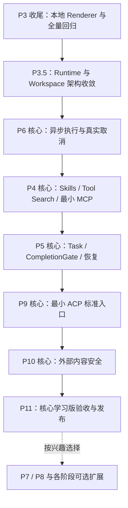
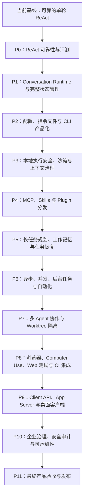

# zzm-agent 升级改进路线图

> **执行说明：进入本文档后，先查看下方“执行进度总览”，根据勾选状态确认当前进度；每次只执行一个最小任务点。任务通过验收后，必须先补齐对应功能说明文档，再将对应的 `- [ ]` 更新为 `- [x]`，不得提前勾选或一次笼统勾选多个任务。**

标记说明：

- [x] 已完成：实现、测试、文档和对应验收均已完成；
- [ ] 未完成：尚未开始、正在进行或尚未通过完整验收；
- 任务开始后仍保持 `- [ ]`，只有满足完成定义后才改为 `- [x]`；
- 每个任务点完成后必须新增或更新对应功能说明文档，并严格使用下方“功能说明文档生成 Prompt”；
- 文档的第一读者是不了解本次代码实现的项目使用者，不是代码审查者；“读者不看源码也能明白功能有什么用、什么时候生效、现在能做到什么”是文档验收条件；
- 技术细节用于开发者定位代码，必须放在通俗说明之后；不能用术语替代解释，也不能靠类名、函数名和数据结构反向说明功能；
- 每次开发新增或修改的方法都必须同步补充详细中文注释；不能只翻译方法名，必须说明用途、主要输入输出、关键状态变化、边界条件、失败行为以及它在整体流程中的位置；
- “执行进度总览”保留原 P0～P11 编号，是路线图进度的唯一状态来源；每个阶段同时列出核心任务和可选扩展，核心学习版不要求完成可选项；
- 默认从上到下执行；如果因依赖关系调整顺序，应在任务旁补充简短说明。

### 功能说明文档生成 Prompt

后续完成每个路线图任务时，使用以下 Prompt 编写对应的 `docs/<任务编号>-*.md`：

```text
请为刚完成的路线图任务编写一份中文功能说明文档。

目标读者：项目作者或普通使用者。他知道这个项目大概是做什么的，但不知道本次实现细节，也不熟悉相关技术术语。文档的首要目标是让他看懂，不是展示实现有多复杂。

写作规则：
1. 开头先用 3～5 句大白话说明：以前有什么具体问题、本次增加了什么、用户能感受到什么变化。
2. 必须提供一个从“用户做了什么”开始的完整实际例子，按时间顺序写清系统如何处理、最后用户会看到什么。不要用抽象占位符充当例子。
3. 单独增加“功能的大致流程”，从功能开始生效的入口写到最终结果，按顺序说明系统大致经过哪些阶段、每个阶段解决什么问题，以及成功、失败或冲突时分别会发生什么。这里面向普通使用者，只讲用户能理解的过程，不得用类名、函数名和字段名代替流程说明，也不能与“给开发者看的实现位置”重复。
4. 单独列出“开发前”和“开发后”的区别。描述可观察行为，不要只写内部组件变化。
5. 单独列出“现在已经能做到什么”和“现在还做不到什么”。不得把未来预留接口描述成已经可用的功能。
6. 第一次出现英文或技术术语时，必须立刻用一句日常语言解释。能用中文日常表达时，不使用术语。例如不能只写 deadline、LIFO、callback、token、checkpoint。
7. 不允许用类名、函数名、字段名或执行链路作为功能解释。读者即使跳过所有代码内容，也必须能理解前面至少 70% 的文档。
8. 通俗说明完成后，再增加“给开发者看的实现位置”，简要列出相关代码文件、关键类/函数和执行链路。每个代码名称后说明它具体负责什么。
9. 最后写测试覆盖和实际测试结果，并用普通语言说明这些测试证明了什么。
10. 避免空泛表达，如“提升健壮性”“完善机制”“统一能力”。如果使用，必须紧接具体说明：防止了什么现象，失败时会看到什么。
11. 全文优先使用短句。每段只表达一个重点。不要连续堆砌超过 3 个陌生术语。

固定结构：
- 一句话说明
- 为什么需要它
- 一个实际使用例子
- 功能的大致流程
- 开发前和开发后的区别
- 现在已经支持的能力
- 当前限制（还做不到什么）
- 给开发者看的实现位置
- 测试如何证明它有效

完成后进行一次“非技术读者检查”：隐藏“给开发者看的实现位置”一节，确认剩余内容仍能独立回答以下问题：
- 这个功能是干什么的？
- 我什么时候会用到或遇到它？
- 它具体改变了什么？
- 它从开始生效到产生结果，大致会经过什么过程？
- 它现在有什么限制？

只要其中一个问题无法从文档直接得到答案，就继续改写，不能提交文档或勾选路线图任务。
```

### 代码实现与中文注释规范

该规范适用于后续所有路线图任务，是代码验收条件的一部分：

1. 每个新增方法必须包含中文 docstring；每个被实质修改的方法也必须同步检查并补齐中文 docstring。
2. 方法注释必须说明“为什么存在、接收什么、返回什么、会修改哪些状态、失败或达到边界时怎样处理”，不能只写“执行某功能”或逐字翻译方法名。
3. 状态机、循环、自动恢复、权限、副作用、上下文压缩等复杂方法，除 docstring 外还必须在关键阶段增加中文行内注释，解释各阶段的目的和不能省略的原因。
4. 测试方法必须用中文 docstring 说明它验证的场景、关键断言和能够防止的回归问题。
5. 注释必须与当前实现一致。修改行为时同步修改注释；过期注释与缺少注释都视为任务尚未完成。
6. 注释用于解释设计意图和边界，不逐行复述代码；参数名、类名和函数名不能代替中文解释。

后续完成任务并勾选路线图前，应检查本次 Git 差异中的所有 Python 方法是否满足以上要求。

## 0. 项目定位与范围收敛（2026-07）

本路线图的目标不是把 `zzm-agent` 做成 Grok Build、Codex 或 Claude Code 的替代品，也不以功能数量、客户端数量或企业能力覆盖率作为成功标准。项目的核心目标是通过一个可运行、可测试、可解释的个人编码 Agent，深入学习并实践以下关键问题：

1. 模型调用、工具调用和 Observation 如何形成可靠的 Agent 循环；
2. 状态、消息、上下文预算、取消、权限和错误恢复如何协同；
3. 文件、Shell 和 Git 等副作用如何被统一授权、记录、检查和撤销；
4. 长任务如何让出、续段、验证完成并从检查点恢复；
5. Agent Runtime 如何与 CLI、JSONL、ACP 等入口解耦；
6. 如何使用单元测试、状态断言和 Replay 评测证明行为正确。

Grok Build 提供的主要学习价值是清晰的职责边界：界面、Agent Runtime、工具执行、Workspace、协议和持久化分别演进。本项目吸收这些边界和工程原则，但不复制其完整 TUI、企业治理、插件市场、多 Agent 集群、浏览器或桌面产品矩阵。

### 0.1 功能投入等级

后续未完成能力统一标记为以下三种投入等级，防止学习项目重新膨胀为全功能产品计划：

- **核心实现**：必须亲自完成关键模型、状态、协议和测试，不能用占位接口代替；
- **最小实现**：只完成一条端到端路径，用于理解边界和验证架构，不追求传输、平台和 UI 的完整覆盖；
- **可选实验**：只有出现明确学习问题或真实使用需求时才开发，不属于默认完成条件。

默认策略：核心实现按顺序执行；最小实现不得扩展为平台工程；可选实验可以永久不做。

### 0.2 核心学习范围

| 能力 | 投入等级 | 完成边界 |
|---|---|---|
| ReAct、错误恢复、状态机、消息分层 | 核心实现 | 已有能力持续回归，不继续堆叠启发式规则 |
| Token Budget、Artifact、Segment、自动续段 | 核心实现 | 长任务不会假完成，简单任务没有额外续跑 |
| AgentLoop 职责拆分 | 核心实现 | 模型、工具、恢复、上下文不再由一个类直接控制 |
| WorkspaceRuntime 与 EffectRecord | 核心实现 | File、Shell、Git 副作用经过统一边界并可审计 |
| RuntimeEvent 与 ExecutionJournal | 核心实现 | CLI、JSONL、Replay 共享同一事实协议 |
| TaskState、CompletionGate、恢复 | 核心实现 | 模型回复只是完成提议，证据决定是否完成 |
| 异步进程、取消和顺序工具执行 | 核心实现 | 能真正终止子进程；第一版不追求工具并发 |
| Skills 与 Tool Search | 最小实现 | 支持本地 Skill、渐进加载和按需工具暴露 |
| MCP | 最小实现 | 只支持一个 stdio Server 的发现、调用和关闭 |
| ACP | 最小实现 | 只实现 stdio 下的初始化、会话、提示、事件和取消 |
| Plugin | 最小实现 | 只做本地 Manifest、启用和禁用，不做市场与在线安装 |
| 全屏鼠标 TUI | 可选实验 | 明确保留 Grok Build 的全屏、鼠标交互终端方向；包含固定输入区、滚动时间线、工具折叠、Diff、权限弹窗、任务面板和状态栏，并保留键盘操作与纯文本降级 |
| Worktree | 可选实验 | 只在需要研究隔离执行时实现单 Agent 最小闭环 |
| 多 Agent / Swarm | 可选实验 | 默认不做，不属于项目完成条件 |
| Browser / Computer Use | 可选实验 | 默认不做，优先使用外部 MCP 或现有工具 |
| Desktop / App Server | 可选实验 | 默认不做；ACP 已能验证多入口边界 |
| Automations / 企业治理 / Telemetry | 可选实验 | 默认不做，只保留基础日志、脱敏和本地审计 |

### 0.3 收敛后的主执行路线



依赖顺序固定为：先保证当前行为正确，再拆职责；先统一副作用，再接外部工具；先建立异步取消，再连接 MCP；先建立完成门禁，再增加 Planner；先用 ACP 验证运行时与入口解耦，再决定是否需要桌面端。

### 0.4 当前代码拆分地图

以下拆分是后续 P3.5 的正式任务，不要求在 8.6 Renderer 开发中顺手完成。

| 当前模块 | 当前问题 | 目标模块 | 对应执行任务 | 拆分方式 |
|---|---|---|---|---|
| `core/agent_loop.py` | 同时负责模型请求、流解析、工具协调、权限、重试、上下文和结束判定 | `model_turn.py`、`tool_coordinator.py`、`recovery_policy.py`、`context_preparation.py` | 8.7 | 保留 `AgentLoop` 作为单 Segment 状态编排器，在 8.7 内一次完成全部职责迁移 |
| `core/runtime_state.py` | 应用、会话、Turn、Loop、权限和取消对象集中在单文件 | `state/application.py`、`state/conversation.py`、`state/turn.py`、`state/loop.py`、`state/permission.py`、`state/cancellation.py` | 8.8 | 移动定义并提供导出兼容层，不改变状态语义 |
| `cli_support/runtime.py` | 启动装配、配置、REPL、输入循环和运行控制混合 | `cli_support/bootstrap.py`、`repl.py`、`execution.py` | 8.10A | CLI 只消费 QueryEngine 和 RuntimeEvent，不直接协调 AgentLoop 内部状态 |
| `cli_support/commands.py` | Slash 命令解析、业务逻辑和展示混合 | `commands/router.py`、`commands/session.py`、`commands/git.py`、`commands/diagnostics.py` | 8.10B | 使用 CommandContext 注入依赖；命令返回结构化结果，由 Renderer 展示 |
| `cli_support/rendering.py` | 输入、补全、Renderer、主题和格式化集中 | `ui/input.py`、`ui/completion.py`、`ui/renderers/`、`ui/theme.py` | 8.10C | 8.6 只提取本地工具 Renderer；8.10C 完成目录调整 |
| `memory/store.py` | 会话、语义、情景、上下文组装和压缩协调过多 | 保留 Store 门面，拆为现有专用 Store + `context_preparation.py` | 8.7 | Memory 负责存取和检索，上下文选择与预算移交 ContextPreparationService |
| `core/tool_registry.py` | 注册、Schema、插件加载、校验、执行、超时和 cleanup 混合 | `tool_catalog.py`、`tool_validator.py`、`tool_runtime.py` | 8.7（执行边界）；后续按插件任务继续收敛 | 工具执行统一进入 ToolCallCoordinator，目录化不混入 8.7 |
| `plugins/file_ops.py`、`plugins/shell.py`、`cli_support/git_workflow.py` | 三套副作用入口，ChangeSet 无法覆盖 Shell/Git | `workspace/runtime.py`、`workspace/filesystem.py`、`workspace/process.py`、`workspace/git.py`、`workspace/effects.py` | 8.9 | 原工具改为薄适配器，所有副作用产生 EffectRecord |

拆分约束：以“执行进度总览”的单个复选框为一次开发任务边界；一个任务内列出的全部模块必须一次完成并统一验收。保留旧 import 和公开入口；先增加 characterization test；重构提交不同时增加产品功能；定向测试、Replay 和全量测试通过后才能勾选该任务。

### 0.5 如何阅读后续路线

“执行进度总览”继续保留原 P0～P11 编号和完整能力地图。P3.5 是唯一新增阶段，用于补上从 Grok Build 学到的 Runtime、Workspace 和事件边界。每个 P 模块中的 `[核心]`、`[核心最小版]` 项目构成默认学习路线；“可选扩展”完整记录尚未实现的产品能力，后续可以按兴趣单独添加，不影响核心学习版完成。

推荐执行顺序遵守依赖而不改变编号：P3 收尾 → P3.5 架构收敛 → P6 异步核心 → P4 Skills/Tool Search/最小 MCP → P5 Task/CompletionGate → P9 最小 ACP → P10 基础安全 → P11 核心验收。P7、P8 以及各阶段可选扩展不设默认完成期限。

### 0.6 从 Grok Build 学到并明确保留的可选扩展索引

以下能力全部保留在路线图中。它们不是核心学习版的完成门槛，但不能因为当前不开发就从能力地图消失：

| Grok Build 启发的能力 | 路线图位置 | 本项目可选学习方向 |
|---|---|---|
| 全屏鼠标 TUI / Pager | P6 可选扩展 G | 全屏终端、鼠标点击和滚动、固定输入区、执行时间线、工具折叠、Diff、权限弹窗、会话和后台任务面板 |
| PTY Harness | P6 可选扩展 F | 交互式命令、ANSI、窗口 resize、持续输入、Ctrl+C 和跨平台进程树终止 |
| Prompt Queue | P4 可选扩展 G | Agent 运行中排队追加消息、修改后续要求、插入中断，并定义消息归属和顺序 |
| SQLite Journal | P3.5 可选扩展 A | 事务化事件、索引、恢复游标、Schema Migration 和并发读取 |
| Hunk Tracker | P3.5 可选扩展 B | 代码块级变更来源、覆盖关系、局部 Diff 和局部撤销 |
| Codebase Graph | P3.5 可选扩展 C | import、调用、符号和文件关系图谱及增量索引 |
| Fast Worktree / Workspace Snapshot | P3.5 可选扩展 D、P7 12.1 | 快速隔离工作区、基线 Commit、测试、Diff、冲突检查和失败清理 |
| File System Notify | P3.5 可选扩展 E | 配置、指令、Skill、插件和已读文件变化监听及缓存失效 |
| MCP 多传输与治理 | P4 可选扩展 A～C | HTTP/SSE/WebSocket、多个 Server、鉴权、重连、限流、健康检查和故障隔离 |
| Plugin Marketplace | P4 可选扩展 D～E | 插件安装、卸载、版本、依赖、升级回滚、来源校验和市场索引 |
| Circuit Breaker | P6 可选扩展 C | Provider/MCP/网络工具的熔断、冷却、半开探测和手动恢复 |
| Background Task / Process | P6 可选扩展 D～E | 自动化触发、后台进程、运行历史、日志、取消和恢复入口 |
| System Power | P6 可选扩展 H | 长任务期间防休眠并在完成或崩溃后可靠释放电源锁 |
| Sub-Agent Resolution / Agent Team | P7 12.2～12.4 | 子 Agent 选择、隔离上下文、团队依赖、冲突结论和整体收敛 |
| Mermaid | P8 13.5 | Mermaid 转 SVG、终端降级、主题、字体和失败回退 |
| PDF / Image Artifact | P8 13.6 | 页级提取、缩略图、按需渲染和上下文控制 |
| Voice | P8 13.7 | 录音、转写确认、隐私、取消和高风险指令防误触 |
| ACP | P9 14.0 | 标准客户端初始化、会话、Prompt、事件、权限和取消 |
| Auth / Secrets | P2 可选扩展 B、P3 可选扩展 B、P9 14.6 | 浏览器/设备认证、Token 刷新、安全存储和凭据隔离 |
| Crash Handler | P10 15.5 | 脱敏崩溃诊断、最后事件序号、状态保存和恢复说明 |
| Tracing / Telemetry | P10 15.3、15.6 | 模型、工具、MCP、Workspace 的关联追踪、性能和成本分析 |
| Update / Announcements / Version | P2 可选扩展 C、P11 可选扩展 D/F | 更新检查、验证、切换、回滚、版本公告和迁移提示 |
| Hardened Release | P11 可选扩展 C～E | 多平台产物、签名、依赖与许可、调试符号、发布加固和可复现构建 |

## 执行进度总览

> **当前下一任务：9.5 `[核心最小版]` MCP / Skill / Plugin Renderer。**

### 当前能力基线

- [x] Native Tool Calling 驱动的 ReAct 循环
- [x] 流式与非流式模型输出
- [x] 多轮工具调用及 Observation 回填
- [x] 最大工具迭代次数限制和连续重复调用熔断
- [x] 工具风险分级、执行确认和 `auto_approve`
- [x] 结构化工具错误及有限自动重试
- [x] 工具事件、耗时、Diff、Token 和费用可观测性
- [x] 多会话、Semantic / Episodic Memory
- [x] 记忆检索、上下文压缩和 Pinned Context
- [x] PromptManager、回放测试和固定基准任务
- [x] Prompt 评估、候选生成、Diff、应用和回滚

### P0：ReAct 可靠性与评测

- [x] 5.1 ProgressMonitor 无进展检测：识别工具循环、重复结果、连续失败和多轮无新信息等停滞信号
- [x] 5.2 一次性 Reflection 纠偏：首次停滞时插入结构化反思提示，要求模型换策略而不是盲目重试
- [x] 5.3 工具错误恢复增强：细分错误类型、重试策略、退避规则和恢复建议，提升模型从失败中恢复的能力
- [x] 5.4 回放基准扩充（在 5.2、5.3 后执行）：补充权限错误、空结果循环、参数修正、反思换路和安全停止等固定评测场景
- [x] P0 阶段验收：验证 ReAct 可靠性增强不破坏权限、安全熔断、短任务性能和现有回放基线
- [ ] P0 可选扩展 A — Sampler 对照实验：在相同 Prompt、工具和随机种子条件下比较模型、temperature、reasoning effort 与重试策略，记录成功率、Token、延迟和行为差异
- [ ] P0 可选扩展 B — 性能基准：为长上下文组装、流式解析、工具 Schema 生成和 Replay 建立基准，只有测出热点后才进行缓存或底层优化

### P1：Conversation Runtime 与完整状态管理

- [x] 6.1 状态生命周期与所有权模型：定义 Application、Conversation、Turn、Loop、Task 和 WorkingMemory 的创建、修改、持久化和销毁边界
- [x] 6.2 ApplicationState / ConversationState / TurnState / LoopState：把当前散落在 AgentLoop 中的计数器、消息、权限、用量和运行状态收敛到明确状态对象
- [x] 6.3 LoopPhase / LoopTransition 正式状态机：用显式阶段和转换原因描述 ReAct 循环，支持 follow-up、reflection、stop hook、取消和失败
- [x] 6.4 运行时消息、待提交消息与持久化消息分层：区分当前执行视图、未提交消息、已提交历史和模型上下文视图
- [x] 6.5 完整 UsageState 及多作用域累计：按模型、Turn、Conversation、Task 和应用层累计 Token、调用次数和费用
- [x] 6.5.1 Prompt 输出约束与结构化回复协议：统一 system prompt 中的工具调用边界、最终回复版式和不同任务类型的回答协议
- [x] 6.6 完整 PermissionState 及权限生命周期：记录权限请求、授权、拒绝、过期、孤立请求和不同作用域的权限决定
- [x] 6.7-6.8 文件状态缓存与 Memory 加载去重：合并开发 FileStateCache 和 MemoryLoadState，统一处理路径规范化、版本、重复注入、失效和上下文来源追踪
- [x] 6.9 CancellationController 基础层级模型：为会话、Turn、模型请求和工具调用建立可传播的取消控制基础
- [x] 6.10 Hook 系统、Stop Hook 与阻塞重试保护：支持执行前后扩展点，并防止 Stop Hook 无限阻塞最终回复
- [x] 6.11 EventBus、ArtifactStore 与 CheckpointStore：统一记录事件、保存大结果/产物，并为恢复与回放提供检查点
- [x] 6.12-6.15 工具结果、进度事件与展示协议：合并开发 ToolResult、ToolProgressEvent、ToolRenderer / RendererRegistry 和 DisplayMode，统一打通模型内容、展示内容、Artifact、进度和折叠策略
- [x] 6.16 状态序列化、版本迁移与恢复协议：让 Conversation、Turn、Task 等状态可持久化、可升级并能在重启后安全恢复
- [x] 6.17-6.20 QueryEngine、ModelAdapter、StreamEvent 与 CLI 主链路迁移：合并开发跨 Turn 编排器、模型适配层、分层流事件和 CLI 主执行路径，避免先迁移 CLI 后再重改流式与模型协议
- [x] P1 阶段验收：确认完整状态体系可观察、可恢复，并保持现有同步 ReAct 调用兼容
- [ ] P1 可选扩展 A — Provider 能力协商：ModelAdapter 声明工具调用、Reasoning、Prompt Cache、上下文窗口、流式 Usage 和结构化输出差异，运行时按能力降级而不是散落 Provider 判断
- [ ] P1 可选扩展 B — Chat State 查询：在快照恢复之外支持按 Session、Turn、Tool、Artifact 和结束原因查询历史，为调试与后续 UI 提供只读视图

### P2：配置、指令文件与 CLI 产品化

- [x] 7.1 ConfigManager、Profile 与配置作用域：合并开发全局、项目、本地和托管配置，统一模型、权限、MCP、Skills、UI 和功能开关来源
- [x] 7.2 Agent 指令文件与自动记忆：支持 `AGENTS.md` / `ZZM.md` 分层加载、就近覆盖、来源审计、大小预算和跨会话自动记忆
- [x] 7.3 Slash Command 与交互式 CLI：合并开发 `/status`、`/resume`、`/sessions`、`/config`、`/permissions`、`/artifacts`、`/plan`、`/review` 等核心命令
- [x] 7.3A 终端输出分层与可降级渲染：先解决思考过程、工具执行和最终总结混排问题，建立可复用的 CLI 渲染边界
- [x] 7.3B 响应语言策略、系统语言检测与全局语言设置：支持系统 locale 默认识别、会话语言继承、用户全局语言偏好和单轮语言覆盖
- [x] 7.4 非交互 `exec`、stdin 管道与 JSON 输出：支持脚本、CI、批处理、`--json` 事件流、最终结果输出文件和 shell completion
- [x] 7.5 Git / Review / Commit / PR 工作流：合并开发 diff review、stage/unstage、commit message、branch、PR 描述和 CI 失败分析入口
- [x] P2 阶段验收：确认终端版具备可恢复、可配置、可脚本化、可审查和可日常高频使用的产品体验
- [ ] P2 可选扩展 A — Model Catalog：从 Provider 获取并缓存模型列表、能力、上下文窗口和价格信息，支持搜索与切换；离线或接口失败时保留上次可用配置
- [ ] P2 可选扩展 B — 认证流程：除 API Key 外研究浏览器/设备授权、Token 刷新、退出和本地安全存储，认证状态与 Agent Runtime 分离
- [ ] P2 可选扩展 C — 版本与公告：实现 `--version`、兼容性提示、版本化迁移公告和重要安全通知；非交互模式只能输出到结构化事件或 stderr，不污染结果

### P3：本地执行安全、沙箱与上下文治理

- [x] 8.1 工具生命周期、参数校验与权限网关：合并开发工具注册、参数 schema 校验、风险分级、权限确认、执行前后事件和结果记录
- [x] 8.2 文件系统与网络沙箱 Profile：支持 read/write/deny、workspace roots、敏感文件拒读、网络域名 allow/deny、localhost/private network 规则和 Windows/WSL 差异
- [x] 8.3 工具超时、取消与资源清理：为模型请求、Shell、文件操作、MCP 工具和后台进程提供超时、用户取消、安全检查点和清理回调
- [x] 8.4 ChangeSet、Patch 与 `/undo`：记录受管文件变更、生成可审查 Patch、支持按变更集撤销并处理冲突
- [x] 8.4A.1 统一终止原因与结束可观测性：区分 completed、yielded、blocked、failed、cancelled，所有结束路径必须显示并持久化原因
- [x] 8.4A.2 空模型回复与异常完成恢复：空内容且无工具调用不得标记完成，记录 provider finish reason，有限恢复后明确阻塞
- [x] 8.5 Token Budget、自动压缩与上下文解释：合并开发上下文预算、超长工具结果 Artifact 化、自动 compact、prompt cache 策略和上下文来源说明
- [x] 8.4A.3 SegmentResult 与安全让出：把工具轮次/上下文段上限从“终止任务”改为 yielded 检查点，不把内部换段暴露为任务失败
- [x] 8.4A.4 QueryEngine 自动续段与基础完成门禁：压缩后自动继续同一任务，只有明确完成、阻塞、失败或取消才把控制权交回用户
- [x] 8.4A 阶段验收：确认长工具任务不会静默结束或因单段轮次耗尽而假完成，简单任务无额外续跑开销
- [x] 8.6 本地工具 Renderer 合集：合并开发 FileRead、FileEdit、Search、Shell、动态活动描述和纯文本降级渲染
- [x] P3 阶段验收：确认本地工具执行有确定性安全边界、可撤销、可取消、可解释，长结果不会污染模型上下文，且所有任务结束原因可见
- [ ] P3 可选扩展 A — OS 级沙箱：在应用层路径策略之外，研究 Windows Job Object、受限进程、Linux namespace/seccomp 或容器隔离；用真实逃逸测试验证文件、进程和网络边界
- [ ] P3 可选扩展 B — Secrets Store：集中读取、引用和轮换 API Key/Token，工具只获得所需凭据句柄，敏感值不得进入 Prompt、Artifact、事件或异常文本
- [ ] P3 可选扩展 C — Git 状态加速：研究基于 Git 对象库或增量索引读取 status/diff，比较 subprocess Git 的正确性、性能和跨平台维护成本后再决定是否替换

### P3.5：Runtime、Workspace 与事件内核收敛

- [x] 8.7 `[核心]` AgentLoop 职责拆分：提取 ModelTurnDriver、ToolCallCoordinator、RecoveryPolicy 和 ContextPreparationService，AgentLoop 只保留单 Segment 状态编排
  - 完成：四个职责组件已全部提取并接入，原兼容入口、权限、Replay、流事件与上下文行为保持不变；全量测试通过。说明见 `docs/8.7-agent-loop-responsibility-split.md`。
- [x] 8.8 `[核心]` RuntimeState 拆分：按 Application、Conversation、Turn、Loop、Permission 和 Cancellation 移动定义，保留兼容导出且不改变状态语义
  - 完成：六类核心状态已迁移到 `core/state/` 独立模块，File/Memory 辅助状态移入 support，旧 `core.runtime_state` 缩减为兼容导出门面；序列化、生命周期和 Replay 行为保持不变，全量测试通过。说明见 `docs/8.8-runtime-state-split.md`。
- [x] 8.9 `[核心]` WorkspaceRuntime 与 EffectRecord：统一 File、Shell、Git 的授权、执行、变更记录、检查点和撤销边界
  - 完成：File、Shell、Git 已接入 WorkspaceRuntime，统一生成 EffectRecord；文件操作支持持久化检查点、跨进程恢复、冲突感知撤销，Git 索引操作通过同一 Effect 撤销。说明见 `docs/8.9-workspace-runtime-effects.md`。
- [x] 8.10 `[核心]` RuntimeEvent 与 ExecutionJournal：为 CLI、JSONL、Replay 和未来协议入口提供带版本、顺序号和状态关联的统一事实记录
  - 完成：RuntimeEvent 已增加 Schema 版本与状态关联，ExecutionJournal 统一分配序号、持久化、筛选和 Replay；QueryEngine 与 CLI JSON 输出共享同一事实记录。说明见 `docs/8.10-runtime-event-execution-journal.md`。
- [x] 8.10A `[核心]` CLI Runtime 拆分：把 `cli_support/runtime.py` 拆为 bootstrap、REPL 与 execution，CLI 只依赖 QueryEngine 和 RuntimeEvent
  - 完成：启动装配、交互循环和非交互执行已分别迁入 bootstrap、repl 与 execution；旧 runtime 路径保留兼容门面，新的执行入口统一经 QueryEngine。说明见 `docs/8.10A-cli-runtime-split.md`。
- [x] 8.10B `[核心]` Slash Command 拆分：把 `cli_support/commands.py` 拆为 router、session、git 与 diagnostics，并以 CommandContext 注入依赖
  - 完成：Slash Command 已迁入 commands 包，Router 使用 CommandContext 注入依赖，会话、Git 与诊断能力拥有独立模块。说明见 docs/8.10B-slash-command-split.md。
- [x] 8.10C `[核心]` UI 与 Renderer 目录拆分：把 `cli_support/rendering.py` 的输入、补全、Renderer 和主题迁入 `ui/` 分层目录
  - 完成：输入、补全、Renderer 与主题已通过 ui 分层目录提供，原 rendering 路径保留兼容门面。说明见 docs/8.10C-ui-renderer-split.md。
- [x] 8.11 `[核心]` Secret Redaction 与内容信任标签基础：敏感信息在日志和事件输出前脱敏，外部工具结果默认标记为不可信内容
  - 完成：RuntimeEvent、ToolEvent 与 ToolResult 已接入统一递归脱敏器，工具结果默认记录来源并标记为 untrusted。说明见 docs/8.11-secret-redaction-content-trust.md。
- [x] P3.5 阶段验收：重构不改变既有用户行为和 Replay 结果，所有副作用经过 WorkspaceRuntime，CLI 不再依赖 AgentLoop 私有实现
  - 完成：Replay、Workspace 副作用、CLI 依赖和兼容门面已形成可重复验收证据。说明见 docs/p3.5-architecture-acceptance.md。
- [ ] P3.5 可选扩展 A — SQLite Journal：把追加事件、Turn/Tool/Checkpoint 索引和恢复游标写入 SQLite，练习事务、并发读取、Schema Migration 和损坏恢复；核心版继续使用 JSONL，不要求数据库化
- [ ] P3.5 可选扩展 B — Hunk Tracker：记录每次文件编辑具体影响的代码块、来源 Tool Call、前后摘要和后续覆盖关系，用于精确 Diff、局部撤销和判断“某段代码是谁改的”
- [ ] P3.5 可选扩展 C — Codebase Graph：从 import、调用、符号引用和文件关系建立轻量代码图谱，先支持 Python，再评估增量更新和跨语言索引；用于研究图谱检索是否比文本搜索更有效
- [ ] P3.5 可选扩展 D — Fast Workspace Snapshot：为大仓库研究 reflink/硬链接/增量复制或 Git 对象复用，比较完整复制、Git Worktree 和增量快照的创建速度、磁盘占用与清理可靠性
- [ ] P3.5 可选扩展 E — File Watcher：监听指令文件、配置、Skill、插件和已读代码的外部变化，精确失效缓存并发布 RuntimeEvent；需要处理事件合并、编辑器临时文件和跨平台差异

### P4：MCP、Skills 与 Plugin 分发

- [x] 9.1 `[核心最小版]` MCP Client：先支持一个 stdio Server 的 initialize、工具发现、调用和 shutdown，并复用权限、超时、Artifact 与错误隔离
- [x] 9.2 `[核心]` Skills 模块化与发现状态：支持本地 Skill 格式、显式触发、渐进加载、SkillDiscoveryState、资源预算和禁用策略
- [x] 9.3 `[核心]` 工具 Schema 按需装载与 Tool Search：根据任务、Skill、MCP Server 和执行阶段延迟暴露工具，减少固定 Schema 成本；MCP 工具使用独立的 `@mcp:` 前缀模糊搜索，不混入 `$Skill` 菜单
  - 完成：MCP Schema 默认延迟暴露，可由任务、Skill、显式 `@mcp:`、模型 `tool_search` 和续段阶段启用；状态记录 Schema Token 节省，目标调用仍经过权限网关。说明见 docs/9.3-tool-schema-search.md。
- [x] 9.4 `[核心最小版]` Plugin Manifest：支持本地插件描述、Skills/MCP 配置打包、权限声明、启用和禁用
  - 完成：支持 YAML/JSON Manifest、父目录包发现、旧式 Python 插件兼容、配置覆盖启停、包内路径校验、权限声明状态，以及 Skills/stdio MCP 统一装配。说明见 docs/9.4-plugin-manifest.md。
- [ ] 9.5 `[核心最小版]` MCP / Skill / Plugin Renderer：展示来源、连接状态、激活原因、权限请求和远程错误
- [ ] P4 核心阶段验收：一个本地 Skill 和一个真实 stdio MCP Server 可端到端使用，且不能绕过核心权限和 Workspace 边界
- [ ] P4 可选扩展 A — MCP 多传输：在 stdio 验收后分别增加 Streamable HTTP、SSE 和 WebSocket，统一连接状态、请求取消、流式结果、断线语义和 Transport 无关测试
- [ ] P4 可选扩展 B — MCP 连接治理：支持多个 Server 的启动顺序、能力变化通知、自动重连、指数退避、限流、健康检查和单 Server 故障隔离，避免一个外部服务拖垮整个 Agent
- [ ] P4 可选扩展 C — MCP 鉴权与密钥：实现 OAuth、访问令牌刷新、环境变量引用、敏感字段脱敏和按 Server 的凭据边界；凭据不得进入模型上下文、Journal 或普通日志
- [ ] P4 可选扩展 D — Plugin 生命周期：支持本地安装、卸载、启用、禁用、版本约束、依赖检查、升级和失败回滚，并明确插件代码与配置的权限声明
- [ ] P4 可选扩展 E — Plugin Marketplace：实现本地或远程索引、搜索、版本展示、来源校验、安装确认和更新检查；不默认执行第三方安装脚本
- [ ] P4 可选扩展 F — Skill 智能发现：研究显式名称、任务分类、语义匹配和历史成功率等触发方式，记录为何激活、加载了哪些资源以及带来的 Token 成本
- [ ] P4 可选扩展 G — Prompt Queue：用户可在模型或工具仍运行时排队追加消息、修改后续要求或请求中断；队列必须定义消息顺序、当前 Turn 归属和取消后的处理方式

### P5：长任务规划、工作记忆与任务恢复

- [ ] 10.0 `[核心]` TaskRouter 与自动规划策略：区分 simple、standard、planned 和 durable，简单任务不承担 Planner 开销
- [ ] 10.1 `[核心]` TaskState 与 WorkingMemory：记录目标、步骤、发现、证据、产物、阻塞和压缩注入来源
- [ ] 10.2 `[核心最小版]` 外层 Planner 与重规划：只为复杂任务拆解步骤、调整计划，并保留轻量路径
- [ ] 10.2A `[核心]` TaskRunner、CompletionProposal 与 CompletionGate：模型最终回复只是完成提议，必须验证步骤、失败、验收条件和证据
- [ ] 10.3 `[核心]` 暂停、恢复与 Checkpoint：支持暂停、继续、重试和不可恢复原因报告
- [ ] 10.4 `[核心最小版]` TaskProgressRenderer：展示目标、当前步骤、证据、产物和阻塞原因
- [ ] P5 核心阶段验收：复杂任务能持续和恢复，完成状态有证据，简单任务不被强制 Planner 化
- [ ] P5 可选扩展 A — 交互式计划管理：显示新旧计划 Diff，允许确认、修改、跳过、重排和重试步骤，并记录用户干预如何改变 CompletionGate
- [ ] P5 可选扩展 B — 任务依赖图：步骤不再只有线性顺序，而是声明依赖、可并行条件、验收证据和阻塞传播；Renderer 展示当前可执行节点和关键路径
- [ ] P5 可选扩展 C — 成本与进度估算：结合历史 Replay、模型调用、工具耗时和剩余步骤估算完成比例、Token 和时间，并明确估算置信度而不是显示虚假精确值
- [ ] P5 可选扩展 D — Durable Task：任务跨进程重启继续，支持租约、恢复所有者、重复执行保护、外部状态变化检查和人工接管
- [ ] P5 可选扩展 E — 多 Planner 策略评测：比较直接执行、规则路由、单模型规划和专用规划模型，以成功率、调用成本、重规划次数和简单任务额外开销决定是否启用

### P6：异步、并发、后台任务与自动化

- [ ] 11.1 `[核心]` Async Agent Loop：实现 `async_run()`、异步模型调用和同步兼容入口；核心版工具仍按顺序执行
- [ ] 11.2 `[核心]` 异步子进程与取消传播：持续读取 stdout/stderr，支持超时、真实终止、子进程清理和 CancellationController 传播
- [ ] 11.3 `[核心最小版]` ExecutionSupervisor 与后台 ProcessHandle：统一模型、工具和进程生命周期，不实现完整任务平台
- [ ] P6 核心阶段验收：现有 CLI 行为不变，长 Shell 能被真正取消，资源与 Journal 状态完整
- [ ] P6 可选扩展 A — 只读工具并发：ToolCallScheduler 根据只读声明、路径集合和依赖关系并发执行 search/read 等工具，结果按原 Tool Call 顺序回填；所有写操作、Shell 和 Git 默认串行
- [ ] P6 可选扩展 B — 写操作冲突控制：对文件、Git index、branch 和 Workspace Checkpoint 建立资源锁与冲突检测，禁止两个任务同时修改同一目标后静默覆盖
- [ ] P6 可选扩展 C — Circuit Breaker：按 Provider、MCP Server 和网络工具统计连续失败与失败率，支持 Closed/Open/Half-Open、冷却时间、半开探测和用户手动恢复
- [ ] P6 可选扩展 D — Automations：实现一次性定时、周期任务和事件触发；记录触发来源、权限 Profile、运行历史、失败重试、错过触发处理和通知结果
- [ ] P6 可选扩展 E — 后台任务中心：列出后台进程和 Agent Task 的状态、开始时间、日志 Artifact、退出码、资源占用、取消入口和恢复入口，程序退出前明确处理仍运行的任务
- [ ] P6 可选扩展 F — PTY 终端执行：为需要交互式终端、ANSI 控制、窗口尺寸或持续输入的命令提供伪终端，处理 Windows/Unix 差异、resize、Ctrl+C、进程树终止和原始输出记录
- [ ] P6 可选扩展 G — 全屏鼠标 TUI：实现占满终端窗口的交互界面，支持鼠标点击、选择、滚轮浏览和面板切换；界面包含固定输入区、可滚动执行时间线、工具详情折叠、Diff 预览、权限弹窗、会话选择、后台任务面板和上下文/Usage 状态栏，同时保留完整键盘操作以及非 TTY 纯文本降级
- [ ] P6 可选扩展 H — 系统电源与长任务保护：长任务期间按配置阻止系统休眠，任务结束或异常退出后恢复原状态，并保证没有残留电源锁

### P7：多 Agent 协作与 Worktree 隔离

- [ ] 12.1 `[可选基础]` 单 Agent Git Worktree 隔离：记录基线 Commit，创建独立 Branch/Worktree，在隔离目录修改和运行测试，生成 Diff 与证据；合并前检查用户工作区变化、冲突和失败清理
- [ ] 12.2 `[可选进阶]` Sub-Agent / TaskTool：实现独立上下文、权限边界、Usage 汇总、取消传播和结构化结果
- [ ] 12.3 `[可选高级]` Agent Team：限制在少量角色清晰的 Agent，定义任务依赖、并行/串行调度、共享事实来源、预算上限、失败传播和主 Agent 最终核验
- [ ] 12.4 `[可选研究]` Swarm 与可视化 Renderer：研究动态分工、结论冲突、重复劳动检测、停止条件和整体收敛，并展示拓扑、状态、成本、证据及未解决分歧
- [ ] P7 可选阶段验收：只有实测证明隔离或多 Agent 带来可衡量收益时才算完成；P7 不属于核心学习版发布门槛

### P8：浏览器、Computer Use、Web 测试与 CI 集成

- [ ] 13.1 `[可选基础]` Browser Controller：通过稳定的浏览器协议完成打开页面、点击、输入、截图、DOM/可访问性树检查、控制台日志和本地 Web App 冒烟测试；每个动作记录页面和证据
- [ ] 13.2 `[可选高风险]` Computer Use：只在 CLI、API、浏览器协议和 MCP 无法完成时启用；操作前显式授权，保护密码框等敏感区域，并保存截图证据、失败回退和审计记录
- [ ] 13.3 `[可选进阶]` Web / CI / GitHub 集成：读取 CI 状态与日志、生成 PR Review、从 issue/PR 触发任务并回写结果；区分只读分析和会影响外部人员的写操作授权
- [ ] 13.4 `[可选展示]` 浏览器与 CI Renderer：把页面状态、关键截图、测试结果、PR 评论、CI 日志摘要和复现步骤关联到同一 Task，而不是只展示工具原始输出
- [ ] 13.5 `[可选可视化]` Mermaid 渲染：识别回答中的 Mermaid，转换为 SVG/终端可读降级结果，处理字体、主题、超大图和不可信图表输入；失败时保留原始源码
- [ ] 13.6 `[可选多模态]` PDF/图片查看：把 PDF 页和图片作为 Artifact，支持元数据、页级提取、缩略图和按需渲染，避免完整二进制或 OCR 文本直接进入上下文
- [ ] 13.7 `[可选交互]` 语音输入：语音只作为用户输入适配器，明确录音开始/结束、转写确认、隐私和取消；不得在未确认时把误识别文本直接作为高风险操作指令
- [ ] P8 可选阶段验收：外部 MCP 已能满足需求时无需自建；P8 不属于核心学习版发布门槛

### P9：Client API、App Server 与桌面客户端

- [ ] 14.0 `[核心最小版]` ACP stdio Server：支持 initialize、session new/load、prompt、RuntimeEvent update、permission 和 cancel，用标准客户端验证多入口共享同一 Runtime
- [ ] 14.1 `[可选基础]` App Server / 本地桥接协议：提供提交消息、取消、权限、会话、任务、Artifact 和事件订阅 API；定义版本协商、断线恢复、背压和本机访问控制
- [ ] 14.2 `[可选产品]` Desktop Client 主工作台：只作为 QueryEngine 前端，不复制状态机
- [ ] 14.3 `[可选产品]` 桌面权限、取消和工具进度界面：复用已有 Permission、Cancellation 和 Event 协议
- [ ] 14.4 `[可选产品]` Artifact / Diff / 日志 / Replay 查看器：按来源、Turn 和 Tool Call 浏览长结果、Patch、测试日志、Checkpoint 和 Replay，并支持只读导出
- [ ] 14.5 `[可选验收]` CLI、ACP、App Server 和桌面行为一致性测试：相同输入和权限决定应得到一致状态转换，客户端崩溃或断线不得改变 Runtime 结果
- [ ] 14.6 `[可选认证]` 浏览器登录与本地凭据管理：实现设备/浏览器授权、Token 刷新、退出登录和凭据存储抽象；模型、插件和普通日志不得读取原始凭据
- [ ] P9 核心阶段验收：一个 ACP Client 能完成提示、流事件、工具权限和取消；桌面端不属于核心发布门槛

### P10：企业治理、安全审计与可运维性

- [ ] 15.1 `[核心基础]` Secret Redaction、外部内容隔离与 Prompt Injection 防护：网页、MCP、日志和工具输出默认不可信并记录来源
- [ ] 15.2 `[可选企业]` Governance、Managed Config 与审计日志：区分管理员强制策略和用户配置，记录禁止覆盖项、权限决定、数据保留周期、审计查询和导出
- [ ] 15.3 `[可选运维]` Telemetry、性能指标与成本报表：在用户可关闭和隐私脱敏前提下，统计成功率、延迟、Token、费用、工具耗时、恢复次数和失败趋势，并区分本地指标与远程上传
- [ ] 15.4 `[可选发布]` SAST、依赖扫描、自定义安全 Review 和发布门禁：对源码、依赖、发布产物和密钥泄露进行检查，保留发现、处理决定和修复证据
- [ ] 15.5 `[可选稳定性]` Crash Handler：捕获未处理异常、保存脱敏诊断信息、当前状态和最后事件序号，重启时说明是否可恢复；不得上传源代码、Prompt 或密钥
- [ ] 15.6 `[可选性能]` Tracing 与性能剖析：为模型、工具、MCP、Workspace 和渲染建立关联 Span，定位延迟和资源热点；只有发现真实性能问题时才增加采样器或专用内存分配器研究
- [ ] P10 核心阶段验收：核心版只要求敏感信息不进入日志、外部内容不能提升为可信指令；企业治理不属于发布门槛

### P11：最终产品验收与发布

- [ ] 16.1 `[核心]` 核心端到端基准：代码理解、修改、测试、长任务、恢复、权限、取消、ACP 和最小 MCP
- [ ] 16.2 `[核心最小版]` 兼容性与迁移：覆盖当前主要 Windows 环境、旧会话、旧配置和旧记忆；其他平台按实际条件验证
- [ ] 16.3 `[核心]` 学习总结、用户文档、示例和故障排查：解释架构取舍、失败案例、当前边界和扩展入口
- [ ] 16.4 `[核心]` 个人学习版发布检查：安装、升级、回滚、隐私、安全、测试和已知限制
- [ ] P11 核心阶段验收：发布可长期自用的终端 Agent，不要求桌面、多 Agent、Browser、Automations 或企业能力完成
- [ ] P11 可选扩展 A — 完整兼容矩阵：在 Windows、WSL、macOS、Linux 和不同 Shell 上验证路径、权限、PTY、信号、编码、安装、升级和恢复，并明确未支持组合
- [ ] P11 可选扩展 B — 完整真实任务套件：覆盖桌面、多 Agent、Browser、CI、Automations、外部 MCP 故障和跨进程恢复，以成功率、人工接管次数、成本和耗时评估收益
- [ ] P11 可选扩展 C — 多平台发布产物：构建独立可执行文件或平台安装包，校验版本、签名、依赖、调试符号和可复现构建；源码安装继续作为基础降级路径
- [ ] P11 可选扩展 D — 自动更新：区分检查、下载、验证、切换和回滚步骤，支持稳定/预览通道；更新失败不得破坏当前可运行版本
- [ ] P11 可选扩展 E — 发布加固：研究最小权限、依赖裁剪、二进制签名、漏洞响应、第三方许可清单和安全发布 Profile，并保留可调试所需的符号与诊断信息
- [ ] P11 可选扩展 F — 公告与变更日志：启动时按版本展示重要迁移、安全公告和功能变化，记录已读状态但不干扰非交互执行
- [ ] P11 可选扩展 G — 隐私与支持流程：说明本地数据、日志、Telemetry、凭据和崩溃报告边界，提供诊断导出、数据删除、漏洞报告和已知问题入口

---

## 1. 路线图目标

zzm-agent 已经具备较完整的 ReAct 核心循环、工具执行安全底座、分层记忆、上下文压缩、Prompt 管理、可观测性和回放评估能力。

后续升级的目标不是机械复制其他 Agent 框架，而是在保持核心简单、可测试和可控的前提下，逐步提高：

- 现有 ReAct 的任务成功率和错误恢复能力；
- 本地文件与命令执行的安全性和可撤销性；
- 终端版的可配置、可恢复、可脚本化和 Git/PR 日常工作流；
- 模型、上下文、工具和外部协议的扩展能力；
- 长任务的规划、状态保持、暂停和恢复能力；
- 异步执行、并发工具和后台任务的运行效率；
- 多 Agent 协作和隔离执行能力；
- 桌面端、浏览器、CI 和企业治理等产品化能力。

Datawhale Hello-Agents、Claude Code、Codex 等项目作为设计参考，但不作为逐项复刻清单。每项升级都应对应明确的用户痛点，并通过单元测试、回放基准或可量化指标证明收益。

---

## 2. 当前能力基线

### 2.1 已完成

以下内容是“执行进度总览”中已完成基线的详细说明，不在此处重复维护勾选状态：

- Native Tool Calling 驱动的 ReAct 循环；
- 流式与非流式模型输出；
- 多轮工具调用及 Observation 回填；
- 最大工具迭代次数限制和连续重复调用熔断；
- Low / Medium / High 工具风险分级及执行确认；
- 结构化工具错误及有限自动重试；
- 工具事件、耗时、Diff、Token 和费用可观测性；
- 多会话、Semantic / Episodic Memory；
- 记忆检索、上下文压缩和 Pinned Context；
- PromptManager、回放测试和固定基准任务；
- Prompt 评估、候选生成、Diff、应用和回滚。

### 2.2 当前主要缺口

- QueryEngine 已成为 CLI 主消息入口，但未来桌面端、后台任务和多 Agent 仍需要继续接入同一入口；
- ModelAdapter 与 ModelStreamEvent 已完成基础协议，后续仍需扩展更多 provider 能力声明和 JSON/桌面事件输出；
- 缺少完整配置作用域、Profile、Agent 指令文件和跨会话自动记忆；
- CLI 缺少产品级 `/resume`、`/status`、`/config`、`/permissions`、`/review`、`exec`、JSON 输出和管道化能力；
- 工具运行时校验、OS 级沙箱、网络权限、超时和取消机制仍可加强；
- 文件变更缺少任务级统一记录和一键撤销；
- Git / PR / Code Review / CI 失败分析尚未形成日常工作流；
- 工具输出、记忆、指令文件、Skill、MCP 和历史消息尚未形成完整的分区预算与自动压缩策略；
- 尚未接入 MCP、Skills 和 Plugin 分发机制；
- 缺少 TaskState、WorkingMemory 和外层 Planner；
- Agent Loop 仍为同步执行，多个 tool call 顺序运行；
- 缺少后台任务、自动化、子 Agent、Worktree 隔离和 Swarm 编排；
- 缺少浏览器控制、Computer Use、Web/CI 集成和可复现视觉证据；
- 缺少 App Server / Client API，桌面端尚无稳定桥接协议；
- 缺少 Secret Redaction、Prompt Injection 防护、托管配置、审计日志和可运维指标。

---

## 3. 路线图原则

1. **真实痛点优先**：先解决已经出现的失败模式，再扩大能力边界。
2. **确定性机制优先**：权限、校验、超时和熔断不能只依赖模型自觉。
3. **保持 AgentLoop 聚焦**：AgentLoop 负责单次用户轮次内的 ReAct；Planner 在外层编排。
4. **短任务保持轻量**：普通问答和简单工具调用不承担 Planner、Reflection 等额外模型开销。
5. **抽象由实现推动**：BaseAgent 等统一抽象保留在正式计划中，但应基于多个真实 Agent 实现提炼。
6. **写操作默认串行**：文件写入、Shell 和存在副作用的工具不得盲目并发。
7. **状态可观察、可恢复**：长任务必须能展示进度、报告阻塞并支持恢复。
8. **兼容现有入口**：异步改造、多 Provider 和 Planner 不应破坏现有同步调用方式。
9. **每阶段可独立验收**：实现、测试、文档和回放指标同时满足后才算完成。
10. **终端版先产品化**：CLI 的恢复、配置、脚本化、Git/PR 和 review 工作流必须早于桌面 UI。
11. **多端共享同一内核**：CLI、桌面端、未来 Web UI 和自动化任务都必须通过 QueryEngine / Client API 调用同一运行时。
12. **外部内容默认不可信**：网页、MCP、日志、CI 输出和工具结果必须隔离来源，避免 prompt injection 和敏感数据外泄。
13. **所有规划能力正式保留**：后置阶段代表实施顺序，不代表可选、搁置或取消。

---

## 4. 整体演进路线



### 4.1 实际执行顺序

阶段编号表示能力分类，实际执行按依赖关系推进：

```text
5.1 ProgressMonitor（已完成）
→ 5.2 Reflection
→ 5.3 错误恢复
→ 5.4 回放基准
→ P0 阶段验收
→ P1 Conversation Runtime 与完整状态管理
→ P2 配置、指令文件与 CLI 产品化
→ P3 本地执行安全、沙箱与上下文治理
→ P4 MCP、Skills 与 Plugin 分发
→ P5 长任务规划、工作记忆与任务恢复
→ P6 异步、并发、后台任务与自动化
→ P7 多 Agent 协作与 Worktree 隔离
→ P8 浏览器、Computer Use、Web 测试与 CI 集成
→ P9 Client API、App Server 与桌面客户端
→ P10 企业治理、安全审计与可运维性
→ P11 最终产品验收与发布
```

P0 先完成现有 ReAct 的可靠性闭环；P1 收敛运行时状态，并在 6.17-6.20 把 QueryEngine、ModelAdapter、StreamEvent 和 CLI 主链路一次打通；P2 先把终端版做成可日常使用的产品，再进入更重的沙箱、生态、长任务、多端和企业能力。

### 4.2 完整概念的引入时间

| 完整概念 | 首次引入 | 后续扩展 |
|---|---|---|
| Application / Conversation / Turn / Loop State | P1 | P5 Task、P7 Child Agent |
| ModelAdapter / ModelStreamEvent | P1 | P4 MCP 工具、P6 Async、P9 Desktop |
| QueryEngine | P1 | P5 Task、P6 后台任务、P7 Multi-Agent、P9 Desktop |
| ConfigManager / Profile | P2 | P3 沙箱、P4 MCP/Plugin、P10 托管配置 |
| Agent 指令文件 / 自动记忆 | P2 | P4 Skills、P5 WorkingMemory、P10 审计 |
| CLI command / exec / JSON event | P2 | P6 自动化、P8 CI、P9 App Server |
| TerminalRenderer / TUI Shell | P2 渲染协议 | P6 异步 TUI、P9 Desktop |
| Git / Review / PR workflow | P2 | P7 Worktree、P8 CI、P10 安全扫描 |
| Loop 状态机、`needs_follow_up` | P1 | P5 Planner、P6 Async |
| Hook、Stop Hook、`stop_hook_active` | P1 | P5 Task Hook、P7 Agent Hook、P10 Governance |
| Runtime / Pending / Persisted Messages | P1 | P5 WorkingMemory、P7 Agent 消息 |
| UsageState | P1 | P5 Task Usage、P6 Automation、P7 子 Agent 汇总、P10 成本报表 |
| PermissionState | P1 | P3 权限策略、P6 自动化、P7 Agent 边界 |
| OS 沙箱 / 网络权限 Profile | P3 | P4 MCP、P7 Worktree、P10 托管策略 |
| FileStateCache | P1 | P3 ChangeSet、P7 Worktree |
| MemoryLoadState | P1 | P2 指令文件、P4 Skill References、P5 WorkingMemory |
| CancellationController | P1 同步基础 | P6 异步传播、P7 子 Agent 树 |
| EventBus / Artifact / Checkpoint | P1 | 后续全部阶段复用 |
| ToolResult 展示分层 / ToolProgressEvent | P1 | P3 本地工具、P4 MCP/Skill、P5 Planner、P6/P7 并发与 Agent |
| ToolRenderer / RendererRegistry / DisplayMode | P1 | 各阶段注册对应的专属 Renderer |
| MCP / Skill / Plugin | P4 | P5 Task Skill、P7 Agent Skill、P9 Desktop |
| TaskState / WorkingMemory | P5 | P7 分布式子任务 |
| Async / Background / Automation | P6 | P7 Agent Team、P9 Desktop、P10 运维 |
| Browser / Computer Use / CI | P8 | P9 Desktop、P10 审计 |
| Client API / App Server | P9 | 桌面端、未来 Web UI、远程控制 |
| BaseAgent | P7 | 多 Agent 类型、SDK 化 |
| Orphaned Permission Recovery | P6 | P7 子 Agent 恢复 |
| Governance / Audit / Telemetry | P10 | P11 最终发布 |

---

## 5. P0：ReAct 可靠性与评测

### 5.1 ProgressMonitor 无进展检测

在现有重复工具调用检测之上，识别：

- 连续多次不可重试错误；
- 相同工具、参数和 Observation 重复；
- 参数变化但 Observation 基本不变；
- 多个工具之间形成固定循环；
- 连续多轮没有产生新事实、文件变化或有效结果。

ProgressMonitor 只负责判断执行是否停滞，不替代最大迭代上限。

完成情况：

- [x] 新增独立 `ProgressMonitor` 和结构化 `ProgressSignal`；
- [x] 检测变化参数连续得到相同 Observation；
- [x] 检测连续不可重试失败；
- [x] 检测固定工具轮次循环；
- [x] 新结果会重置连续重复结果计数；
- [x] AgentLoop 在检测到停滞后安全持久化结果并停止；
- [x] 保留现有最大迭代和相同调用熔断机制；
- [x] 单元测试、AgentLoop 集成测试和全量回归通过。

### 5.2 一次性 Reflection 纠偏

当执行没有进展时，在熔断前插入一次结构化纠偏提示，要求模型总结已尝试方法、判断失败原因，并更换工具、参数或执行路线。

约束：

- 每个用户轮次最多触发一次；
- 不重置 `max_tool_iterations`；
- 再次无进展时立即熔断；
- 正常成功任务不增加额外模型调用；
- 不要求模型输出或持久化完整隐藏思维链。

完成情况：

- [x] ProgressMonitor 首次检测停滞时注入结构化 `REFLECTION_REQUIRED` System 消息；
- [x] 相同工具盲目重复达到限制时也先获得一次 Reflection 机会；
- [x] Reflection 提示包含停滞原因、轮次数、换路要求和阻塞报告要求；
- [x] 每个用户 Turn 最多触发一次 Reflection；
- [x] Reflection 不重置 `max_tool_iterations`；
- [x] Reflection 后再次停滞会明确标记 `after reflection` 并安全停止；
- [x] Reflection 提示只存在于当前运行上下文，不写入持久会话历史；
- [x] 正常成功任务不产生额外 Reflection 调用；
- [x] 单元测试、AgentLoop 集成测试、Replay 测试和全量回归通过。

### 5.3 工具错误恢复增强

- 区分参数、权限、超时、环境、外部服务和业务错误；
- 根据错误类型决定是否允许重试；
- 支持 Retry-After 和指数退避；
- 对确定性失败禁止盲目重试；
- 将错误摘要、尝试次数和恢复建议统一反馈给模型。

完成情况：

- [x] `ToolError` 增加 `category`、`deterministic`、`attempts` 和 `retry_after_seconds` 字段，同时保留旧 JSON 字段兼容；
- [x] 将参数错误、权限错误、超时、环境错误、外部服务错误和业务错误映射为明确分类；
- [x] 对确定性参数错误、缺失工具、权限拒绝和文件缺失等失败禁止自动重试；
- [x] 对超时和外部服务错误允许有界自动重试；
- [x] 支持异常对象上的 `retry_after_seconds` / `retry_after` 以及响应头 `Retry-After`；
- [x] 自动重试优先遵守 Retry-After，否则使用指数退避；
- [x] 最终错误结果会反馈尝试次数、错误分类、是否确定性、是否可重试和恢复建议；
- [x] 新增无磁盘依赖的错误恢复目标测试，覆盖确定性参数错误、指数退避和 Retry-After。

### 5.4 回放基准扩充

增加权限错误、相同空结果、双工具循环、参数修正恢复、主动报告阻塞、Reflection 换路和安全停止等固定场景。

完成情况：

- [x] Replay Runner 增加扩展断言，支持检查模型调用次数、Reflection 次数、ProgressSignal 原因、工具调用序列、运行时 Prompt、Retry-After 等待和工具结果 JSON；
- [x] Replay Runner 支持从 YAML 声明工具异常，覆盖真实 `tool_error_from_exception()` 错误分类路径；
- [x] Replay Runner 使用内存 Store 运行 deterministic replay，避免磁盘临时目录影响 AgentLoop 行为验证；
- [x] 新增 `07_reflection_repeated_observation.yaml`，覆盖重复 Observation 触发 Reflection；
- [x] 新增 `08_error_category_recovery.yaml`，覆盖 FileNotFoundError 分类和换工具恢复；
- [x] 新增 `09_retry_after_external_service.yaml`，覆盖外部服务 Retry-After 和重试耗尽结构化错误；
- [x] 新增 `tests/test_eval_runner.py`，验证新增 benchmark 能通过，且 runner 能发现错误期望；
- [x] 新增 `docs/5.4-replay-benchmarks.md`，说明功能作用、代码位置、执行链路、测试位置和验证结果。

### 验收标准

- 相同失败调用不会持续到最大迭代次数；
- Reflection 不绕过权限确认和硬性熔断；
- 正常短任务的调用次数和延迟无明显退化；
- 新增行为均具备确定性回放测试。

完成情况：

- [x] 目标测试通过：`tests/test_progress_monitor.py`、`tests/test_tool_error_recovery.py`、`tests/test_eval_runner.py` 共 12 个测试通过；
- [x] Replay suite 通过：9 个 replay benchmark 全部通过，成功率 100%；
- [x] 验收期间修复 replay eval 对真实临时 workspace 的依赖，replay 模式改为无磁盘写入；
- [x] 新增 `docs/p0-acceptance.md`，记录验收项、对应代码、测试结果、已知限制和进入 P1 的迁移点。

---

## 6. P1：Conversation Runtime 与完整状态管理

本阶段建立类似 QueryEngine 的正式会话运行时。它不是临时包装层，而是跨用户 Turn 状态的最终所有者。后续权限、Skills、Planner、异步和多 Agent 都在这一状态体系上扩展。

### 6.1 状态生命周期与所有权模型

正式定义五层状态及生命周期：

```text
ApplicationState
└── ConversationState
    ├── TurnState
    │   └── LoopState
    └── TaskState
        └── WorkingMemory
```

- `ApplicationState`：进程级，保存配置、模型、工具、Skills、MCP 连接和活动会话；
- `ConversationState`：会话级，跨多个用户 Turn 累积；
- `TurnState`：单次用户输入级，从提交消息到最终完成；
- `LoopState`：单个 Turn 内部的 ReAct 状态；
- `TaskState`：长任务级，跨多个 Turn 和子步骤存在；
- `WorkingMemory`：Task 内的结构化临时记忆。

每种状态必须明确：创建者、唯一所有者、允许修改者、持久化边界、恢复策略和销毁时机。

完成情况：

- [x] 新增 `zzm_agent/core/state_lifecycle.py`，定义状态范围、生命周期、持久化边界、恢复策略和状态生命周期规则；
- [x] 定义 `Application / Conversation / Turn / Loop / Task / WorkingMemory` 的父子关系、所有者、允许修改者、创建者、销毁时机和用途；
- [x] 提供 `get_state_policy()`、`state_lineage()`、`state_children()` 和 `validate_state_lifecycle_policies()` 查询与校验函数；
- [x] 新增 `tests/test_state_lifecycle.py`，固定状态层级、所有权、持久化边界和恢复策略；
- [x] 新增 `docs/6.1-state-lifecycle-ownership.md`，说明整体背景、代码位置、执行链路、测试位置和后续 6.2 边界。

### 6.2 ApplicationState / ConversationState / TurnState / LoopState

正式状态至少包含：

```text
ApplicationState
├── configuration
├── model_registry
├── tool_registry
├── skill_registry
├── mcp_connections
└── active_session_id

ConversationState
├── session_id
├── messages
├── usage
├── permissions
├── file_reads
├── skills
├── memories
├── cancellation
├── active_turn
└── active_task

TurnState
├── turn_id
├── user_input
├── status
├── usage
├── discovered_skills
├── loaded_memory_paths
├── permission_requests
├── permission_denials
├── artifacts
├── loop
├── final_response
└── error

LoopState
├── phase
├── transition
├── model_iterations
├── tool_iterations
├── reflection_count
├── current_tool_calls
├── observations
├── progress_signal
├── needs_follow_up
├── stop_hook_active
└── stop_hook_attempts
```

当前 `AgentLoop` 中的局部计数器和 `last_*` 字段逐步迁移到这些有明确作用域的状态对象。

完成情况：

- [x] 新增 `zzm_agent/core/runtime_state.py`，实现 `ApplicationState`、`ConversationState`、`TurnState`、`LoopState` 四层运行时状态对象；
- [x] 新增 `TurnStatus` 和 6.2 过渡版 `LoopPhase`，先承载状态字段和基础阶段记录，正式状态机留到 6.3 完成；
- [x] 每个运行时状态对象都提供 `policy()`，与 6.1 的 `StateScope` / `StatePolicy` 生命周期规则对齐；
- [x] `ConversationState` 支持创建、完成、失败和防重入 Turn，避免同一会话中同时存在多个活动 Turn；
- [x] `TurnState` 记录用户输入、状态、用量、Skills、Memory 路径、权限请求/拒绝、Artifacts、最终回复和错误；
- [x] `LoopState` 记录模型调用次数、工具轮次、当前工具调用、Observation、无进展信号、Reflection 次数、follow-up 标记和 Stop Hook 标记；
- [x] `AgentLoop.run()` 开始创建并更新 `last_turn_state` / `last_loop_state`，让单轮 ReAct 执行过程能被结构化观察；
- [x] 新增 `tests/test_runtime_state.py`，覆盖状态对象字段、生命周期、防重入、Loop 观测记录，以及 `AgentLoop` 的基础集成；
- [x] 新增 `docs/6.2-runtime-state-objects.md`，用中文说明整体作用、代码位置、关键类、执行链路、测试位置和验证结果。

### 6.3 LoopPhase / LoopTransition 正式状态机

正式引入状态枚举：

```text
LoopPhase:
IDLE → PREPARING → CALLING_MODEL → STREAMING_RESPONSE
→ VALIDATING_TOOL_CALLS → AWAITING_PERMISSION
→ EXECUTING_TOOLS → PROCESSING_OBSERVATIONS
→ REFLECTING → RUNNING_STOP_HOOKS
→ COMPLETED / BLOCKED / CANCELLED / FAILED
```

转换原因至少包括：

- `next_turn`；
- `tool_follow_up`；
- `reflection_retry`；
- `stop_hook_retry`；
- `completed`；
- `no_progress`；
- `iteration_limit`；
- `duplicate_call_limit`；
- `permission_denied`；
- `blocked`；
- `cancelled`；
- `error`。

`needs_follow_up` 显式表示工具执行后是否需要再次调用模型；`stop_hook_active` 和 `stop_hook_attempts` 防止 Stop Hook 无限阻止结束。所有状态转换通过集中方法执行并验证非法转换。

完成情况：

- [x] 扩展 `LoopPhase`，正式覆盖 `PREPARING`、`STREAMING_RESPONSE`、`VALIDATING_TOOL_CALLS`、`AWAITING_PERMISSION`、`PROCESSING_OBSERVATIONS`、`RUNNING_STOP_HOOKS` 和终态；
- [x] 新增 `LoopTransition`，枚举 `next_turn`、`tool_follow_up`、`reflection_retry`、`stop_hook_retry`、`completed`、`no_progress`、`iteration_limit`、`duplicate_call_limit`、`permission_denied`、`blocked`、`cancelled`、`error` 等转换原因；
- [x] 新增 `LoopTransitionError` 和 `_ALLOWED_LOOP_TRANSITIONS`，通过 `LoopState.transition_to()` 集中校验非法状态跳转；
- [x] 新增 `transition_history`，记录每次状态转换的来源、目标和原因，方便后续回放、调试和 UI 展示；
- [x] 为 `LoopState` 增加 `prepare_next_turn()`、`record_streaming_response()`、`validate_tool_calls()`、`await_permission()`、`record_permission_denial()`、`record_tool_execution_start()`、`mark_cancelled()` 和 `mark_failed()` 等状态机方法；
- [x] `AgentLoop.run()` 接入工具校验、权限等待、权限拒绝、工具执行、Observation 处理和流式响应阶段；
- [x] `needs_follow_up` 在工具 Observation 后置为 `True`，在完成、阻塞、取消或失败时清理；
- [x] `stop_hook_active` / `stop_hook_attempts` 进入 `RUNNING_STOP_HOOKS` 阶段，为后续 6.10 Hook 系统预留正式状态入口；
- [x] 扩充 `tests/test_runtime_state.py`，覆盖合法状态流、非法转换、转换原因映射、权限拒绝路径和 AgentLoop 集成；
- [x] 新增 `docs/6.3-loop-state-machine.md`，说明整体作用、代码位置、关键类/函数、执行链路、测试位置和验证结果。

### 6.4 运行时消息、待提交消息与持久化消息分层

建立完整消息模型：

```text
ConversationMessageStore
├── persisted_messages
├── runtime_messages
├── pending_messages
└── model_context_messages
```

- `persisted_messages`：已经原子提交的完整历史；
- `runtime_messages`：当前会话运行视图；
- `pending_messages`：当前 Turn 尚未提交的消息；
- `model_context_messages`：经过压缩和预算分配后发送给模型的视图。

中断时只回滚 `pending_messages`，不得破坏已提交历史；上下文压缩不得覆盖原始完整消息。

完成情况：

- [x] 新增 `zzm_agent/core/runtime_messages.py`，实现 `ConversationMessageStore` 运行时消息账本；
- [x] 明确 `persisted_messages`、`runtime_messages`、`pending_messages`、`model_context_messages` 和 `committed_messages` 的职责；
- [x] 新增 `begin_turn()`，从压缩后的模型上下文和当前用户消息创建本轮消息账本；
- [x] 新增 `append_pending()`，把当前 Turn 应提交的 user、assistant、tool 消息同时加入运行视图和待提交缓冲；
- [x] 新增 `append_runtime_only()`，支持 Reflection 等只给模型看的运行时消息，不写入真实历史；
- [x] 新增 `prepare_model_context()`，在每次模型调用前冻结当前模型上下文快照；
- [x] 新增 `commit()` 和 `rollback_pending()`，正常完成时原子提交 pending，中断时只回滚 pending；
- [x] `AgentLoop.run()` 接入消息账本，替代裸 `messages` / `turn_messages` 提交流程；
- [x] `_request_reflection()` 改为写入 runtime-only 消息，避免 Reflection 提示污染持久化历史；
- [x] 新增 `tests/test_runtime_messages.py`，覆盖消息分层、提交、回滚和输入复制隔离；
- [x] 扩充 `tests/test_runtime_state.py`，覆盖 `AgentLoop` 简单回复、工具调用和 Reflection runtime-only 集成；
- [x] 新增 `docs/6.4-runtime-message-layers.md`，说明整体作用、代码位置、关键类/函数、执行链路、测试位置和验证结果。

### 6.5 完整 UsageState 及多作用域累计

UsageState 完整记录：

- input / output tokens；
- cache creation / cache read tokens；
- reasoning tokens；
- tool schema tokens；
- 模型调用次数和工具调用次数；
- 估算费用；
- 按 Model、Turn、Conversation、Task 和 Application 聚合。

Usage 必须随 Session 和 Task 持久化，进程重启后可恢复，切换 Session 时不能串账。

已完成：

- [x] 扩展 `TokenUsage`，记录 cache creation、cache read、reasoning、tool schema、模型调用次数和工具调用次数；
- [x] 新增 `UsageState`，支持 Turn、Conversation、Task、Application 和 Model 维度累计；
- [x] 为 `UsageState` 增加 `to_record()` / `from_record()`，为后续 Session / Task 持久化恢复预留结构；
- [x] `TurnState`、`ConversationState` 和 `ApplicationState` 接入 `usage_state`；
- [x] `MemoryStore` 支持把 `UsageState` 保存到当前 Session 的 `meta.json`，并在恢复或切换 Session 时读取对应账本；
- [x] `AgentLoop` 在每次模型调用后记录 usage，在工具调用时记录工具调用次数；
- [x] `_usage_from_sdk_object()` 兼容 cache 和 reasoning token 明细；
- [x] 保留 `last_turn_usage`、`cumulative_usage` 等旧字段，兼容 CLI 和已有调用方；
- [x] 扩充 `tests/test_runtime_state.py` 和 `tests/test_agent_loop.py`，覆盖多作用域累计、模型维度、序列化恢复和 AgentLoop 接入；
- [x] 新增 `docs/6.5-usage-state.md`，说明整体作用、代码位置、关键类/函数、执行链路、测试位置和验证结果。

### 6.5.1 Prompt 输出约束与结构化回复协议

本任务尽快补强 `PromptManager` 的输出约束，让模型在调用工具和输出最终答案时遵守统一协议，减少过程文本、工具调用标记和最终回答混杂的问题。

实现要求：

- 统一新增 `[Response Protocol]` prompt section；
- 明确 Tool call 与 Final response 两种输出模式；
- 文本 fallback 工具调用必须只输出 `<tool_call>...</tool_call>`，禁止前后夹杂解释；
- 最终回答不得暴露隐藏推理、私有计划、原始 prompt 规则或 tool-call 标记；
- coding / analysis / chat 按任务意图注入不同回答版式；
- 继续保留 native tool calling，不强制把最终回复包进 XML；
- 为后续非法输出校验和自动重试预留统一入口。

已完成：

- [x] 新增 `zzm_agent/prompt/output_protocol.py`，集中生成输出协议；
- [x] 新增 `PROMPT_SECTION_RESPONSE_PROTOCOL` 常量；
- [x] `PromptManager.build()` 在工具说明之后、模板输出格式之前注入 `Response Protocol`；
- [x] 扩充 `tests/test_prompt_manager.py`，覆盖协议注入和意图专属回答版式；
- [x] 新增 `docs/6.5.1-prompt-output-protocol.md`，说明整体作用、代码位置、执行链路、测试位置和边界。

### 6.6 完整 PermissionState 及权限生命周期

正式引入：

```text
PermissionState
├── pending_requests
├── decisions
├── denials
├── session_grants
├── task_grants
├── orphaned_requests
└── has_handled_orphaned_permission
```

权限状态包括 Pending、Approved Once、Approved for Session、Approved for Task、Denied、Expired、Orphaned 和 Cancelled。

每个权限决定记录工具、参数摘要、风险、作用域、原因、时间和关联 Tool Call。历史拒绝用于避免重复申请，但不得自动变成永久拒绝。

已完成：

- [x] 新增 `PermissionStatus` 和 `PermissionScope`，覆盖 pending、approved once、approved for session、approved for task、denied、expired、orphaned 和 cancelled；
- [x] 新增 `PermissionRequest`、`PermissionDecision` 和 `PermissionState`，记录请求、决定、拒绝、session/task grant、孤立请求和孤立处理标记；
- [x] 权限记录包含工具名、参数摘要、风险、作用域、原因、时间、Turn、Task 和 Tool Call 关联信息；
- [x] 支持 `request_permission()`、`approve_request()`、`deny_request()`、`expire_request()`、`cancel_request()`、`orphan_request()`、`handle_orphaned_permissions()` 和 `find_active_grant()`；
- [x] 支持 `to_record()` / `from_record()` 序列化恢复；
- [x] `TurnState` 和 `ConversationState` 接入正式 `PermissionState`，并保留旧 `permission_requests` / `permission_denials` 兼容字段；
- [x] `AgentLoop` 在工具确认路径中记录权限 request、approval 和 denial，拒绝仍回填 `User denied tool execution.`；
- [x] 扩充 `tests/test_runtime_state.py`，覆盖授权、拒绝、grant 查找、孤立请求和序列化恢复；
- [x] 扩充 AgentLoop 权限集成测试，覆盖拒绝与同意两条路径；
- [x] 新增 `docs/6.6-permission-state.md`，说明功能作用、代码位置、执行链路、测试位置和验证结果。

### 6.7-6.8 文件状态缓存与 Memory 加载去重

这两个任务合并开发。原因是二者都在解决“运行时上下文来源已经读过什么、版本是什么、是否还能复用”的问题：FileStateCache 面向文件内容，MemoryLoadState 面向项目 Memory、嵌套 Memory、Skill Reference 和长期记忆注入。合并后可以统一处理路径规范化、版本标识、重复加载防护、失效检测和上下文来源追踪。

#### 6.7 FileStateCache 文件状态缓存

每个文件状态至少记录：

- 规范化路径；
- 内容或内容引用；
- Hash、大小、mtime、编码和行数；
- 已读取范围；
- 摘要；
- 最后读取时间；
- Agent 最后修改时间；
- 文件版本。

支持重复读取复用、部分范围读取、外部修改检测、缓存失效、Agent 写入后的缓存更新，并与 ChangeSet 和 Artifact 联动。

#### 6.8 MemoryLoadState 与嵌套记忆去重

记录：

- 已加载项目 Memory 路径；
- 已加载嵌套目录 Memory 路径；
- 已加载 Skill Reference 路径；
- 已注入 Semantic / Episodic Memory ID；
- Memory 文件版本。

支持根目录到子目录的规则继承、重复加载防护、文件变化后重新加载和上下文来源追踪。

已完成：

- [x] 新增 `FileReadRange`、`FileState` 和 `FileStateCache`，记录规范化路径、内容 Hash、大小、mtime、编码、行数、已读范围、摘要、读取时间、Agent 修改时间和缓存版本；
- [x] `read_file` 接入文件状态缓存，支持缓存复用、读取范围追加和外部修改失效后重读；
- [x] `write_file`、`file_edit` 和 `file_append` 在 Agent 写入后刷新文件缓存；
- [x] 新增 `MemorySourceRecord` 和 `MemoryLoadState`，记录项目 Memory、嵌套 Memory、Skill Reference、Semantic / Episodic Memory ID、Memory 文件版本和重复来源；
- [x] `MemoryStore.build_memory_messages()` 在每轮构建上下文时生成新的 MemoryLoadState，避免本轮重复注入同一记忆来源；
- [x] `MemoryStore.build_turn_messages()` 在 compression 元数据里返回 `memory_load_state`，供后续 QueryEngine / CheckpointStore / UI 使用；
- [x] `ConversationState.file_reads` 和 `ConversationState.memories` 从占位 dict 升级为正式状态对象；
- [x] 扩充 `tests/test_runtime_state.py`、`tests/test_plugins.py` 和 `tests/test_memory_store.py`，覆盖缓存范围、外部修改、Agent 写入刷新、Memory 来源记录、重复去重和序列化恢复；
- [x] 新增 `docs/6.7-6.8-file-memory-state.md`，说明功能作用、代码位置、执行链路、测试位置和验证结果。

### 6.9 CancellationController 基础层级模型

建立会话、Turn、Task 和 Child Token 的层级取消模型：

```text
Session Token
├── Turn Token
├── Task Token
└── Child Tokens
```

Token 支持取消原因、取消时间、子 Token、回调注册和 `raise_if_cancelled()`。本阶段先完成同步执行链路接入；异步模型请求、并发工具、后台进程和子 Agent 的完整传播在 P6、P7 扩展。

已完成：

- [x] 新增 `CancellationToken`、`CancellationController` 和 `CancellationError`，支持 Session、Turn、Task 和 Child Token 的层级取消树；
- [x] Token 记录取消原因、取消时间、父子关系，支持回调注册、取消传播、`raise_if_cancelled()` 和序列化恢复；
- [x] `ConversationState.cancellation` 从占位 dict 升级为正式 controller，`start_turn()` 会为当前 Turn 绑定取消 token；
- [x] `AgentLoop` 支持外部传入 controller，并在同步模型调用前、工具执行前、工具 retry 前后接入取消检查点；
- [x] pre-cancelled session 不会继续调用模型；工具执行前取消会回滚 pending message，并将 `TurnState` / `LoopState` 标记为 cancelled；
- [x] 扩充 `tests/test_runtime_state.py`，覆盖取消传播、回调、序列化、ConversationState 绑定和 AgentLoop 同步取消链路；
- [x] 新增 `docs/6.9-cancellation-controller.md`，说明功能作用、具体使用场景、代码位置、执行链路、测试位置和验证结果。

### 6.10 Hook 系统、Stop Hook 与阻塞重试保护

正式 Hook 类型包括：

- Session Start / End；
- Turn Start / End；
- Before / After Model；
- Before / After Tool；
- Tool Error；
- Stop。

Hook 决策包括 Continue、Block、Retry、Modify 和 Stop。Stop Hook 可以阻止模型过早结束并要求继续，但必须通过 `stop_hook_active`、`stop_hook_attempts` 和最大次数防止无限阻塞。

已完成：

- [x] 新增 `HookType`、`HookDecision`、`HookContext`、`HookResult` 和 `HookRegistry`，建立同步进程内 Hook 基础协议；
- [x] 支持 Session Start / End、Turn Start / End、Before / After Model、Before / After Tool、Tool Error 和 Stop Hook；
- [x] Hook 决策支持 Continue、Block、Retry、Modify 和 Stop，其中 Block 可阻塞当前 Turn，Modify 可修改模型消息、工具参数、工具结果或最终回答；
- [x] Hook callback 异常会被记录为 `hook_error` 并按 Continue 处理，避免观察者破坏主流程；
- [x] `AgentLoop` 接入同步 Hook 链路，覆盖模型调用、工具执行、工具错误、最终回答和 Turn/Session 结束；
- [x] Stop Hook 支持 runtime-only retry prompt，要求模型继续补一轮回答，提示不会写入持久历史；
- [x] Stop Hook 通过 `stop_hook_active`、`stop_hook_attempts` 和 `max_stop_hook_attempts` 防止无限重试，超过上限时进入 blocked；
- [x] 扩充 `tests/test_runtime_state.py`，覆盖 HookRegistry 决策、异常隔离、Stop Hook 重试、重试上限阻塞、工具参数修改和工具结果修改；
- [x] 新增 `docs/6.10-hook-system-stop-hook.md`，说明功能作用、具体使用场景、代码位置、执行链路、测试位置和验证结果。

### 6.11 EventBus、ArtifactStore 与 CheckpointStore

- `EventBus`：统一发布状态转换、模型调用、工具、权限、Hook、Usage 和取消事件；
- `ArtifactStore`：保存长工具结果、报告、Diff、日志和生成文件；
- `CheckpointStore`：保存 Conversation、Turn、Task 和 WorkingMemory 检查点。

事件和状态持久化必须区分事实记录与 UI 展示，观察者异常不得改变 Agent 行为。

### 6.12-6.15 工具结果、进度事件与展示协议

这四个任务合并开发。原因是 ToolResult 决定工具结果的数据结构，ToolProgressEvent 决定执行中事件流，DisplayMode 决定长结果如何折叠，ToolRenderer / RendererRegistry 决定这些结构最终如何展示。分开开发会反复修改同一条工具结果与 UI 事件链路；合并开发可以一次确定模型内容、展示内容、Artifact、进度、Renderer 和折叠策略之间的边界。

#### 6.12 ToolResult 展示分层

工具执行结果不得继续只用一个字符串同时服务模型和终端。正式结构至少包括：

```text
ToolResult
├── model_content：发送给模型的机器可读内容
├── display_content：供用户界面渲染的结构化内容
├── artifacts：完整日志、文件、Diff 或超长结果引用
└── metadata：退出码、路径、命中数、耗时等工具元数据
```

模型内容、用户展示和完整原始结果可以采用不同预算与格式，但必须通过同一个 Tool Call ID 关联。

#### 6.13 ToolProgressEvent

在现有 Tool Start / End / Error 事件之间加入进度事件：

```text
ToolProgressEvent
├── tool_call_id
├── sequence
├── message
├── percent
├── stdout_chunk
├── stderr_chunk
└── metadata
```

- 支持有百分比和无百分比两类进度；
- 保证同一 Tool Call 内 sequence 单调递增；
- 慢消费者不得无限积压输出；
- UI 观察者异常不得中断工具；
- 完整日志进入 Artifact，终端只保留受预算控制的实时窗口。

#### 6.14 ToolRenderer / RendererRegistry

定义完整工具渲染协议：

```text
ToolRenderer
├── render_use()：工具准备执行时展示名称、参数和权限状态
├── render_progress()：执行期间展示实时进度
├── render_result()：成功后展示专属结果
└── render_error()：失败后展示错误、恢复建议和已产生 Artifact
```

`RendererRegistry` 根据工具名称、工具类别和来源选择 Renderer，并提供：

- 本地工具专属 Renderer；
- MCP、Skill、Planner、后台任务和 Agent Renderer；
- 通用默认 Renderer；
- 纯文本降级 Renderer；
- 插件注册和名称冲突处理。

Renderer 只能消费事件和结构化结果，不得直接执行工具或修改核心状态。

#### 6.15 DisplayMode 与折叠策略

正式定义展示模式：

```text
INLINE
COLLAPSED
STREAMING
SUMMARY_ONLY
HIDDEN
```

每种工具可以声明：

- 默认展示模式；
- 最大预览行数和字符数；
- 是否属于 Search / Read 类工具；
- 是否保留实时输出；
- 是否生成完整 Artifact；
- 用户是否可以切换展开状态。

终端暂不支持交互展开时，应显示摘要、被隐藏的数量和 Artifact 路径，不能静默丢弃内容。

完成情况：

- [x] 新增 `zzm_agent/core/tool_results.py`，定义 `ToolResult`、`ToolProgressEvent`、`ToolProgressEmitter`、`DisplayMode`、`DisplayPolicy`、`ToolRenderer`、`RendererRegistry` 和默认纯文本 Renderer；
- [x] `AgentLoop` 在工具回填前创建结构化 `ToolResult`，并通过 `to_model_message()` 保持原有模型 tool result 协议兼容；
- [x] `TurnState.tool_results` 和 `AgentLoop.last_tool_results` 可观察每次工具调用的模型内容、展示内容、状态和 metadata；
- [x] `ToolProgressEmitter` 保证同一 Tool Call 内进度 `sequence` 单调递增，并通过 `EventBus` 发布 `tool.progress` 事件，同时限制本地缓冲长度；
- [x] `RendererRegistry` 支持按工具名、类别、来源选择 Renderer，并提供纯文本降级 Renderer；
- [x] 新增 `tests/test_tool_results.py` 并扩充 `tests/test_runtime_state.py`，验证结构化结果、进度事件、Renderer 选择和 AgentLoop 兼容性；
- [x] 新增 `docs/6.12-6.15-tool-result-display-protocol.md`，说明使用场景、代码位置、执行链路、测试位置和已知边界。

### 6.16 状态序列化、版本迁移与恢复协议

- 所有持久状态具有 Schema Version；
- 支持向后兼容迁移；
- 使用原子写入和损坏文件隔离；
- 明确哪些运行中状态可以恢复；
- 不可恢复状态转换为 Blocked 或 Failed 并给出原因；
- 恢复时校验工作区、文件版本、权限和 Artifact。

完成情况：

- [x] 新增 `zzm_agent/core/state_serialization.py`，提供 `StateEnvelope`、`StateSnapshotStore`、`migrate_state_record()`、`RecoveryValidator` 和恢复判定结构；
- [x] 为 `LoopState`、`TurnState`、`ConversationState`、`ApplicationState` 增加 `to_record()` / `from_record()`，覆盖 Usage、权限、文件缓存、记忆、取消 token、事件、Artifact、Checkpoint 和 active turn；
- [x] 快照文件通过 `StorageIO` 写入，复用原子替换、`.bak` 备份和损坏 JSON 隔离；
- [x] 运行中 Turn 默认要求 checkpoint；中间阶段、缺失 Artifact、记忆文件版本变化、工作区缺失会分别返回 Blocked 或 Failed；
- [x] 新增 `tests/test_state_serialization.py`，覆盖 schema version、旧记录迁移、checksum 防篡改、损坏文件隔离、Conversation roundtrip 和恢复判定；
- [x] 新增 `docs/6.16-state-serialization-recovery.md`，说明使用场景、示例、执行链路、恢复规则、测试和当前边界。

### 6.17-6.20 QueryEngine、ModelAdapter、StreamEvent 与 CLI 主链路迁移

这四个任务合并开发。原因是 QueryEngine 会成为跨 Turn 会话入口，而模型适配、分层流事件和 CLI 主链路是同一条执行链路上的协议边界。如果先迁移 CLI，再补 ModelAdapter 和 StreamEvent，后续很容易重复改动流式输出、reasoning 展示、工具调用和恢复逻辑。合并开发时仍需要保留兼容入口，保证现有 REPL、Session、Slash Command 和 AgentLoop 测试持续可用。

#### 6.17 ModelAdapter 与模型能力声明

引入统一模型适配层，隔离 OpenAI、OpenRouter、Anthropic、本地模型等 provider 的响应差异：

```text
ModelAdapter
├── ModelCapabilities
├── request/response normalize
├── stream chunk normalize
├── reasoning/content/tool_call mapping
└── provider error mapping
```

主要职责：

- 统一模型请求、流式 chunk、工具调用、usage 和错误结构；
- 声明模型是否支持 reasoning、tool call、json schema、vision、parallel tool calls、prompt cache 等能力；
- 将 provider 原始响应转换为内部标准事件；
- 让 QueryEngine 和 CLI 不直接依赖某个 SDK 的响应形状；
- 为后续模型热切换、降级、回放和测试 fake model 提供稳定接口。

#### 6.18 ModelStreamEvent 分层协议

正式区分流式输出中的不同语义层：

```text
ModelStreamEvent
├── status
├── reasoning_summary
├── content_delta
├── tool_call_delta
├── tool_result
├── usage
├── final_message
└── error
```

主要职责：

- 将“思考摘要/推理说明”和“最终回答内容”分开传递；
- 将工具调用参数增量、工具结果、状态提示和最终消息分开；
- CLI 可以用不同样式渲染，桌面端可以放到不同面板；
- EventBus 可以继续发布内部运行事件，但模型流事件负责用户可见输出；
- 回放测试可以断言事件序列，而不是解析混在一起的字符串。

#### 6.19 QueryEngine 会话编排器

正式引入 QueryEngine：

```text
QueryEngine
├── ApplicationState
├── ConversationState
├── BaseAgent / AgentLoop
├── Model
├── ToolRegistry
├── SkillRegistry
├── HookRegistry
└── EventBus
```

主要职责：

- 接收用户消息并创建 TurnState；
- 管理跨 Turn 的 ConversationState；
- 调用 AgentLoop；
- 管理消息提交、Usage、权限、Skills、Memory 和取消；
- 处理 Stop Hook、孤立请求和恢复；
- 在 Turn 边界调用 StateSnapshotStore，完成 6.16 状态快照的真实落地；
- 为 Planner、后台任务和 Sub-Agent 提供统一入口。

AgentLoop 只负责一个 Turn 内部的 ReAct，不再承担跨 Turn 会话编排。

#### 6.20 CLI 主链路迁移到 QueryEngine

- REPL 通过 `QueryEngine.submit_message()` 运行；
- Session 切换、取消、模型切换和 Slash Commands 通过 QueryEngine 更新状态；
- CLI 不直接拼装多个核心对象的内部状态，也不再解析 provider 原始流；
- CLI 根据 ModelStreamEvent 分层渲染状态、reasoning、正文、工具调用和最终结果；
- 断点恢复、会话恢复和中断回滚通过 QueryEngine 调用 StateSnapshotStore；
- 保留兼容入口，迁移期间现有命令和测试持续可用。

#### 完成记录

- [x] 新增 `zzm_agent/core/model_adapter.py`，提供 `ModelCapabilities`、`ModelRequest`、`ModelResponse`、`ModelStreamChunk` 和 OpenAI-compatible adapter；
- [x] 新增 `zzm_agent/core/model_stream.py`，定义 status、reasoning_summary、content_delta、tool_call_delta、tool_result、usage、final_message 和 error 分层事件；
- [x] `AgentLoop.run()` 增加 `on_stream_event`，保留 `on_text_chunk` 兼容，并保证伪 XML 工具调用不会作为正文流式渲染；
- [x] 新增 `zzm_agent/core/query_engine.py`，提供 `QueryEngine.submit_message()`、`QueryResult` 和 Turn 边界 snapshot 保存；
- [x] CLI 主执行路径优先通过 QueryEngine 提交消息，保留旧 `loop.run()` 降级路径；
- [x] 新增 `tests/test_query_engine_streaming.py`，覆盖 adapter 归一化、分层流事件、原生 tool call delta、伪 XML 隐藏和 QueryEngine snapshot；
- [x] 新增 `docs/6.17-6.20-query-engine-model-stream.md`，说明使用场景、模块边界、执行链路、兼容策略和测试命令。

### 验收标准

- 五种状态作用域及其所有权清晰可测试；
- 非法 Loop 状态转换会被拒绝；
- `needs_follow_up`、Reflection、Stop Hook 和结束原因均可观察；
- Pending 消息可以原子提交或中断回滚；
- Usage、权限拒绝、文件缓存和 Memory 加载状态可持久化恢复；
- 取消能够从 Session 传播到同步 Turn 和工具检查点；
- ToolResult 的模型内容、展示内容和 Artifact 不再互相混用；
- ToolProgressEvent 可以按顺序驱动实时 UI；
- RendererRegistry 能选择专属、默认和纯文本降级 Renderer；
- DisplayMode 能控制长结果折叠而不丢失完整内容；
- ModelAdapter 能屏蔽 provider SDK 响应结构差异；
- ModelStreamEvent 能区分 status、reasoning、content、tool_call、final 和 error；
- QueryEngine 成为 CLI 的统一会话入口；
- StateSnapshotStore 被 QueryEngine 在真实 Turn 边界调用，不只停留在协议和单测层；
- 现有 ReAct、Session、Memory 和回放测试保持兼容。

---

## 7. P2：配置、指令文件与 CLI 产品化

P2 的目标是让终端版先成为可日常使用的产品，而不是只有一个能跑 AgentLoop 的入口。Claude Code 和 Codex 的共同经验是：用户每天依赖的是可恢复会话、清晰配置、项目指令、权限命令、review、git、脚本化和 CI 接口。没有这些，后面的桌面端也只是在不稳定内核上套 UI。

### 7.1 ConfigManager、Profile 与配置作用域

建立统一配置系统，覆盖全局、项目、本地和托管/管理员作用域。配置项至少包括模型、reasoning effort、权限 profile、沙箱 profile、MCP server、Skills、Plugin、CLI UI、日志、自动化和默认验证命令。

验收要求：

- [x] 配置加载有明确优先级和来源审计；
- [x] CLI 能显示当前生效配置；
- [x] 项目配置可以提交到仓库，本地配置默认不提交；
- [x] 托管配置可以声明不可被用户覆盖的安全要求。

完成记录：

- [x] 新增 `zzm_agent/core/config.py`，提供 `ConfigManager`、`ConfigScope`、`ConfigSource`、`ConfigOrigin` 和 `ConfigLoadResult`；
- [x] `load_config()` 迁移到 ConfigManager，同时保留旧函数入口和 `--config` / `ZZM_AGENT_CONFIG` 兼容行为；
- [x] 支持 global、project、local、managed 作用域合并，记录 `_config_sources`、`_config_origin` 和 `_config_locked`；
- [x] 支持 `${ENV:-default}` 展开和 `ZZM_AGENT_PROFILE` profile 覆盖；
- [x] 新增 `/config` 命令显示当前关键配置、来源和锁定信息；
- [x] 新增 `tests/test_config_manager.py`，扩充 `tests/test_cli.py`；
- [x] 新增 `docs/7.1-config-manager-profile.md`，说明问题、例子、链路、关键数据结构和验证结果。

### 7.2 Agent 指令文件与自动记忆

支持 `AGENTS.md` / `ZZM.md` 这类 repo 指令文件，按目录层级加载并允许就近覆盖。自动记忆用于保存跨会话稳定事实，例如构建命令、测试入口、常见故障和用户偏好；它不能替代指令文件，也不能静默覆盖显式指令。

验收要求：

- [x] 启动时能列出加载的指令文件和优先级；
- [x] 指令文件有大小预算和截断提示；
- [x] 自动记忆有创建、查看、删除、禁用和来源记录；
- [x] nested repo / monorepo 的就近规则可测试。

完成记录：

- [x] 新增 `zzm_agent/memory/instructions.py`，提供 `InstructionManager` 和 `InstructionFile`，支持 `AGENTS.md` / `ZZM.md` 从 workspace root 到当前目录的层级加载；
- [x] `MemoryStore.build_turn_messages()` 接入项目指令文件和自动记忆，并通过 `MemoryLoadState` 记录来源、版本、截断和重复信息；
- [x] 语义记忆新增 `source` 和 `enabled` 元数据，支持禁用后保留但不注入上下文；
- [x] 新增 `/instructions`、`/memory-disable`、`/memory-enable`，增强 `/semantic` 和 `/config` 的来源展示；
- [x] 默认配置新增 `memory.instruction_files`、`memory.instruction_max_chars` 和 `memory.auto_memory_enabled`；
- [x] 扩充 `tests/test_memory_store.py` 和 `tests/test_cli.py`，覆盖指令加载、预算截断、来源审计和自动记忆启停；
- [x] 新增 `docs/7.2-agent-instructions-auto-memory.md`，说明问题、例子、执行链路、关键数据结构、边界和验证结果。

### 7.3 Slash Command 与交互式 CLI

合并开发核心 CLI 命令：`/status`、`/resume`、`/sessions`、`/config`、`/permissions`、`/artifacts`、`/plan`、`/review`、`/undo`、`/tools`、`/skills`、`/mcp`。这些命令都应通过 QueryEngine 或统一服务层读取状态，而不是直接扒内部字段。

验收要求：

- [x] 用户能恢复最近会话、查看当前 Turn、切换权限和打开 Artifact；
- [x] `/review` 能对未提交改动、暂存区或指定 commit 做只读审查；
- [x] `/plan` 能在编辑前展示计划并允许用户确认；
- [x] 命令输出在无 Rich 环境下仍可读。

完成记录：

- [x] 新增 `/status`、`/resume`、`/permissions`、`/artifacts`、`/plan`、`/review`、`/undo`、`/skills` 和 `/mcp` 命令；
- [x] `/status` 展示 session、model、workspace、stream、tools、context window、active turn 和 usage；
- [x] `/resume` 支持无参数恢复最近历史会话，或指定 session id；
- [x] `/permissions` 通过 QueryEngine / runtime 权限账本展示 pending、decisions、denials 和 grants；
- [x] `/artifacts` 支持列表、预览和 `--full` 完整输出；
- [x] `/plan` 只读展示 active task 或本地 `task.md` / `implementation_plan.md`；
- [x] `/review` 读取 git diff，并通过 QueryEngine 发起只读审查请求；
- [x] `/undo`、`/skills`、`/mcp` 对尚未接入的后续能力给出明确占位提示；
- [x] 更新 help 和 slash completion；
- [x] 新增 `docs/7.3-slash-command-interactive-cli.md`，说明问题、例子、命令边界、执行链路和验证结果。

### 7.3A 终端输出分层与可降级渲染

先做轻量但关键的终端输出整理，不在这一阶段重构成全屏 TUI。目标是解决当前思考过程、工具执行、状态提示和最终总结混在一堆文本里的问题，并为后续 `exec --json`、P6 异步 TUI 和桌面端共用同一套展示语义打基础。

这一阶段应基于 `ModelStreamEvent`、`ToolProgressEvent`、`ToolResult` 和 `RendererRegistry` 建立 CLI 渲染边界。CLI 渲染层只能消费结构化事件，不应直接解析 AgentLoop 的自然语言输出，也不应修改核心运行状态。

验收要求：

- [x] 思考摘要、状态提示、工具执行记录、工具结果、正文增量和最终总结按事件类型分区渲染；
- [x] 最终总结前有清晰分隔线，用户能一眼区分执行过程和最终结论；
- [x] 工具执行使用统一样式展示 `Running`、`Ran`、`Failed`、`Cancelled`，命令正文弱化显示，关键状态更醒目；
- [x] 长工具输出走折叠、摘要或 Artifact 引用，不把 transcript 和模型上下文冲爆；
- [x] 支持 `TerminalRenderer` / `PlainTextRenderer` 分层：有 TTY 和 Rich 时使用增强样式，无 TTY、无 Rich、CI、管道或重定向环境自动降级为普通文本；
- [x] 降级文本仍保留事件顺序、工具状态、最终总结和错误信息，便于日志、CI 和脚本消费；
- [x] 本阶段不实现固定底部输入框、不在同步 AgentLoop 外包线程做完整 TUI，也不承诺 Esc 能立即终止所有同步工具；这些放到 11.6。

完成记录：

- [x] 新增 `PlainTextRenderer`、`TerminalRenderer` 和 `build_terminal_renderer()`；
- [x] `run_repl()` 的 `on_stream_event` 改为消费完整 `ModelStreamEvent`，不再只处理 `CONTENT_DELTA`；
- [x] 支持 `reasoning_summary`、`tool_call_delta`、`tool_result`、`content_delta`、`final_message` 和 `error` 分层渲染；
- [x] 最终消息前输出 Rich Rule 或纯文本 `---` 分隔线；
- [x] 非 Rich console 或非 TTY 输出自动选择 `PlainTextRenderer`；
- [x] 保留旧 `on_text_chunk` fallback；
- [x] 新增 `docs/7.3A-terminal-renderer.md`，说明问题、例子、事件链路、数据结构和验证结果。

### 7.3B 响应语言策略、系统语言检测与全局语言设置

让 Agent 的回答语言像 Codex / Claude Code 一样自然：普通问题跟随用户输入语言，`/review`、`/plan`、`exec` 这类没有自然语言正文的命令继承会话语言或系统语言，而不是每个命令各自硬编码“请用中文回答”。

参考方向：

- Claude Code 官方设置体系包含用户、项目、本地、托管等作用域，适合承载个人偏好；它的 Output style 属于 system prompt 的一部分，说明“回答风格/语言偏好”应该在模型指令层生效，而不是渲染层临时改文本。
- Codex 使用 `config.toml`、项目配置、`AGENTS.md`、rules、memories 等层级承载长期偏好和项目指令；响应语言也应采用“配置默认值 + 会话记忆 + 本轮输入覆盖”的链路。

语言决策优先级：

1. 用户本轮显式要求最高，例如“用英文回答”“下面用中文”；
2. 当前自然语言输入检测，例如中文字符占比高则本轮输出中文；
3. 当前会话最近一次明确语言，例如用户一直中文交流，则 `/review` 继承中文；
4. 全局配置 `ui.response_language`，支持 `auto`、`zh-CN`、`en-US` 等；
5. 系统 locale / 环境变量 fallback，例如 Windows UI 语言、`LANG`、`LC_ALL`；
6. 项目默认值 fallback，仍无法判断时用 `zh-CN` 或配置默认语言。

功能范围：

- 新增 `ResponseLanguagePolicy` 或同等模块，负责检测、解析显式语言指令、读取配置和输出本轮语言决策；
- 新增会话级 `response_language` 字段，记录最近一次自然语言偏好，供 slash command、非交互 `exec` 和自动任务继承；
- 在 `AgentLoop` / `QueryEngine` 构造本轮 runtime-only system message，明确“最终回答使用某语言，代码、命令、路径、错误信息保持原文”；
- 在 `config.yaml` / ConfigManager 中增加全局语言设置，例如 `ui.response_language: auto`、`ui.default_locale_language: zh-CN`；
- 在 `/config` 中展示当前语言策略、系统检测结果、会话继承语言和手动设置值；
- 支持用户在问题中临时覆盖语言，但只影响当前会话/当前轮，不自动写入全局配置，除非用户明确要求“以后都用某语言”；
- `/review` 不再单独指定中文或英文，只提交审查任务，由统一语言策略决定最终总结语言；
- `exec --json` 后续需要在事件 metadata 中输出 `response_language`，方便桌面端和日志回放解释语言来源。

验收标准：

- [x] 中文系统或中文会话中直接输入 `/review`，最终 review 总结为中文；
- [x] 英文问题触发的普通问答最终回答为英文；
- [x] 用户输入“用英文回答：解释项目结构”时，本轮使用英文，但不会永久覆盖全局设置；
- [x] 用户配置 `ui.response_language: zh-CN` 后，slash command、review、exec 默认中文；
- [x] 用户配置 `ui.response_language: auto` 时，优先根据本轮输入和会话语言自动判断；
- [x] `/config` 能看到语言来源：explicit / input_detected / session / config / system_locale / default；
- [x] 新增 `docs/7.3B-response-language-policy.md`，说明问题、例子、配置项、执行链路、数据结构和验证结果。

### 7.4 非交互 `exec`、stdin 管道与 JSON 输出

提供可脚本化入口，例如：

```text
zzm exec "fix CI failure"
git diff --name-only | zzm exec --stdin "review these files"
zzm exec --json "summarize repo"
```

验收要求：

- [x] 支持 stdin、非交互最终结果、JSON event stream 和退出码；
- [x] 支持输出最终消息到文件；
- [x] 非交互模式无法弹出新权限时必须失败并说明原因；
- [x] 支持 shell completion 和 prompt history。

已落地行为：

- 新增 `zzm-agent exec` 子命令，支持一次性提交任务，不进入 REPL；
- 新增 `--stdin`，将标准输入内容合并到任务 prompt，适合管道接收 `git diff`、日志、文件列表和测试输出；
- 新增 `--json`，按 JSONL 输出 `ModelStreamEvent`，最后输出 `type=result` 记录，包含最终回答和语言来源；
- 新增 `--output/-o`，将最终 assistant message 写入文件，适合生成 review 报告、commit message 草稿或 CI 摘要；
- `exec` 复用 `QueryEngine`、`AgentLoop`、配置、记忆、语言策略、状态快照和事件模型，与 REPL 使用同一运行时；
- `exec` 使用非交互权限确认回调，需要人工批准的工具不会弹出菜单或卡住 CI，而是被拒绝并回写给模型；
- 新增 `zzm-agent completion [bash|zsh|powershell]`，输出轻量 shell completion 脚本；
- REPL 继续使用 `prompt_toolkit` 文件历史；`exec` 不写交互输入历史，避免 CI 或脚本把大量日志污染人工 prompt history；
- 新增 `docs/7.4-non-interactive-exec-json.md`，说明使用场景、失败模式、执行链路、事件结构、对应代码和测试位置。

### 7.5 Git / Review / Commit / PR 工作流

把 Git 作为一等工作流，而不是 Shell 的偶然副作用。支持 diff review、stage/unstage、commit message、branch、PR description、CI failure analysis 和 release notes。

验收要求：

- 所有写 Git 操作都可确认和回滚；
- Review 默认只读，不修改工作区；
- commit/PR 描述引用测试结果和关键变更；
- CI 失败分析能关联日志 Artifact 和建议修复。

完成记录：

- [x] 新增 `GitWorkflow` 与 `GitSnapshot`，统一读取 branch、status、staged diff 和 unstaged diff；
- [x] 新增 `/git status|stage|unstage|undo`、`/stage` 和 `/unstage`，index 写操作复用运行时确认入口并支持最近一次操作反向回滚；
- [x] 新增 `/commit-message`、`/branch` 和 `/pr` 只读草稿入口，要求检查 diff 与测试证据，不直接创建 commit、分支或远程 PR；
- [x] 新增 `/ci <log-file>`，将完整日志保存为 `ci-log` Artifact，并生成包含根因、相关代码、最小修复和验证命令的分析；
- [x] Git 子进程使用参数数组和 `--` 路径分隔，拒绝以 `-` 开头的路径参数，避免 Shell 与 option 注入；
- [x] 新增 `tests/test_git_workflow.py` 并扩充 `tests/test_cli.py`，全量回归结果为 `310 passed, 2 skipped`；
- [x] 新增 `docs/7.5-git-review-commit-pr-workflow.md`，说明问题、端到端例子、执行链路、数据结构、安全边界和验证结果。

### 验收标准

- 终端用户能从启动、配置、执行、审查、提交到恢复形成闭环；
- CLI 与 QueryEngine 使用同一状态和权限系统；
- 用户能清楚区分执行过程、工具输出和最终结论；
- 脚本化入口可用于 CI；
- 配置、指令和记忆的来源可解释。

完成记录：

- [x] 新增 `tests/test_p2_acceptance.py`，从用户闭环验证配置来源、项目指令、会话恢复、JSONL、渲染分层、Git 回滚和 CI Artifact；
- [x] 确认 REPL、slash command 与非交互 `exec` 共享 QueryEngine、ConversationState 和权限入口；
- [x] 确认 Git index 写操作需要确认且可逆，review、commit/branch/PR 草稿和 CI 分析保持只读边界；
- [x] 新增 `docs/p2-acceptance.md`，说明用户痛点、端到端例子、执行链路、关键数据结构、边界和验证证据；
- [x] 阶段定向测试 `4 passed`，全量回归 `314 passed, 2 skipped`。

---

## 8. P3：本地执行安全、沙箱与上下文治理

P3 处理本地执行的硬边界。PermissionState 只是账本，不能替代 OS 级沙箱、路径边界、网络访问控制和工具参数校验。

### 8.1 工具生命周期、参数校验与权限网关

统一链路：

```text
tool call -> 参数解析 -> schema 校验 -> 风险分级 -> 权限确认 -> 执行 -> ToolResult -> EventBus / Artifact / Checkpoint
```

验收要求：

- 无效参数不会进入工具函数；
- 高风险工具必须经过权限策略；
- MCP、内置工具和未来插件工具都走同一网关；
- 工具调用前后都有可回放事件。

完成记录：

- [x] ToolRegistry 注册 schema 增加 `additionalProperties=false`，统一拒绝模型虚构的额外参数；
- [x] 新增 `validate_arguments()`，在函数执行前校验必填项、未知字段与基础 JSON 类型，且不做隐式类型转换；
- [x] `ToolRegistry.call()` 强制经过校验，使内置工具、插件工具和未来适配器不能绕过入口；
- [x] AgentLoop 在 BEFORE_TOOL hook 后、权限确认前执行校验，无效高风险调用不会请求授权或发出 `tool.start`；
- [x] 新增 `ToolArgumentValidationError` 结构化错误语义，并保持既有 argument recovery hint 兼容；
- [x] 扩充 `tests/test_tool_registry.py` 和 `tests/test_agent_loop.py`，最终定向回归 `56 passed`，全量回归 `317 passed, 2 skipped`；
- [x] 新增 `docs/8.1-tool-lifecycle-permission-gateway.md`，说明真实问题、执行链路、事件语义、代码位置与阶段边界。

### 8.2 文件系统与网络沙箱 Profile

支持 read/write/deny、workspace roots、敏感文件拒读、网络域名 allow/deny、localhost/private network 规则、Unix socket 或 Windows 特殊路径策略。Windows、WSL、macOS/Linux 的能力差异必须文档化。

验收要求：

- `.env`、密钥目录和显式 deny 路径不可读；
- 写入默认限制在 workspace roots；
- 网络默认关闭或按 profile 限制域名；
- 沙箱失败能请求受控升级而不是静默绕过。

完成记录：

- [x] 新增核心 `SandboxProfile`，统一 workspace roots、显式 deny、敏感路径和网络边界；
- [x] 文件与搜索插件统一复用 `authorize_path()`，默认拒读 `.env`、`.ssh`、云凭据目录和私钥名称；
- [x] 写操作默认限制在 workspace roots，并继续防止真实路径和符号链接父目录逃逸；
- [x] 新增 `authorize_url()`，网络默认关闭，支持域名 allow/deny、localhost、loopback、private/link-local 独立策略；
- [x] `SandboxViolation` 进入结构化 permission 错误，明确要求受控 Profile 变更或显式升级，禁止静默绕过；
- [x] 记录 Windows、WSL、Unix 路径分隔、符号链接、socket 与应用层/OS 层沙箱差异；
- [x] 新增 `tests/test_sandbox_profile.py` 并扩充插件安全测试，定向回归 `43 passed, 2 skipped`，全量回归 `323 passed, 2 skipped`；
- [x] 新增 `docs/8.2-filesystem-network-sandbox-profile.md`，说明场景、链路、配置、边界与验证结果。

### 8.3 工具超时、取消与资源清理

为模型请求、Shell、文件操作、MCP 工具和后台进程设置超时和取消机制。不能强制停止的同步工具必须在下一安全检查点停止，并报告无法立即停止的原因。

完成记录：

- [x] 工具注册元数据支持 `timeout_seconds`，并在统一调用入口使用单调时钟执行 deadline 检查；
- [x] `CancellationToken` 贯穿 AgentLoop 与 ToolRegistry，在执行前后和重试等待边界设置安全检查点；
- [x] 兼容不接受取消参数的自定义/测试注册器，通过能力检测在调用前后保留取消检查；
- [x] 支持按工具注册 cleanup callback，并保证成功、失败、超时或取消时均按 LIFO 顺序清理；
- [x] deadline 超时和 cleanup 失败具有明确、非静默的结构化错误语义；
- [x] 新增并扩充工具注册、AgentLoop、运行状态、错误恢复、Replay 与 Eval 测试，专项回归 `98 passed`，全量回归 `327 passed, 2 skipped`；
- [x] 新增 `docs/8.3-tool-timeout-cancellation-cleanup.md`，说明执行链路、配置方式、安全检查点、清理协议与阶段边界。

### 8.4 ChangeSet、Patch 与 `/undo`

所有受管写操作生成 ChangeSet，记录 before/after hash、Patch、tool call、Turn 和撤销状态。`/undo` 必须检测文件是否已被用户或外部工具改动。

完成记录：

- [x] 新增持久化 `ChangeSetStore`，在成功的 `file_edit`、`write_file`、`file_append` 工具调用后记录文件内容、前后 SHA-256 摘要、统一 diff、工具调用 ID、会话、Turn 和撤销状态；
- [x] ChangeSet 仅在文件实际变化后写入 `.zzm_agent/changesets.json`，重启后仍可读取；
- [x] 新增 `/undo` 和 `/undo <changeset-id>`，默认撤销当前会话最近一项仍生效的受管变更，支持恢复覆盖前内容或删除由 Agent 新建的文件；
- [x] 撤销前使用写入后摘要验证当前文件。检测到用户或外部工具后续修改时标记冲突、保留文件并明确报告，不静默覆盖；
- [x] 新增 `tests/test_change_set.py` 并更新 CLI 断言，覆盖补丁和元数据、持久化、恢复、创建文件删除、冲突保护和 slash command；定向回归 `88 passed`；
- [x] 新增 `docs/8.4-changeset-patch-undo.md`，说明用户可见行为、使用例子、限制、实现位置和验证结果。

### 8.4A 任务持续执行、完成判定与终止治理

解决 Agent 在大型任务中执行大量工具后无提示返回输入框，或把单段工具轮次耗尽误当成整个任务结束的问题。本任务先建立可靠的终止协议和自动续段基础；P5 再基于 TaskState、计划步骤和验收证据完成任务级 CompletionGate。

执行顺序按依赖调整为：`8.4A.1 → 8.4A.2 → 8.5 → 8.4A.3 → 8.4A.4 → 8.4A 阶段验收 → 8.6`。8.5 必须先提供工具结果 Artifact 化和自动压缩，否则自动续段会持续累积上下文。

#### 8.4A.1 统一终止原因与结束可观测性

- 定义 `completed`、`yielded`、`blocked`、`failed`、`cancelled`，不得继续用空字符串或普通最终回复隐含运行状态；
- 每条 AgentLoop、Hook、取消、Provider 和 QueryEngine 结束路径都必须携带结构化原因；
- CLI、JSON 事件、Checkpoint 和状态快照必须能解释任务为什么结束；
- `yielded` 只代表内部执行段结束，不得显示为任务完成或失败。

完成记录：已增加统一结束记录、五种状态协议、Provider 结束标记历史、结束事件、终端显示和按真实状态保存的会话快照。功能说明见 `docs/8.4A.1-termination-observability.md`。

#### 8.4A.2 空模型回复与异常完成恢复

- 模型同时没有文本和工具调用时，不得提交空 assistant message 或把 Turn 标记为 completed；
- ModelAdapter 保留 provider 的 finish reason、截断、流中断和空响应信息；
- 允许有限的结构化恢复提示，要求模型继续工具执行、提交有效最终回复或明确报告阻塞；
- 恢复仍为空时标记 blocked，展示已执行轮次、工具次数、上下文状态和继续入口，不得静默返回提示符。

完成记录：任何无文字且无工具调用的模型响应都不再完成任务；默认恢复两次，耗尽后以 `empty_model_response` 明确阻塞，并显示调用轮次、上下文估算、Provider 结束标记和继续入口。功能说明见 `docs/8.4A.2-empty-response-recovery.md`。

#### 8.4A.3 SegmentResult 与安全让出

- AgentLoop 增加结构化 `SegmentResult`，包含状态、原因、回复、工具轮次、工具调用数、检查点和剩余工作摘要；
- `max_tool_iterations` 改为单段安全边界，达到后生成 `yielded` 和检查点，不再直接终止整个任务；
- 重复调用、连续失败、权限拒绝和取消继续作为安全信号，但必须区分可恢复让出与不可恢复停止；
- 同步 `run()` 保持兼容，新的分段协议供 QueryEngine 和后续异步入口使用。

完成记录：已增加 `SegmentResult`、可持久化检查点、工具轮次与上下文安全让出；重复循环、失败、权限和取消仍保持原安全语义。功能说明见 `docs/8.4A.3-segment-result-safe-yield.md`。

#### 8.4A.4 QueryEngine 自动续段与基础完成门禁

- QueryEngine 消费 `SegmentResult`；收到 yielded 时调用 8.5 压缩能力，保存事实来源并自动继续同一用户任务；
- 空回复、单段轮次耗尽、上下文压缩和一次工具批次完成都不能单独成为任务完成条件；
- 简单问答和明确的小修改仍走轻量路径，不产生额外 Planner 调用；
- 当前基础门禁负责协议完整性和显式阻塞；基于计划步骤与验收证据的完整完成判定由 10.2A 实现。

完成记录：QueryEngine 已能压缩并自动消费 yielded 段，拒绝空完成结果，简单任务保持单次模型调用，并用可配置保险丝把无界续段转为明确阻塞。功能说明见 `docs/8.4A.4-query-engine-auto-continuation.md`。

验收要求：

- 复现“大量 read/search/shell 后空回复”的场景时，系统会恢复或明确阻塞，不再静默回到输入框；
- 达到单段轮次边界后能压缩、检查点和自动续跑，用户不需要手动输入“继续”；
- 正常简单问答仍在单次模型回复内完成；
- 相同调用死循环、连续失败、用户取消和权限边界保持有效；
- Replay 固定覆盖正常完成、空回复恢复、provider 截断、yielded 续段、明确阻塞和安全停止。

完成记录：新增 `tests/test_84a_acceptance.py`，覆盖超长工具结果 Artifact 化、检查点、压缩、自动续段、Provider 截断恢复和重复循环阻塞；完整回归 `348 passed, 2 skipped`。功能说明见 `docs/8.4A-stage-acceptance.md`。

### 8.5 Token Budget、自动压缩与上下文解释

预算分区至少包括 system prompt、指令文件、记忆、pinned context、历史消息、tool schema、tool result、reflection prompt 和 output reserve。大结果进入 Artifact，模型只接收摘要、关键片段和引用。自动 compact 必须保留事实来源。

完成记录：已实现结构化预算分区、输出预留、超长工具结果 Artifact 化、来源链接、自动压缩、Prompt Cache 策略说明和 `/status` 上下文解释。功能说明见 `docs/8.5-token-budget-auto-compact.md`。

### 8.6 本地工具 Renderer 合集

合并开发 FileRead、FileEdit、Search、Shell、动态活动描述和纯文本降级 Renderer。Renderer 消费 ToolResult / ToolProgressEvent，不直接解析自然语言输出。

完成记录：已增加文件读取、文件编辑、搜索和 Shell 专用 Renderer，CLI 根据结构化参数生成动态活动描述，并消费 AgentLoop 发布的 ToolResult 展示成功、失败、折叠内容和 Artifact；未知工具继续走纯文本降级。功能说明见 `docs/8.6-local-tool-renderers.md`。

### 验收标准

- 本地执行有确定性权限和沙箱边界；
- 文件修改可撤销；
- 长工具结果不会撑爆上下文；
- 用户能看懂工具做了什么、为什么被拒绝、如何恢复。

完成记录：新增 `tests/test_p3_acceptance.py`，端到端覆盖参数与沙箱拒绝、ChangeSet 撤销和冲突保护、取消与 LIFO 清理、长结果 Artifact 化、自动续段、Renderer 及终止原因；定向验收 `4 passed`，完整回归 `357 passed, 2 skipped`。功能说明见 `docs/p3-acceptance.md`。

---

## 9. P4：MCP、Skills 与 Plugin 分发

P4 把扩展生态做成可安装、可禁用、可审计的系统。MCP 负责外部工具连接，Skills 负责可复用工作流，Plugin 是分发单元。

### 9.1 MCP Client 与连接治理

支持 stdio、HTTP、SSE、WebSocket MCP Server，包含能力发现、动态工具更新、鉴权、重连、限流、错误隔离、输出限制和权限治理。

### 9.2 Skills 模块化与发现状态

Skill 是任务知识包，包含触发描述、步骤、资源、示例、允许工具和可选脚本。SkillDiscoveryState 记录 available、discovered、activated、pinned、rejected、loaded resources、token cost 和 activation reason。

### 9.3 工具 Schema 按需装载与 Tool Search

根据任务、Skill、MCP server、阶段和用户显式选择延迟暴露工具，避免每轮塞入全部 schema。大型 MCP server 支持工具搜索和按需启用。会话输入中的 `$` 只模糊搜索 Skills；MCP 工具在本阶段使用独立的 `@mcp:` 前缀搜索，候选项必须展示 Server 来源，选中后只按需暴露对应工具，不直接绕过权限执行。

### 9.4 Plugin Manifest、安装与启停

Plugin 可以打包 Skills、MCP 配置、资源、UI 元数据、权限声明、依赖和版本。支持本地开发、安装、启用、禁用、卸载、版本检查和 marketplace 预留字段。

### 9.5 MCP / Skill / Plugin Renderer

展示来源、连接状态、激活原因、权限请求、工具进度、远程错误、token 成本和禁用原因。

### 验收标准

- 至少接入一个真实 MCP server；
- Skills 可显式/隐式触发并可禁用；
- Plugin 可本地安装和卸载；
- 外部工具不能绕过权限、沙箱和审计。

---

## 10. P5：长任务规划、工作记忆与任务恢复

P5 让 Agent 从“单轮 ReAct”扩展到可暂停、可恢复、可审查的长任务。Planner 在 AgentLoop 外层工作，不强迫简单任务进入重规划流程。

### 10.0 TaskRouter 与自动规划策略

在 QueryEngine 外层判断任务应走 simple、standard、planned 还是 durable 路径。`planning_mode=auto` 为默认：简单问答和小修改直接执行；新增模块、跨目录功能、重构、迁移、实现加测试、引用实施计划或预计跨多个执行段的任务先建立计划。`always` 强制先规划，`never` 跳过 Planner 但不绕过权限、安全与终止治理。

显式 `/plan` 进入只调查、澄清和生成计划的模式，在用户确认前不执行写操作。自动规划在需求明确且权限允许时可以展示计划后直接执行；存在关键歧义、高风险选择或不可逆操作时必须等待用户确认。

### 10.1 TaskState 与 WorkingMemory

TaskState 保存目标、步骤、状态、发现、Artifacts、阻塞和更新时间。WorkingMemory 保存任务内临时事实、计划、子步骤结果和当前阻塞；它与长期记忆分离，结束时可以选择性沉淀为 Episodic Memory。

### 10.2 外层 Planner、计划 Diff 与重规划

Planner 负责拆解目标、定义验收条件、调度步骤、接收结果、反思失败、调整计划并生成计划 Diff。正常完成且没有新信息的步骤不应额外消耗模型反思。计划必须是带 pending、running、completed、blocked 状态的运行时数据，不得只保存为一段 Markdown。

### 10.2A TaskRunner、计划感知 CompletionGate 与持续执行

TaskRunner 复用 8.4A 的自动续段协议，跨 Turn 推进 TaskState。模型没有工具调用或生成最终文本，只表示提出完成；CompletionGate 必须确认所有必要计划步骤完成、验收条件满足、测试或其他验证证据存在、没有未处理阻塞，才能把 Task 标记为 completed。若仍有未完成步骤则继续执行；若缺少用户输入、权限、凭据或外部条件则明确 blocked。

### 10.3 用户干预、暂停与恢复

支持确认、修改、跳过、重试、暂停和从检查点恢复。恢复时验证工作区、文件版本、Artifact、权限请求和后台任务。

### 10.4 PlannerRenderer 与 TaskProgressRenderer

展示目标、约束、步骤列表、当前步骤、计划变化、完成比例、Usage、耗时、Artifacts、阻塞原因和下一步选择。

### 验收标准

- 复杂任务能跨 Turn 执行；
- 自动路由能让简单任务保持轻量，让新增模块等复杂任务进入计划执行；
- 用户能修改计划并继续；
- 模型提前输出最终回复时，未完成计划不会被误判为任务完成；
- 中断后能从最近安全状态恢复或明确阻塞原因；
- 简单任务默认不启用 Planner；
- 可与纯 ReAct 基线比较成功率、耗时和 Token。

---

## 11. P6：异步、并发、后台任务与自动化

P6 解决长时间运行和重复运行的问题：异步模型流、并发工具、后台进程、定时任务、监控和失败重试。

### 11.1 Async Agent Loop 与只读工具并发

提供 `async_run()`，保留同步 `run()`。只并发低风险、只读、无依赖工具，写操作、Shell 和未知副作用工具默认串行。

### 11.2 ToolCallScheduler、后台进程与取消传播

ToolCallScheduler 根据依赖、风险、副作用和资源限制调度工具。后台进程支持启动、查询、停止、日志 Artifact 和退出清理。CancellationController 贯穿模型流、工具、后台进程和子任务。

### 11.3 Circuit Breaker 与外部依赖降级

为 Provider、MCP Server、网络工具和后台服务建立 Closed、Open、Half-Open 状态机，支持失败率阈值、冷却、半开探测、手动恢复和降级提示。

### 11.4 Automations、定时任务与事件触发

支持 recurring task、monitor、webhook/channel trigger、失败重试、通知、运行历史和手动暂停。自动化必须使用非交互权限策略，不能等待无人批准的权限请求。

### 11.5 ConcurrentToolsRenderer 与 BackgroundProcessRenderer

展示并发工具状态、完成顺序、耗时、失败、取消；展示后台进程 ID、命令、日志、退出码、运行时长和 Artifact。

### 11.6 基于 prompt_toolkit 的异步交互式终端 TUI

在 `async_run()`、ToolCallScheduler、后台进程和取消传播稳定后，再把交互式终端升级为真正的非阻塞 TUI。目标是接近 Codex / Claude Code 这类产品体验：Agent 执行时输入框和状态栏固定在底部，上方 transcript 可滚动，用户可以继续输入，按 Esc 或 Ctrl+C 能取消当前 Turn 或正在运行的后台任务。

这一阶段不应通过把同步 `AgentLoop.run()` 简单丢进线程池来完成最终架构。可以为了兼容旧同步入口保留适配层，但产品级 TUI 应以 QueryEngine 的异步 API、CancellationController、EventBus 和渲染协议为主链路。

验收要求：

- 终端布局分为 transcript、固定输入框和固定状态栏，Agent 输出不会把输入框顶走；
- Agent 执行中输入框仍可编辑，用户可排队输入下一条消息或执行 slash command；
- Esc / Ctrl+C 调用 `cancel_turn()` 或 `cancel_task()`，取消信号能传播到模型流、并发工具、后台进程和子任务；
- 权限确认、计划确认、工具进度、后台任务状态和最终总结不会互相覆盖或打乱布局；
- TUI 复用 7.3A 的 TerminalRenderer 语义，不重新发明一套输出协议；
- 无 TTY、无 Rich、CI 和管道环境继续走 PlainTextRenderer / `exec --json`，不启动全屏 TUI；
- Windows Terminal、PowerShell、CMD、WSL、macOS/Linux 终端兼容性有测试或手动验证记录。

### 验收标准

- 同步入口继续可用；
- 只读并发有明确收益；
- 后台任务可查询和停止；
- 自动化任务可审计、可暂停、可失败恢复；
- 交互式终端能在异步任务运行时保持输入可用，并能取消当前 Turn；
- 外部依赖持续失败时会熔断。

---

## 12. P7：多 Agent 协作与 Worktree 隔离

P7 处理并行探索和复杂任务分工。多 Agent 不是默认路径，只在能带来上下文隔离、并行收益或角色专业化时启用。

### 12.1 Sub-Agent / TaskTool 与子 Agent 状态

主 Agent 可委派边界清晰的任务。子 Agent 有独立上下文、工具权限、Usage、取消 token 和结构化结果。权限授权不得意外跨越 Agent 边界。

### 12.2 Git Worktree 隔离与合并审查

写操作子 Agent 在独立 worktree 和分支中工作，记录基线 commit、改动、测试和 Artifact。合并前必须生成 Diff、测试结果和冲突检查。

### 12.3 Swarm / Agent Team 编排

支持角色、依赖图、并行/串行调度、共享事实、冲突结论处理、重复劳动去重、部分失败收敛和资源上限。

### 12.4 SubAgentRenderer 与 SwarmRenderer

展示 Agent 拓扑、任务分配、当前动作、成本、阻塞、证据、完成比例和整体收敛状态。

### 验收标准

- 子 Agent 无法无限递归；
- 主 Agent 能获得可核验结果；
- worktree 不污染用户当前工作区；
- 多 Agent 在选定任务上相较串行有可衡量收益。

---

## 13. P8：浏览器、Computer Use、Web 测试与 CI 集成

P8 扩展到真实软件交付环境：网页调试、视觉证据、CI 失败分析、PR 审查和必要时的桌面应用操作。所有外部内容默认不可信。

### 13.1 Browser Controller 与网页调试

支持打开页面、点击、输入、截图、DOM 检查、控制台日志、网络错误和本地 Web App 冒烟测试。截图、HTML 片段和控制台日志进入 Artifact。

### 13.2 Computer Use 高风险能力边界

Computer Use 只在浏览器/MCP/CLI 无法完成时启用，必须有显式授权、敏感区域保护、截图证据、失败回退和审计记录。

### 13.3 Web / CI / GitHub 集成

支持 CI 日志分析、PR 自动审查、issue/PR 触发任务、状态回写和凭据边界。外部网页、issue、日志和评论均按不可信内容处理。

### 13.4 浏览器与 CI Renderer

展示页面状态、截图、测试结果、PR 评论、CI 日志、失败原因和复现步骤。

### 验收标准

- Agent 能完成本地 Web App 冒烟测试；
- CI 失败分析能定位日志和建议修复；
- 外部内容不会直接污染系统指令；
- 高风险 Computer Use 有授权和证据链。

---

## 14. P9：Client API、App Server 与桌面客户端

桌面端值得做，但必须建立在稳定 QueryEngine 和 Client API 之上。桌面端是可视化操作层，不重新实现 AgentLoop、权限、取消、记忆或工具执行。

### 14.1 App Server / 本地桥接协议

提供 `submit_message`、`cancel_turn`、`cancel_task`、`approve_permission`、`deny_permission`、`list_sessions`、`switch_session`、`list_background_tasks`、`open_artifact` 和事件订阅。协议支持进程内 Python API、localhost 服务或 WebSocket。

### 14.2 Desktop Client 边界与主工作台

第一屏是工作台：会话列表、当前 Turn、任务计划、运行状态、Usage、Artifacts、可恢复任务、错误和取消状态。桌面端不直接调用工具函数，不改内部状态。

### 14.3 桌面权限、取消与工具进度界面

权限确认、取消按钮和工具进度复用 PermissionState、CancellationController、EventBus、ToolProgressEvent 和 RendererRegistry。

### 14.4 Artifact / Diff / 日志 / Replay 查看器

长内容放在专门视图：完整工具输出、生成文件、Patch、Diff、测试日志、后台进程日志、多 Agent 报告和回放记录。

### 14.5 桌面端端到端验收

覆盖 CLI 与桌面行为一致性、重启恢复、权限请求、取消、后台任务、桥接层异常和 UI 崩溃不影响后端执行。

---

## 15. P10：企业治理、安全审计与可运维性

P10 让系统从个人工具走向团队和企业可用：策略、审计、安全、成本和运维。

### 15.1 Secret Redaction、外部内容隔离与 Prompt Injection 防护

识别并遮蔽密钥、token、`.env`、私钥和敏感路径。网页、MCP、CI、日志、issue、PR 评论和工具输出都标记来源，不能覆盖系统/开发者/项目指令。

### 15.2 Governance、Managed Config 与审计日志

支持组织级配置、不可覆盖策略、权限审计、数据保留、导出、用户/项目范围和安全事件记录。

### 15.3 Telemetry、性能指标与成本报表

记录任务成功率、失败类型、恢复次数、延迟、Token、费用、工具耗时、MCP 错误、自动化运行和阶段对比。

### 15.4 安全扫描与发布门禁

集成 SAST、依赖扫描、自定义安全 review 和发布前检查，输出可追踪发现、修复建议、验证命令和证据 Artifact。

### 验收标准

- 敏感数据不会进入普通日志和模型上下文；
- 管理员策略不能被项目配置绕过；
- 成本、失败和安全事件可审计；
- 发布门禁能复现安全发现和验证结果。

---

## 16. P11：最终产品验收与发布

P11 是最终路线的收口，不新增大架构，只验证终端版和桌面版是否真的可长期日常使用。

### 16.1 端到端基准与真实任务套件

覆盖代码理解、修改、测试、PR、Web 调试、长任务、多 Agent、恢复、自动化和桌面操作。每个场景记录成功率、耗时、Token、失败原因和人工干预次数。

### 16.2 兼容性与迁移验证

覆盖 Windows、WSL、macOS/Linux、PowerShell、bash/zsh、旧会话、旧配置、旧记忆、旧 Artifact 和旧 Checkpoint。

### 16.3 用户文档、示例项目与故障排查

补齐终端版、桌面版、MCP、Skills、Plugins、权限、沙箱、自动化、浏览器、CI、企业配置和安全说明。

### 16.4 发布检查清单

确认安装、升级、回滚、隐私、安全、性能、可观测性、支持流程、已知限制和版本说明。

### 验收标准

- 终端版和桌面版使用同一核心运行时；
- 关键场景具备回归基准；
- 旧数据可迁移或明确报告不可迁移；
- 用户能根据文档完成安装、配置、日常任务和故障排查。

---
## 17. 统一工程验收模板

每项路线任务在进入开发前都应补齐：

### 用户痛点

说明该能力解决的真实失败模式或使用障碍。

### 当前能力

说明仓库中已经存在的基础，避免重复建设。

### 本阶段范围

列出本次实现必须交付的行为。

### 非目标

明确当前阶段不解决的相邻问题，防止范围失控。

### 依赖与风险

说明依赖模块、兼容性、安全风险和迁移成本。

### 验收标准

使用用户可观察行为描述完成条件，而不是只检查是否新增了某个类或文件。

### 测试与指标

至少覆盖：

- 单元测试和集成测试；
- Replay / Benchmark；
- 成功率、Token 消耗和延迟；
- 错误恢复；
- 安全和兼容性回归。

### 功能说明文档

任务完成后必须新增或更新对应 `docs/*.md` 功能说明文档，并且不能只写“新增了哪些类/函数”。文档至少包含：

- **一句话说明**：这项能力到底是干什么的；
- **解决的问题**：没有这项能力时，用户、CLI、运行时、桌面端或后续开发会遇到什么真实问题；
- **具体例子**：至少给出 1 个端到端例子，包含用户输入、系统内部发生了什么、最终输出或状态变化；
- **使用场景**：说明用户什么时候会直接感知它，运行时什么时候会间接使用它；
- **执行链路**：用文本、列表或 Mermaid 说明从入口到关键模块再到结果的调用顺序；
- **关键事件或数据结构**：如果涉及 EventBus、ModelStreamEvent、ToolProgressEvent、Artifact、Checkpoint、StateSnapshot 等，必须说明谁发布、谁接收、每类事件或数据代表什么；
- **代码定位**：列出主要文件、关键类、关键函数，以及它们之间的职责边界；
- **边界与非目标**：说明当前阶段没有解决什么，避免后续误以为已经完整支持；
- **测试与验证**：列出新增或更新的测试文件、测试覆盖点、实际运行过的验证命令和结果。

文档结构建议：

```text
# 阶段编号 + 功能名

## 一句话说明
## 解决的问题
## 具体例子
## 使用场景
## 执行链路
## 关键事件或数据结构
## 代码定位
## 边界与非目标
## 测试与验证
```

---

## 18. 阶段完成定义

一个阶段只有同时满足以下条件才算完成：

- 目标能力已经实现；
- 关键路径具备自动化测试；
- 新行为进入回放基准；
- 配置和用户文档已经更新；
- 现有功能没有未解释的明显退化；
- 安全边界和已知限制已经记录；
- 可观测性能够解释执行过程和失败原因。

P0～P11 的完整能力地图都保留在“执行进度总览”。标记为 `[核心]`、`[核心最小版]` 的任务构成默认学习路线；标记为“可选扩展”“可选基础”“可选进阶”或“可选研究”的任务可以永久不实现，但始终保留在对应 P 模块下，作为差距清单和后续学习入口。
